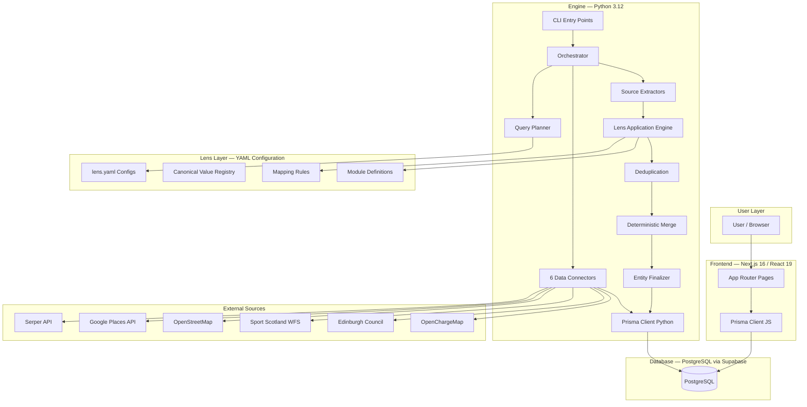
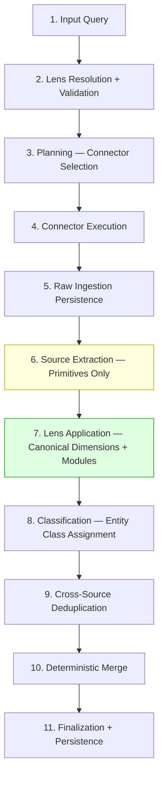

# Architecture Overview

**Generated:** 2026-02-06
**Status:** Auto-generated documentation

> **Note:** This is a generated overview for onboarding purposes. The authoritative architectural documents are [`docs/system-vision.md`](../system-vision.md) (immutable constitution) and [`docs/architecture.md`](../architecture.md) (runtime specification). Always defer to those documents for architectural decisions.

---

## System Overview

Edinburgh Finds is built on a **Universal Entity Extraction Engine** — a vertical-agnostic platform that transforms natural language queries into structured, accurate entity records through AI-powered multi-source orchestration.

The system is composed of three main layers:

1. **Python Engine** (Backend) — Data ingestion, extraction, orchestration, and entity persistence
2. **Next.js Frontend** (Web) — User-facing application for browsing and discovering entities
3. **PostgreSQL Database** (via Supabase) — Persistent storage for entities, raw ingestion data, and pipeline artifacts

---

## Core Architectural Principle: Engine vs Lens

The most critical architectural decision in this system is the **strict separation between the Engine and Lenses**.

| Aspect | Engine | Lens |
|--------|--------|------|
| **Role** | Domain-blind execution platform | Domain-specific interpretation layer |
| **Knows about** | Generic structures (entity_class, canonical arrays, modules) | Domain vocabulary, mapping rules, display semantics |
| **Contains** | Zero domain knowledge | All domain knowledge |
| **Changes when** | Pipeline mechanics change | New verticals or domain rules are added |
| **Adding new vertical** | Zero code changes | New lens.yaml file |

This separation is enforced by:
- **Import boundary tests** — Engine code cannot import lens modules
- **Literal detection tests** — No domain terms (e.g., "padel", "tennis") in engine code
- **CI checks** — `scripts/check_engine_purity.sh` runs on every PR

---

## Technology Stack

### Frontend
| Technology | Version | Purpose |
|-----------|---------|---------|
| Next.js | 16.1.1 | React framework with App Router, SSR/ISR |
| React | 19.2.3 | UI component library |
| TypeScript | 5.x | Type safety |
| Tailwind CSS | 4.x | Utility-first CSS styling |
| Prisma Client JS | 7.3+ | Type-safe database ORM |
| Lucide React | 0.562+ | Icon library |

### Backend (Engine)
| Technology | Version | Purpose |
|-----------|---------|---------|
| Python | 3.12 | Core language |
| Pydantic | Latest | Schema validation |
| Prisma Client Python | Latest | Database ORM |
| Instructor + Anthropic | Latest | Schema-bound LLM extraction |
| aiohttp | Latest | Async HTTP for connectors |
| FuzzyWuzzy | Latest | String similarity for deduplication |
| PyYAML | Latest | YAML configuration parsing |

### Database
| Technology | Purpose |
|-----------|---------|
| PostgreSQL (Supabase) | Primary data store |
| TEXT[] arrays + GIN indexes | Faceted filtering on canonical dimensions |
| JSONB | Flexible module storage |

---

## Data Flow: The 11-Stage Pipeline

Data flows through a strictly ordered pipeline defined in [`docs/architecture.md`](../architecture.md) Section 4.1:

**Key boundary:** Between stages 6 and 7 is the **Extraction Boundary** — the most critical contract in the system. Source extractors (stage 6) emit ONLY schema primitives and raw observations. Lens application (stage 7) produces all canonical dimensions and module data. See [BACKEND.md](BACKEND.md) for details.

---

## Key Architectural Decisions

1. **YAML as Single Source of Truth** — All schema definitions live in `engine/config/schemas/*.yaml` and auto-generate Python models, Prisma schemas, and TypeScript interfaces
2. **Immutable Pipeline Artifacts** — Each stage produces immutable outputs; downstream stages never mutate upstream data
3. **Determinism Over Convenience** — Same inputs + same lens = identical outputs, always
4. **Fail-Fast Validation** — Invalid lens contracts abort at bootstrap, not at runtime
5. **Metadata-Driven Merge** — No connector names in merge logic; trust levels drive conflict resolution

---

## Related Documentation

- **Authoritative Architecture:** [`docs/system-vision.md`](../system-vision.md) — Immutable invariants
- **Runtime Specification:** [`docs/architecture.md`](../architecture.md) — Pipeline contracts
- **Database Schema:** [DATABASE.md](DATABASE.md)
- **Backend Details:** [BACKEND.md](BACKEND.md)
- **Frontend Details:** [FRONTEND.md](FRONTEND.md)
- **Development Guide:** [DEVELOPMENT.md](DEVELOPMENT.md)
