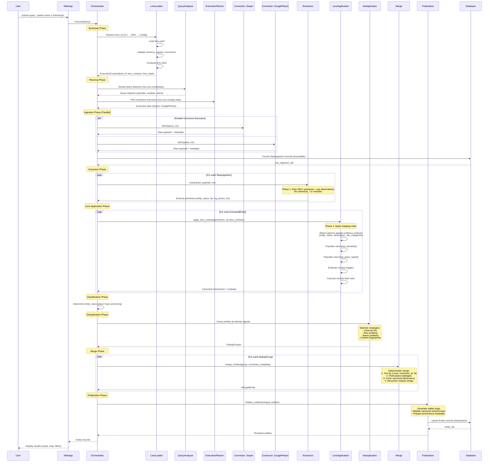

# Backend Architecture Documentation

**Project:** Edinburgh Finds — Universal Entity Extraction Engine
**Generated:** 2026-02-08
**Subsystem:** Python Engine (Backend)

---

## Table of Contents

1. [Overview](#overview)
2. [Architecture](#architecture)
3. [Orchestration](#orchestration)
4. [Ingestion](#ingestion)
5. [Extraction](#extraction)
6. [Lenses](#lenses)
7. [Persistence](#persistence)
8. [Schema System](#schema-system)
9. [Testing](#testing)
10. [CLI Tools](#cli-tools)
11. [Development Workflow](#development-workflow)

---

## Overview

The **Universal Entity Extraction Engine** is a Python-based ETL (Extract, Transform, Load) pipeline designed for vertical-agnostic entity discovery and structured data extraction. The engine operates on a strict architectural separation:

- **Engine Layer (Domain-Blind):** Handles orchestration, ingestion, extraction, deduplication, merging, and persistence using universal entity classifications (`place`, `person`, `organization`, `event`, `thing`).
- **Lens Layer (Domain-Aware):** Provides vertical-specific interpretation through YAML configuration files containing vocabulary, routing rules, mapping rules, and canonical value registries.

### Core Responsibilities

1. **Multi-Source Data Ingestion:** Parallel fetching from 6 data sources (Serper, Google Places, OpenStreetMap, SportScotland, Edinburgh Council, OpenChargeMap)
2. **Intelligent Orchestration:** Query-aware connector selection, phase-based execution, budget management
3. **Hybrid Extraction:** Deterministic parsing + LLM-based structured extraction (Instructor + Claude)
4. **Lens Application:** Pattern-based population of canonical dimensions and modules
5. **Deduplication & Merge:** Cross-source identity matching and conflict resolution
6. **Entity Finalization:** Slug generation, provenance tracking, idempotent persistence

### 11-Stage Execution Pipeline

The engine implements the canonical 11-stage pipeline defined in `docs/target/architecture.md` Section 4.1:

1. **Input** - Accept query or entity identifier
2. **Lens Resolution & Validation** - Bootstrap lens contract, compute hash
3. **Planning** - Derive query features, select connectors via lens routing rules
4. **Connector Execution** - Parallel fetch from planned connectors
5. **Raw Ingestion Persistence** - Immutable artifact storage
6. **Source Extraction** - Phase 1: Emit ONLY primitives + raw observations (NO canonical_* or modules)
7. **Lens Application** - Phase 2: Populate canonical dimensions + modules via mapping rules
8. **Classification** - Determine entity_class via geographic anchoring
9. **Cross-Source Deduplication** - Group entities by identity signals
10. **Deterministic Merge** - Metadata-driven conflict resolution
11. **Finalization & Persistence** - Slug generation, idempotent upsert to Entity table

**Critical Contract:** Source extractors (Stage 6) MUST NOT emit `canonical_*` fields or `modules`. These are populated exclusively in Stage 7 (Lens Application) per the locked extraction boundary defined in architecture.md Section 4.2.

### Tech Stack

| Component | Technology |
|-----------|-----------|
| **Language** | Python 3.x |
| **Validation** | Pydantic (schema-driven) |
| **LLM Integration** | Instructor + Anthropic Claude |
| **ORM** | Prisma Client Python |
| **Database** | PostgreSQL (via Supabase) |
| **Testing** | pytest (>80% coverage target) |
| **Schema Source** | YAML (single source of truth) |

### Key Principles

1. **Engine Purity (Invariant 1):** Zero domain knowledge in engine code. All domain semantics live in Lens YAML configs.
2. **Determinism (Invariant 4):** Same inputs + same Lens contract = identical outputs, always.
3. **Schema-Bound LLM Usage (Invariant 7):** LLMs produce validated Pydantic-structured output only.
4. **Fail-Fast Validation (Invariant 6):** Invalid Lens contracts fail at bootstrap, not runtime.

---

## Architecture

The engine is composed of 6 major subsystems, each with clearly defined responsibilities and boundaries.

```mermaid
graph TD
    %% Orchestration Layer
    subgraph Orchestration["Orchestration Layer"]
        ExecutionContext["ExecutionContext<br/>(Immutable context carrier)"]
        QueryFeatures["QueryFeatureExtractor<br/>(Vocabulary-based analysis)"]
        ExecutionPlanner["ExecutionPlanner<br/>(Connector selection)"]
        Orchestrator["Orchestrator<br/>(Pipeline coordinator)"]
        EntityFinalizer["EntityFinalizer<br/>(Slug generation & persistence)"]
    end

    %% Lens Layer
    subgraph LensLayer["Lens Layer"]
        LensLoader["LensLoader<br/>(YAML → runtime contract)"]
        LensValidator["LensValidator<br/>(Bootstrap validation)"]
        MappingEngine["MappingEngine<br/>(Pattern → canonical values)"]
        ModuleTriggerEngine["ModuleTriggerEngine<br/>(Conditional module attachment)"]
    end

    %% Ingestion Layer
    subgraph IngestionLayer["Ingestion Layer"]
        ConnectorRegistry["ConnectorRegistry<br/>(Metadata: trust, cost, phase)"]
        ConnectorAdapters["ConnectorAdapters<br/>(Async bridge & normalization)"]
        RawIngestionStorage["RawIngestionStorage<br/>(Immutable artifact persistence)"]

        subgraph Connectors["Connectors"]
            Serper["Serper"]
            GooglePlaces["GooglePlaces"]
            OSM["OpenStreetMap"]
            SportScotland["SportScotland"]
            EdinburghCouncil["EdinburghCouncil"]
            OpenChargeMap["OpenChargeMap"]
        end
    end

    %% Extraction Layer
    subgraph ExtractionLayer["Extraction Layer"]
        ValidationEngine["ValidationEngine<br/>(Pydantic schemas)"]
        LLMExtractionEngine["LLMExtractionEngine<br/>(Instructor + Claude)"]

        subgraph SourceExtractors["Source Extractors"]
            SerperExtractor["SerperExtractor<br/>(Primitives only)"]
            GooglePlacesExtractor["GooglePlacesExtractor<br/>(Primitives only)"]
            OSMExtractor["OSMExtractor<br/>(Primitives only)"]
            SportScotlandExtractor["SportScotlandExtractor<br/>(Primitives only)"]
            EdinburghCouncilExtractor["EdinburghCouncilExtractor<br/>(Primitives only)"]
            OpenChargeMapExtractor["OpenChargeMapExtractor<br/>(Primitives only)"]
        end

        EntityClassifier["EntityClassifier<br/>(Geographic anchoring rules)"]
        ModuleExtractor["ModuleExtractor<br/>(Generic field rule executor)"]
    end

    %% Deduplication & Merge Layer
    subgraph MergeLayer["Deduplication & Merge"]
        DeduplicationEngine["DeduplicationEngine<br/>(Cross-source grouping)"]
        MergeEngine["MergeEngine<br/>(Metadata-driven conflict resolution)"]
    end

    %% Persistence Layer
    subgraph PersistenceLayer["Persistence Layer"]
        EntityRepository["EntityRepository<br/>(Idempotent upsert)"]
        ProvenanceTracker["ProvenanceTracker<br/>(Source metadata)"]
    end

    %% Schema Generation System
    subgraph SchemaGeneration["Schema Generation"]
        SchemaParser["SchemaParser<br/>(YAML reader)"]
        PythonGenerator["PythonGenerator<br/>(FieldSpecs)"]
        PrismaGenerator["PrismaGenerator<br/>(Database schema)"]
        TypeScriptGenerator["TypeScriptGenerator<br/>(Frontend types)"]
    end

    %% Dependencies - Orchestration
    LensLoader --> ExecutionContext
    LensValidator --> LensLoader
    ExecutionContext --> QueryFeatures
    ExecutionContext --> ExecutionPlanner
    QueryFeatures --> ExecutionPlanner
    ConnectorRegistry --> ExecutionPlanner
    ExecutionPlanner --> Orchestrator
    Orchestrator --> ConnectorAdapters
    Orchestrator --> EntityFinalizer

    %% Dependencies - Lens Layer
    LensLoader --> LensValidator
    LensLoader --> MappingEngine
    LensLoader --> ModuleTriggerEngine
    MappingEngine --> EntityClassifier
    ModuleTriggerEngine --> ModuleExtractor

    %% Dependencies - Ingestion
    ConnectorAdapters --> Serper
    ConnectorAdapters --> GooglePlaces
    ConnectorAdapters --> OSM
    ConnectorAdapters --> SportScotland
    ConnectorAdapters --> EdinburghCouncil
    ConnectorAdapters --> OpenChargeMap
    ConnectorAdapters --> RawIngestionStorage
    ConnectorRegistry --> ConnectorAdapters

    %% Dependencies - Extraction
    RawIngestionStorage --> SerperExtractor
    RawIngestionStorage --> GooglePlacesExtractor
    RawIngestionStorage --> OSMExtractor
    RawIngestionStorage --> SportScotlandExtractor
    RawIngestionStorage --> EdinburghCouncilExtractor
    RawIngestionStorage --> OpenChargeMapExtractor

    SerperExtractor --> ValidationEngine
    GooglePlacesExtractor --> ValidationEngine
    OSMExtractor --> ValidationEngine
    SportScotlandExtractor --> ValidationEngine
    EdinburghCouncilExtractor --> ValidationEngine
    OpenChargeMapExtractor --> ValidationEngine

    SerperExtractor --> LLMExtractionEngine
    GooglePlacesExtractor --> LLMExtractionEngine
    OSMExtractor --> LLMExtractionEngine
    SportScotlandExtractor --> LLMExtractionEngine
    EdinburghCouncilExtractor --> LLMExtractionEngine
    OpenChargeMapExtractor --> LLMExtractionEngine

    %% Dependencies - Lens Application
    SerperExtractor --> MappingEngine
    GooglePlacesExtractor --> MappingEngine
    OSMExtractor --> MappingEngine
    SportScotlandExtractor --> MappingEngine
    EdinburghCouncilExtractor --> MappingEngine
    OpenChargeMapExtractor --> MappingEngine

    MappingEngine --> ModuleExtractor
    ModuleExtractor --> EntityClassifier

    %% Dependencies - Merge & Persistence
    EntityClassifier --> DeduplicationEngine
    DeduplicationEngine --> MergeEngine
    ConnectorRegistry --> MergeEngine
    MergeEngine --> EntityFinalizer
    EntityFinalizer --> EntityRepository
    EntityFinalizer --> ProvenanceTracker

    %% Dependencies - Schema Generation
    SchemaParser --> PythonGenerator
    SchemaParser --> PrismaGenerator
    SchemaParser --> TypeScriptGenerator
    PythonGenerator --> ValidationEngine
    PrismaGenerator --> EntityRepository

    %% Styling
    classDef orchestration fill:#e1f5ff,stroke:#01579b,stroke-width:2px
    classDef lens fill:#fff3e0,stroke:#e65100,stroke-width:2px
    classDef ingestion fill:#f3e5f5,stroke:#4a148c,stroke-width:2px
    classDef extraction fill:#e8f5e9,stroke:#1b5e20,stroke-width:2px
    classDef merge fill:#fff8e1,stroke:#f57f17,stroke-width:2px
    classDef persistence fill:#fce4ec,stroke:#880e4f,stroke-width:2px
    classDef schema fill:#e0f2f1,stroke:#004d40,stroke-width:2px

    class ExecutionContext,QueryFeatures,ExecutionPlanner,Orchestrator,EntityFinalizer orchestration
    class LensLoader,LensValidator,MappingEngine,ModuleTriggerEngine lens
    class ConnectorRegistry,ConnectorAdapters,RawIngestionStorage,Serper,GooglePlaces,OSM,SportScotland,EdinburghCouncil,OpenChargeMap ingestion
    class ValidationEngine,LLMExtractionEngine,SerperExtractor,GooglePlacesExtractor,OSMExtractor,SportScotlandExtractor,EdinburghCouncilExtractor,OpenChargeMapExtractor,EntityClassifier,ModuleExtractor extraction
    class DeduplicationEngine,MergeEngine merge
    class EntityRepository,ProvenanceTracker persistence
    class SchemaParser,PythonGenerator,PrismaGenerator,TypeScriptGenerator schema
```



### Module Dependencies

| Layer | Module | Dependencies | Exports |
|-------|--------|--------------|---------|
| **Orchestration** | `execution_context.py` | Lens loader | `ExecutionContext` |
| **Orchestration** | `query_features.py` | Lens vocabulary | `QueryFeatures` |
| **Orchestration** | `planner.py` | Registry, adapters, features | `select_connectors()`, `orchestrate()` |
| **Orchestration** | `orchestrator.py` | Execution plan | `Orchestrator` |
| **Orchestration** | `entity_finalizer.py` | Deduplication, merging | `EntityFinalizer` |
| **Lens** | `loader.py` | Validator | `VerticalLens`, `LensLoader` |
| **Lens** | `mapping_engine.py` | None | `execute_mapping_rules()` |
| **Ingestion** | `registry.py` | Connector classes | `CONNECTOR_REGISTRY`, `get_connector_instance()` |
| **Ingestion** | `adapters.py` | Registry, connectors | `ConnectorAdapter` |
| **Ingestion** | `connectors/*` | Base connector | Source-specific connectors |
| **Extraction** | `extractors/*` | LLM client, validation | Source extractors |
| **Extraction** | `llm_client.py` | Instructor, Anthropic | `InstructorClient` |
| **Extraction** | `entity_classifier.py` | None | `classify_entity()` |
| **Extraction** | `merging.py` | Trust hierarchy | `EntityMerger` |
| **Schema** | `cli.py` | Generators | `main()` |
| **Schema** | `generators/*` | Parser | Generator classes |

---

## Orchestration

The **Orchestration Layer** is the runtime control plane that coordinates multi-source entity discovery. It enforces phase barriers, manages shared context, and produces structured execution reports.



### Query Feature Extraction

**File:** `engine/orchestration/query_features.py`

Provides deterministic boolean signal extraction from query strings to guide connector selection. Uses Lens vocabulary for domain-specific term detection.

**Features Extracted:**

1. **`looks_like_category_search`:** True if query appears to be a generic category/activity search (e.g., "tennis courts") rather than a specific venue name.
2. **`has_geo_intent`:** True if query contains geographic markers (location names, "in", "near").

**Example:**

```python
from engine.orchestration.query_features import QueryFeatures
from engine.orchestration.types import IngestRequest

request = IngestRequest(query="padel courts in Edinburgh", lens="edinburgh_finds")
features = QueryFeatures.extract(request.query, request, lens_name="edinburgh_finds")

# Output:
# QueryFeatures(
#     looks_like_category_search=True,   # "padel courts" is generic
#     has_geo_intent=True                # "in Edinburgh" is location
# )
```

**Vertical-Agnostic Design:**

```python
# OLD (hardcoded domain terms - WRONG):
ACTIVITY_KEYWORDS = ["tennis", "padel", "squash"]  # ❌ Engine impurity

# NEW (uses Lens vocabulary - CORRECT):
lens = get_active_lens(lens_name)
looks_like_category = cls._detect_category_search(normalized, lens)  # ✅ Lens-driven
```

### Execution Planning

**File:** `engine/orchestration/planner.py`

Selects which connectors to run for a given request based on query features, ingestion mode, budget constraints, and Lens routing rules.

**Selection Logic:**

| Query Type | Mode | Connectors Selected |
|------------|------|---------------------|
| Specific venue | `RESOLVE_ONE` | `google_places` only |
| Category search | `RESOLVE_ONE` | `serper` + `google_places` |
| Category search | `DISCOVER_MANY` | `serper` + `openstreetmap` + `google_places` |
| Sports-related | Any | Add `sport_scotland` (via Lens routing) |

**Example:**

```python
from engine.orchestration.planner import select_connectors
from engine.orchestration.types import IngestRequest, IngestionMode

# Category search in DISCOVER_MANY mode
request = IngestRequest(
    query="padel courts in Edinburgh",
    ingestion_mode=IngestionMode.DISCOVER_MANY,
    lens="edinburgh_finds"
)

plan = select_connectors(request)
# ExecutionPlan(connectors=["serper", "openstreetmap", "google_places", "sport_scotland"])
```

**Budget-Aware Gating:**

```python
# Phase C: Filter out paid connectors if budget is tight
if request.budget_limit and request.budget_limit < 0.05:
    # Remove connectors with cost > 0
    selected_connectors = [
        c for c in selected_connectors
        if CONNECTOR_REGISTRY[c].cost_per_call_usd == 0.0
    ]
```

### Connector Adapters

**File:** `engine/orchestration/adapters.py`

Bridges async connectors to the orchestrator, normalizing results and handling timeouts.

**Responsibilities:**

1. Execute connector with timeout enforcement
2. Convert connector-specific payloads to standard format
3. Persist `RawIngestion` records to database
4. Return normalized metadata (latency, cost, candidates found)

**Example:**

```python
from engine.orchestration.adapters import ConnectorAdapter
from engine.ingestion.connectors.serper import SerperConnector

adapter = ConnectorAdapter(db)
connector = SerperConnector()

result = await adapter.execute(
    connector=connector,
    request=request,
    query_features=features,
    context=context
)
# Returns: {"latency_ms": 342, "cost_usd": 0.01, "candidates_added": 12}
```

### Deduplication

**File:** `engine/ingestion/deduplication.py`, `engine/extraction/deduplication.py`

Implements multi-tier identity matching strategies:

1. **External ID Matching:** Match `google_place_id`, `osm_id`, etc.
2. **Geo Similarity:** Haversine distance <100m + name similarity
3. **Name Normalization:** Lowercase, remove punctuation, fuzzy match
4. **Content Fingerprinting:** Hash of normalized (name, address, phone)

**Example:**

```python
from engine.extraction.deduplication import SlugGenerator, group_by_identity

slug_gen = SlugGenerator()

entities = [
    {"entity_name": "The Padel Club", "latitude": 55.9533, "longitude": -3.1883},
    {"entity_name": "Padel Club", "latitude": 55.9534, "longitude": -3.1884}
]

groups = group_by_identity(entities)
# Groups[0]: ["The Padel Club", "Padel Club"]  # Same location + similar name
```

### Entity Finalization

**File:** `engine/orchestration/entity_finalizer.py`

Bridges `ExtractedEntity` records to the final `Entity` table with slug generation and idempotent upsert.

**Process:**

1. Load all `ExtractedEntity` records for orchestration run
2. Group by identity (slug or external_id)
3. Merge each group using `EntityMerger`
4. Generate stable slugs (`"The Padel Club"` → `"padel-club"`)
5. Upsert to `Entity` table (create or update)

**Example:**

```python
from engine.orchestration.entity_finalizer import EntityFinalizer

finalizer = EntityFinalizer(db)
stats = await finalizer.finalize_entities(orchestration_run_id="abc123")

# Returns: {"entities_created": 8, "entities_updated": 2, "conflicts": 0}
```

---

## Ingestion

The **Ingestion Layer** fetches raw data from 6 external sources, persists immutable artifacts, and provides deduplication to prevent redundant API calls.

### Connector Registry

**File:** `engine/orchestration/registry.py`

Centralized metadata for all 6 connectors. Serves as single source of truth for connector capabilities, costs, and trust levels.

**ConnectorSpec Structure:**

```python
@dataclass(frozen=True)
class ConnectorSpec:
    name: str                    # e.g., "serper"
    connector_class: str         # Fully qualified class path
    phase: str                   # "discovery" or "enrichment"
    cost_per_call_usd: float     # Average API cost
    trust_level: float           # 0.0 to 1.0 (1.0 = authoritative)
    timeout_seconds: int         # Max execution timeout
    rate_limit_per_day: int      # Daily request limit
```

**Registry Contents:**

| Connector | Phase | Cost (USD) | Trust | Timeout | Rate Limit |
|-----------|-------|-----------|-------|---------|------------|
| **serper** | discovery | $0.01 | 0.75 | 30s | 2,500/day |
| **google_places** | enrichment | $0.017 | 0.95 | 30s | 1,000/day |
| **openstreetmap** | discovery | $0.00 | 0.70 | 60s | 10,000/day |
| **sport_scotland** | enrichment | $0.00 | 0.90 | 60s | 10,000/day |
| **edinburgh_council** | enrichment | $0.00 | 0.90 | 60s | 10,000/day |
| **open_charge_map** | enrichment | $0.00 | 0.85 | 60s | 10,000/day |

**Usage:**

```python
from engine.orchestration.registry import CONNECTOR_REGISTRY, get_connector_instance

# Get metadata
spec = CONNECTOR_REGISTRY["serper"]
print(f"Trust: {spec.trust_level}, Cost: ${spec.cost_per_call_usd}")

# Instantiate connector
connector = get_connector_instance("serper")
```

### Data Sources

#### 1. Serper (Google Search Results)

**File:** `engine/ingestion/connectors/serper.py`

Fetches Google search results via Serper API. Provides web search coverage for discovery phase.

**Configuration:** `engine/config/sources.yaml`

```yaml
serper:
  api_key: ${SERPER_API_KEY}
  base_url: "https://google.serper.dev"
  timeout_seconds: 30
  default_params:
    gl: uk      # Geolocation: UK
    hl: en      # Language: English
    num: 10     # Results per query
```

**Example Response:**

```json
{
  "searchParameters": {"q": "padel courts edinburgh"},
  "organic": [
    {
      "title": "Edinburgh Padel Centre",
      "link": "https://...",
      "snippet": "Premier padel facility with 4 courts...",
      "position": 1
    }
  ]
}
```

#### 2. Google Places (Authoritative POI Data)

**File:** `engine/ingestion/connectors/google_places.py`

Fetches structured POI data from Google Places API. High-trust enrichment source.

**Fields Retrieved:**
- Place ID, name, address components
- Coordinates (lat/lng)
- Phone number, website, opening hours
- Google ratings, price level
- Place types (e.g., `["gym", "point_of_interest"]`)

#### 3. OpenStreetMap (Crowdsourced Geographic Data)

**File:** `engine/ingestion/connectors/open_street_map.py`

Queries OSM Nominatim API for free geographic data. Good for discovery phase.

**Tags Extracted:**
- `amenity`, `leisure`, `sport`
- `name`, `address`, `phone`, `website`
- Coordinates, bounding box

#### 4. Sport Scotland (Official Sports Facilities)

**File:** `engine/ingestion/connectors/sport_scotland.py`

Queries Scottish government sports facility database. High-trust source for sports venues.

**Facility Types:**
- Swimming pools, gyms, sports halls
- Tennis/padel/squash courts
- Outdoor pitches, tracks

#### 5. Edinburgh Council (Municipal Data)

**File:** `engine/ingestion/connectors/edinburgh_council.py`

Queries City of Edinburgh Council APIs for municipal facilities and events.

#### 6. OpenChargeMap (EV Charging Stations)

**File:** `engine/ingestion/connectors/open_charge_map.py`

Queries global EV charging station database. Demonstrates extensibility to non-sports verticals.

### Raw Ingestion Storage

**File:** `engine/ingestion/storage.py`

Persists immutable raw API responses to filesystem and database.

**Storage Format:**

```
engine/data/raw/
  serper/
    2026-01-15_14-23-45_abc123.json
  google_places/
    2026-01-15_14-24-12_def456.json
```

**Database Schema:**

```prisma
model RawIngestion {
  id            String   @id @default(cuid())
  source        String   // "serper", "google_places", etc.
  content_hash  String   @unique  // SHA-256 of payload
  raw_payload   Json     // Original API response
  query_text    String
  source_url    String?
  createdAt     DateTime @default(now())
}
```

**Deduplication:**

```python
from engine.ingestion.deduplication import compute_content_hash, check_duplicate

content_hash = compute_content_hash(payload)
if not await check_duplicate(db, content_hash):
    await save_raw_ingestion(db, source="serper", payload=payload)
```

---

## Extraction

The **Extraction Layer** transforms raw API responses into structured entity data using a hybrid approach: deterministic parsing + LLM-based extraction.

```mermaid
graph TD
    %% Input Stage
    Input[Input: Query or Entity Identifier]

    %% Stage 1: Lens Resolution & Validation
    Input --> LensResolution[Lens Resolution & Validation]
    LensResolution --> LensLoad[Load lens.yaml]
    LensLoad --> LensValidate[Validate Schema, Registry, Rules]
    LensValidate --> LensHash[Compute Content Hash]
    LensHash --> ExecContext[Create ExecutionContext]

    %% Stage 2: Planning
    ExecContext --> Planning[Planning: Connector Selection]
    Planning --> QueryFeatures[Derive Query Features]
    QueryFeatures --> LensRouting[Apply Lens Routing Rules]
    LensRouting --> ExecPlan[Generate Execution Plan]

    %% Stage 3: Connector Execution
    ExecPlan --> ConnectorExec[Connector Execution: Parallel Ingestion]
    ConnectorExec --> Conn1[Connector 1<br/>Serper]
    ConnectorExec --> Conn2[Connector 2<br/>GooglePlaces]
    ConnectorExec --> Conn3[Connector 3<br/>OSM]
    ConnectorExec --> Conn4[Connector 4<br/>SportScotland]
    ConnectorExec --> Conn5[Connector 5<br/>...]

    %% Stage 4: Raw Ingestion
    Conn1 --> RawIngestion[Raw Ingestion Persistence]
    Conn2 --> RawIngestion
    Conn3 --> RawIngestion
    Conn4 --> RawIngestion
    Conn5 --> RawIngestion
    RawIngestion --> RawArtifacts[(RawIngestion Records<br/>Immutable Artifacts)]

    %% Stage 5: Source Extraction
    RawArtifacts --> SourceExtraction[Source Extraction]
    SourceExtraction --> ExtractPrimitives[Extract Schema Primitives<br/>entity_name, lat, lng, address, phone, etc.]
    ExtractPrimitives --> ExtractRaw[Extract Raw Observations<br/>raw_categories, description, etc.]
    ExtractRaw --> ExtractedEntity[(ExtractedEntity Records<br/>NO canonical_* or modules)]

    %% Stage 6: Lens Application
    ExtractedEntity --> LensApp[Lens Application]
    LensApp --> MappingRules[Apply Mapping Rules<br/>Pattern → canonical_*]
    MappingRules --> ModuleTriggers[Evaluate Module Triggers]
    ModuleTriggers --> ModuleExtraction[Execute Module Field Rules]
    ModuleExtraction --> CanonicalPopulated[(Canonical Dimensions<br/>+ Modules Populated)]

    %% Stage 7: Classification
    CanonicalPopulated --> Classification[Classification: Entity Class Assignment]
    Classification --> GeoCheck{Geographic<br/>Anchoring?}
    GeoCheck -->|Yes: coords, address,<br/>city, or postcode| ClassPlace[entity_class = place]
    GeoCheck -->|No| ClassOther[entity_class = person,<br/>organization, event, thing]
    ClassPlace --> Classified[(Classified Entities)]
    ClassOther --> Classified

    %% Stage 8: Deduplication
    Classified --> Dedup[Cross-Source Deduplication Grouping]
    Dedup --> MatchExternal[Match External Identifiers]
    MatchExternal --> MatchGeo[Geo Similarity Matching]
    MatchGeo --> MatchName[Normalized Name Matching]
    MatchName --> MatchContent[Content Fingerprint Matching]
    MatchContent --> DedupGroups[(Deduplication Groups)]

    %% Stage 9: Merge
    DedupGroups --> Merge[Deterministic Merge]
    Merge --> MergeIdentity[Merge Identity Fields<br/>trust → priority → connector_id]
    MergeIdentity --> MergeGeo[Merge Geo Fields<br/>precision → trust → decimal]
    MergeGeo --> MergeContact[Merge Contact Fields<br/>quality → trust → priority]
    MergeContact --> MergeCanonical[Merge Canonical Arrays<br/>union, dedupe, sort]
    MergeCanonical --> MergeModules[Merge Modules<br/>recursive, trust-driven]
    MergeModules --> MergedEntity[(Merged Entities<br/>Single Canonical Record)]

    %% Stage 10: Finalization
    MergedEntity --> Finalization[Finalization & Persistence]
    Finalization --> SlugGen[Generate Stable Slugs]
    SlugGen --> Provenance[Persist Provenance Metadata]
    Provenance --> Upsert[Idempotent Upsert]
    Upsert --> EntityTable[(Entity Table<br/>Canonical Schema Only)]

    %% Stage 11: Output
    EntityTable --> Output[Output: Persisted Entities<br/>Ready for Display]

    %% Styling
    classDef inputClass fill:#e1f5ff,stroke:#0066cc,stroke-width:2px
    classDef processClass fill:#fff4e6,stroke:#ff8c00,stroke-width:2px
    classDef artifactClass fill:#e8f5e9,stroke:#2e7d32,stroke-width:2px
    classDef decisionClass fill:#f3e5f5,stroke:#7b1fa2,stroke-width:2px
    classDef outputClass fill:#fce4ec,stroke:#c2185b,stroke-width:2px

    class Input,ExecContext inputClass
    class LensResolution,LensLoad,LensValidate,LensHash,Planning,QueryFeatures,LensRouting,ExecPlan,ConnectorExec,SourceExtraction,ExtractPrimitives,ExtractRaw,LensApp,MappingRules,ModuleTriggers,ModuleExtraction,Classification,Dedup,MatchExternal,MatchGeo,MatchName,MatchContent,Merge,MergeIdentity,MergeGeo,MergeContact,MergeCanonical,MergeModules,Finalization,SlugGen,Provenance,Upsert processClass
    class RawArtifacts,ExtractedEntity,CanonicalPopulated,Classified,DedupGroups,MergedEntity,EntityTable artifactClass
    class GeoCheck decisionClass
    class Conn1,Conn2,Conn3,Conn4,Conn5,ClassPlace,ClassOther,Output outputClass
```



### Phase 1: Schema Primitives

**CRITICAL ARCHITECTURAL BOUNDARY:** Phase 1 extractors emit ONLY schema primitives + raw observations. They MUST NOT populate `canonical_*` fields or `modules`.

**Allowed Outputs:**

- **Identity:** `entity_name`, `slug`
- **Geographic:** `latitude`, `longitude`, `street_address`, `city`, `postcode`, `country`
- **Contact:** `phone`, `email`, `website`
- **Metadata:** `description`, `summary`, `raw_categories`, `opening_hours`
- **External IDs:** `google_place_id`, `osm_id`, etc.

**Forbidden Outputs:**

- ❌ `canonical_activities`
- ❌ `canonical_roles`
- ❌ `canonical_place_types`
- ❌ `canonical_access`
- ❌ `modules` (JSONB)

### Phase 2: Lens Application

After Phase 1 extraction, the Lens Application phase populates canonical dimensions and modules using Lens mapping rules and module triggers.

**Process:**

1. Load mapping rules from Lens contract
2. Match patterns against evidence surfaces (`entity_name`, `description`, `raw_categories`)
3. Populate `canonical_activities[]`, `canonical_place_types[]`, etc.
4. Evaluate module triggers (e.g., if `canonical_activities` contains "tennis", add `sports_facility` module)
5. Execute module field rules to extract structured module data

**Example:**

```python
from engine.lenses.mapping_engine import execute_mapping_rules

entity = {
    "entity_name": "Edinburgh Tennis Club",
    "description": "Premier tennis facility with 8 courts",
    "raw_categories": ["sports_club", "tennis"]
}

mapping_rules = [
    {
        "pattern": r"(?i)tennis",
        "canonical": "tennis",
        "dimension": "canonical_activities",
        "source_fields": ["entity_name", "description", "raw_categories"]
    }
]

canonical_dims = execute_mapping_rules(mapping_rules, entity)
# Returns: {"canonical_activities": ["tennis"]}
```

### LLM Integration (Instructor + Claude)

**File:** `engine/extraction/llm_client.py`

Wraps Anthropic Claude with Instructor for structured output validation.

**Configuration:**

```python
from engine.extraction.llm_client import InstructorClient
from engine.extraction.models.entity_extraction import EntityExtraction

client = InstructorClient()

response = client.extract_structured(
    system_message="You are an expert at extracting venue data...",
    user_message="Extract details from: Premier tennis club with 8 courts...",
    response_model=EntityExtraction
)

# Returns validated Pydantic model instance
print(response.entity_name)  # "Edinburgh Tennis Club"
print(response.latitude)     # 55.9533
```

**Cost Tracking:**

```python
from engine.extraction.llm_cost import LLMCostTracker

tracker = LLMCostTracker()
tracker.log_call(prompt_tokens=245, completion_tokens=120, model="claude-sonnet-4")
print(tracker.get_total_cost())  # "$0.0234"
```

### Validation (Pydantic)

All extractor outputs are validated against Pydantic schemas auto-generated from YAML definitions.

**Example:**

```python
from pydantic import BaseModel, validator
from typing import Optional

class EntityExtraction(BaseModel):
    entity_name: str
    latitude: Optional[float] = None
    longitude: Optional[float] = None
    phone: Optional[str] = None

    @validator('latitude')
    def validate_latitude(cls, v):
        if v is not None and not (-90 <= v <= 90):
            raise ValueError("Latitude must be between -90 and 90")
        return v
```

### Source Extractors

Each connector has a dedicated extractor implementing `BaseExtractor`:

**Base Interface:**

```python
from abc import ABC, abstractmethod
from typing import Dict, Any

class BaseExtractor(ABC):
    @property
    @abstractmethod
    def source_name(self) -> str:
        """Unique identifier for this extractor's data source."""
        pass

    @abstractmethod
    async def extract(
        self,
        raw_payload: Dict[str, Any],
        context: ExecutionContext
    ) -> Dict[str, Any]:
        """Extract structured data from raw payload."""
        pass
```

**Example: Serper Extractor**

**File:** `engine/extraction/extractors/serper_extractor.py`

```python
class SerperExtractor(BaseExtractor):
    def __init__(self, llm_client=None):
        self.llm_client = llm_client or InstructorClient()
        # Load Serper-specific prompt template
        with open("engine/extraction/prompts/serper_extraction.txt") as f:
            self.system_message = f.read()

    @property
    def source_name(self) -> str:
        return "serper"

    async def extract(self, raw_payload: Dict, context: ExecutionContext) -> Dict:
        # Aggregate search snippets
        snippets = [
            result["snippet"]
            for result in raw_payload.get("organic", [])
        ]

        # LLM extraction
        response = self.llm_client.extract_structured(
            system_message=self.system_message,
            user_message=f"Extract venue from snippets: {snippets}",
            response_model=EntityExtraction
        )

        # Return ONLY primitives (Phase 1 contract)
        return {
            "entity_name": response.entity_name,
            "street_address": response.street_address,
            "city": response.city,
            "phone": response.phone,
            "website": response.website,
            "description": response.description,
            # NO canonical_* or modules - those come in Phase 2
        }
```

### Entity Classification

**File:** `engine/extraction/entity_classifier.py`

Determines `entity_class` using geographic anchoring rules.

**Rules:**

1. If entity has coordinates, address, city, or postcode → `entity_class = "place"`
2. Otherwise → Heuristic classification:
   - Person indicators (titles, pronouns) → `"person"`
   - Organization indicators (Ltd, Inc, Council) → `"organization"`
   - Event indicators (date ranges, tickets) → `"event"`
   - Default → `"thing"`

**Example:**

```python
from engine.extraction.entity_classifier import classify_entity

entity = {
    "entity_name": "Edinburgh Tennis Club",
    "latitude": 55.9533,
    "longitude": -3.1883
}

entity_class = classify_entity(entity)
# Returns: "place" (geographic anchoring present)
```

---

## Lenses

The **Lens Layer** provides vertical-specific interpretation of universal engine data through YAML configuration files.

### Core Principle

- **Engine knows NOTHING about domains** (Padel, Wine, Restaurants)
- **Lenses provide domain-specific vocabulary and routing rules**
- **Extensibility: Adding a new vertical requires ZERO engine code changes**

### Lens Structure

Each lens is defined in a single comprehensive YAML file:

**File:** `engine/lenses/<lens_id>/lens.yaml`

**Example Structure:**

```yaml
# Vocabulary (for query feature extraction)
vocabulary:
  activity_keywords:
    - tennis
    - padel
    - squash
  location_indicators:
    - edinburgh
    - leith
    - portobello
  role_keywords:
    - coach
    - instructor

# Connector Routing Rules (for execution planning)
connector_rules:
  sport_scotland:
    priority: high
    triggers:
      - type: any_keyword_match
        keywords: [tennis, padel, squash, swimming]

# Mapping Rules (for canonical dimension population)
mapping_rules:
  - pattern: "(?i)tennis|racket sports"
    canonical: tennis
    dimension: canonical_activities
    confidence: 0.95
    source_fields: [entity_name, description, raw_categories]

  - pattern: "(?i)indoor|outdoor"
    canonical: outdoor
    dimension: canonical_access
    confidence: 0.85
    source_fields: [description]

# Module Triggers (for conditional module attachment)
module_triggers:
  - when:
      dimension: canonical_activities
      values: [tennis, padel, squash]
    add_modules: [sports_facility]

# Canonical Values (interpretation metadata)
values:
  - key: tennis
    facet: activity
    display_name: "Tennis"
    description: "Racquet sport played on a rectangular court"
    seo_slug: "tennis"
    search_keywords: ["tennis", "racquet", "court"]
    icon_url: "/icons/tennis.svg"
    color: "#4CAF50"
```

### Lens Loading & Validation

**File:** `engine/lenses/loader.py`

Loads and validates lens configuration at bootstrap (fail-fast).

**Validation Checks:**

1. **Schema Validation:** YAML structure matches expected schema
2. **Registry Completeness:** All canonical values declared in `values` section
3. **Rule Validity:** Regex patterns compile, referenced dimensions exist
4. **Connector Existence:** Referenced connectors exist in registry
5. **Module Namespacing:** Module keys follow `<namespace>_<name>` pattern

**Example:**

```python
from engine.lenses.loader import VerticalLens
from pathlib import Path

# Load and validate (fails if invalid)
lens_path = Path("engine/lenses/edinburgh_finds/lens.yaml")
lens = VerticalLens(lens_path)

# Access compiled data
print(lens.activity_keywords)  # ["tennis", "padel", "squash"]
print(lens.mapping_rules)      # [MappingRule(...), ...]
print(lens.facets)             # {"activity": FacetDefinition(...)}
```

### Mapping Rule Engine

**File:** `engine/lenses/mapping_engine.py`

Applies pattern-based rules to populate canonical dimensions.

**Algorithm:**

1. For each mapping rule:
   - Get `source_fields` (defaults to `["entity_name", "description", "raw_categories"]`)
   - Search pattern across union of source fields
   - First match wins (within source_fields)
   - Emit `{dimension: canonical_value}`
2. Group matches by dimension
3. Deduplicate values
4. Sort deterministically (lexicographic)

**Example:**

```python
from engine.lenses.mapping_engine import execute_mapping_rules

entity = {
    "entity_name": "Edinburgh Tennis & Padel Centre",
    "description": "Premier indoor/outdoor facility",
    "raw_categories": ["sports_club", "tennis"]
}

rules = [
    {"pattern": r"(?i)tennis", "canonical": "tennis", "dimension": "canonical_activities"},
    {"pattern": r"(?i)padel", "canonical": "padel", "dimension": "canonical_activities"},
    {"pattern": r"(?i)indoor", "canonical": "indoor", "dimension": "canonical_access"}
]

result = execute_mapping_rules(rules, entity)
# Returns: {
#     "canonical_activities": ["padel", "tennis"],  # Sorted lexicographically
#     "canonical_access": ["indoor"]
# }
```

### Module Trigger Engine

**File:** `engine/lenses/ops.py` (via module extraction system)

Evaluates conditional rules to determine which modules to attach.

**Trigger Structure:**

```yaml
module_triggers:
  - when:
      dimension: canonical_activities
      values: [tennis, padel]
    add_modules: [sports_facility]

  - when:
      dimension: canonical_place_types
      values: [restaurant, cafe]
    add_modules: [hospitality_venue]
```

**Evaluation Logic:**

```python
def should_trigger_module(entity: Dict, trigger: Dict) -> bool:
    """Check if module trigger conditions are met."""
    dimension = trigger["when"]["dimension"]
    required_values = set(trigger["when"]["values"])

    entity_values = set(entity.get(dimension, []))

    # Trigger if ANY required value is present
    return bool(required_values & entity_values)
```

### Module Field Rules

Once a module is triggered, field rules extract structured data for that module.

**Example:**

```yaml
modules:
  sports_facility:
    fields:
      - name: num_courts
        extractor: numeric_parser
        config:
          pattern: "(?i)(\\d+)\\s*courts?"
          source_fields: [description, summary]

      - name: court_surface
        extractor: regex_capture
        config:
          pattern: "(?i)surface:\\s*(\\w+)"
          source_fields: [description]
```

**Execution:**

```python
from engine.lenses.extractors.numeric_parser import extract_numeric
from engine.lenses.extractors.regex_capture import extract_regex

entity = {"description": "Facility with 8 courts. Surface: clay."}

num_courts = extract_numeric(
    entity,
    pattern=r"(?i)(\d+)\s*courts?",
    source_fields=["description"]
)  # Returns: 8

court_surface = extract_regex(
    entity,
    pattern=r"(?i)surface:\s*(\w+)",
    source_fields=["description"]
)  # Returns: "clay"
```

---

## Persistence

The **Persistence Layer** handles slug generation, provenance tracking, and idempotent database upserts.

### Entity Repository

**Database Schema (Prisma):**

```prisma
model Entity {
  id                    String   @id @default(cuid())
  slug                  String   @unique  // URL-safe identifier
  entity_name           String
  entity_class          String?  // place, person, organization, event, thing

  // Geographic
  latitude              Float?
  longitude             Float?
  street_address        String?
  city                  String?
  postcode              String?
  country               String?   @default("GB")

  // Contact
  phone                 String?
  email                 String?
  website               String?

  // Content
  description           String?
  summary               String?

  // Canonical Dimensions (multi-valued)
  canonical_activities  String[]  // ["tennis", "padel"]
  canonical_roles       String[]  // ["coach", "venue"]
  canonical_place_types String[]  // ["sports_club", "gym"]
  canonical_access      String[]  // ["indoor", "outdoor", "public"]

  // Modules (vertical-specific structured data)
  modules               Json?     // {"sports_facility": {...}, ...}

  // External IDs
  google_place_id       String?   @unique
  osm_id                String?   @unique

  // Metadata
  createdAt             DateTime  @default(now())
  updatedAt             DateTime  @updatedAt

  @@index([entity_class])
  @@index([city])
  @@index([canonical_activities])
}
```

### Slug Generation

**File:** `engine/extraction/deduplication.py`

Generates URL-safe slugs from entity names using deterministic rules.

**Algorithm:**

1. Lowercase the name
2. Remove articles ("the", "a", "an")
3. Remove punctuation except hyphens
4. Replace spaces with hyphens
5. Remove consecutive hyphens
6. Trim leading/trailing hyphens

**Example:**

```python
from engine.extraction.deduplication import SlugGenerator

slug_gen = SlugGenerator()

slugs = [
    slug_gen.generate("The Padel Club"),            # "padel-club"
    slug_gen.generate("Edinburgh Tennis Centre"),   # "edinburgh-tennis-centre"
    slug_gen.generate("O'Neill's Sports Bar"),      # "oneills-sports-bar"
]
```

### Upsert Logic

**File:** `engine/orchestration/persistence.py`

Implements idempotent upsert with deterministic conflict resolution.

**Process:**

1. Check if `Entity` with matching `slug` exists
2. If exists:
   - Merge new data with existing using trust hierarchy
   - Update `updatedAt` timestamp
3. If not exists:
   - Create new `Entity` record
   - Initialize `createdAt` timestamp

**Example:**

```python
from engine.orchestration.persistence import PersistenceManager

manager = PersistenceManager(db)

entity_data = {
    "slug": "padel-club",
    "entity_name": "The Padel Club",
    "latitude": 55.9533,
    "longitude": -3.1883,
    "canonical_activities": ["padel"],
    "modules": {"sports_facility": {"num_courts": 4}}
}

entity_id = await manager.upsert_entity(entity_data)
# Returns: "cuid_abc123" (created or updated)
```

### Provenance Tracking

**Database Schema:**

```prisma
model EntityProvenance {
  id                  String   @id @default(cuid())
  entity_id           String
  source              String   // "serper", "google_places", etc.
  extracted_entity_id String   @unique
  trust_level         Float
  createdAt           DateTime @default(now())

  entity              Entity   @relation(fields: [entity_id], references: [id])

  @@index([entity_id])
  @@index([source])
}
```

**Purpose:**

- Track which sources contributed to each entity
- Enable trust-based conflict resolution during merges
- Support data lineage auditing
- Allow re-extraction from specific sources

---

## Schema System

The **Schema Generation System** maintains YAML as the single source of truth and auto-generates Python, Prisma, and TypeScript schemas.

### Architecture

```
YAML Schemas                Generated Artifacts
(engine/config/schemas/)

entity.yaml         ──►     engine/schema/entity.py (Python FieldSpecs)
                    ──►     engine/prisma/schema.prisma (Prisma schema)
                    ──►     web/prisma/schema.prisma (Prisma schema)
                    ──►     web/lib/types/generated/entity.ts (TypeScript)
                    ──►     engine/extraction/models/entity_extraction.py (Pydantic)
```

### YAML Schema Format

**File:** `engine/config/schemas/entity.yaml`

**Structure:**

```yaml
schema:
  name: Entity
  description: Base schema for all entity types
  extends: null

fields:
  - name: entity_name
    type: string
    description: Official name of the entity
    nullable: false
    required: true
    index: true
    search:
      category: identity
      keywords: [name, called, named]
    python:
      validators: [non_empty]
      extraction_required: true

  - name: latitude
    type: float
    description: Latitude coordinate (WGS84)
    nullable: true
    index: true
    python:
      validators: [latitude_range]
    prisma:
      type: "Float"

  - name: canonical_activities
    type: array
    description: Multi-valued activity dimension
    nullable: false
    default: []
    prisma:
      type: "String[]"
      attributes: ["@default([])"]
    exclude: true  # Not for LLM extraction (populated by Lens)
```

### Generators

#### 1. Python FieldSpec Generator

**File:** `engine/schema/generators/python_fieldspec.py`

Generates Python FieldSpec definitions for use in schema validation.

**Output:** `engine/schema/entity.py`

```python
# AUTO-GENERATED - DO NOT EDIT
# Source: engine/config/schemas/entity.yaml

from engine.schema.field import FieldSpec

ENTITY_FIELDS = {
    "entity_name": FieldSpec(
        name="entity_name",
        type="string",
        description="Official name of the entity",
        nullable=False,
        required=True,
        validators=["non_empty"]
    ),
    "latitude": FieldSpec(
        name="latitude",
        type="float",
        description="Latitude coordinate (WGS84)",
        nullable=True,
        validators=["latitude_range"]
    ),
}
```

#### 2. Prisma Schema Generator

**File:** `engine/schema/generators/prisma.py`

Generates Prisma schema files for database ORM.

**Output:** `web/prisma/schema.prisma`

```prisma
// AUTO-GENERATED - DO NOT EDIT
// Source: engine/config/schemas/entity.yaml

model Entity {
  id                    String   @id @default(cuid())
  entity_name           String
  latitude              Float?
  canonical_activities  String[] @default([])

  @@index([entity_name])
  @@index([latitude])
}
```

#### 3. TypeScript Generator

**File:** `engine/schema/generators/typescript.py`

Generates TypeScript interfaces for frontend type safety.

**Output:** `web/lib/types/generated/entity.ts`

```typescript
// AUTO-GENERATED - DO NOT EDIT
// Source: engine/config/schemas/entity.yaml

export interface Entity {
  id: string;
  entity_name: string;
  latitude?: number | null;
  canonical_activities: string[];
}
```

#### 4. Pydantic Extraction Model Generator

**File:** `engine/schema/generators/pydantic_extraction.py`

Generates Pydantic models for LLM extraction validation.

**Output:** `engine/extraction/models/entity_extraction.py`

```python
# AUTO-GENERATED - DO NOT EDIT
# Source: engine/config/schemas/entity.yaml

from pydantic import BaseModel, validator
from typing import Optional

class EntityExtraction(BaseModel):
    entity_name: str
    latitude: Optional[float] = None

    @validator('latitude')
    def validate_latitude(cls, v):
        if v is not None and not (-90 <= v <= 90):
            raise ValueError("Latitude must be between -90 and 90")
        return v
```

### Regeneration Workflow

**Command:**

```bash
python -m engine.schema.generate --all
```

**Process:**

1. Parse all YAML schemas in `engine/config/schemas/`
2. Validate schema structure
3. Generate Python FieldSpecs
4. Generate Prisma schemas (backend + frontend)
5. Generate TypeScript interfaces
6. Generate Pydantic extraction models
7. Write files with "DO NOT EDIT" headers

**Validation:**

```bash
# Validate schemas without generating
python -m engine.schema.generate --validate

# Generate specific schema only
python -m engine.schema.generate --schema entity
```

---

## Testing

The engine uses **pytest** with strict TDD (Test-Driven Development) practices and >80% coverage target.

### Test Organization

```
tests/engine/
├── config/
│   └── test_entity_model_purity.py  # Schema validation tests
├── orchestration/
│   ├── test_registry.py              # Connector registry tests
│   ├── test_planner.py               # Execution planning tests
│   ├── test_query_features.py        # Query analysis tests
│   └── test_orchestrator.py          # End-to-end orchestration tests
├── ingestion/
│   ├── connectors/
│   │   ├── test_serper.py
│   │   ├── test_google_places.py
│   │   └── ...
│   └── test_storage.py               # Raw ingestion storage tests
├── extraction/
│   ├── extractors/
│   │   ├── test_serper_extractor.py
│   │   ├── test_google_places_extractor.py
│   │   └── ...
│   ├── test_entity_classifier.py     # Classification tests
│   ├── test_merging.py               # Merge logic tests
│   └── test_lens_integration.py      # Lens application tests
├── lenses/
│   ├── test_loader.py                # Lens loading tests
│   ├── test_mapping_engine.py        # Mapping rule tests
│   └── test_validator.py             # Lens validation tests
└── schema/
    ├── test_parser.py                # YAML parsing tests
    └── test_generators.py            # Schema generation tests
```

### Test Configuration

**File:** `pytest.ini`

```ini
[pytest]
markers =
    slow: marks tests as slow (deselect with '-m "not slow"')
    integration: marks tests as integration tests (require real API calls)
asyncio_mode = auto
asyncio_default_fixture_loop_scope = function
norecursedirs = archive/* conductor/* node_modules/* .git/* web/node_modules/*
```

### Running Tests

```bash
# Run all tests
pytest

# Run fast tests only (excludes slow tests)
pytest -m "not slow"

# Run specific module tests
pytest tests/engine/orchestration/

# Run with coverage report
pytest --cov=engine --cov-report=html

# Run with verbose output
pytest -v

# Run specific test function
pytest tests/engine/extraction/test_entity_classifier.py::test_classify_place
```

### Test Patterns

#### Unit Tests

**Example: Query Feature Extraction**

```python
# tests/engine/orchestration/test_query_features.py

import pytest
from engine.orchestration.query_features import QueryFeatures
from engine.orchestration.types import IngestRequest

def test_category_search_detection():
    """Category searches like 'padel courts' should be detected."""
    request = IngestRequest(query="padel courts in Edinburgh", lens="edinburgh_finds")
    features = QueryFeatures.extract(request.query, request)

    assert features.looks_like_category_search is True
    assert features.has_geo_intent is True

def test_specific_venue_search():
    """Specific venue names should NOT be detected as category searches."""
    request = IngestRequest(query="Oriam Scotland", lens="edinburgh_finds")
    features = QueryFeatures.extract(request.query, request)

    assert features.looks_like_category_search is False
    assert features.has_geo_intent is False
```

#### Integration Tests

**Example: End-to-End Extraction**

```python
# tests/engine/extraction/test_lens_integration.py

import pytest
from engine.extraction.extractors.serper_extractor import SerperExtractor
from engine.lenses.mapping_engine import execute_mapping_rules
from engine.orchestration.execution_context import ExecutionContext

@pytest.mark.slow
@pytest.mark.integration
async def test_end_to_end_extraction():
    """Test complete extraction flow: raw → primitives → lens application."""
    # Phase 1: Extract primitives
    extractor = SerperExtractor()
    raw_payload = load_fixture("serper_tennis_response.json")

    primitives = await extractor.extract(raw_payload, context)

    # Verify Phase 1 contract (no canonical_* or modules)
    assert "entity_name" in primitives
    assert "canonical_activities" not in primitives
    assert "modules" not in primitives

    # Phase 2: Apply lens
    lens = load_lens("edinburgh_finds")
    canonical_dims = execute_mapping_rules(lens.mapping_rules, primitives)

    # Verify lens application
    assert "tennis" in canonical_dims["canonical_activities"]
```

#### Mock LLM Calls

```python
# tests/engine/extraction/test_serper_extractor.py

from unittest.mock import Mock
from engine.extraction.extractors.serper_extractor import SerperExtractor
from engine.extraction.models.entity_extraction import EntityExtraction

def test_serper_extraction_with_mock_llm():
    """Test extractor with mocked LLM client."""
    # Create mock LLM client
    mock_llm = Mock()
    mock_llm.extract_structured.return_value = EntityExtraction(
        entity_name="Edinburgh Tennis Club",
        latitude=55.9533,
        longitude=-3.1883,
        phone="+441315551234"
    )

    # Test extractor
    extractor = SerperExtractor(llm_client=mock_llm)
    raw_payload = {"organic": [{"snippet": "Edinburgh Tennis Club..."}]}

    result = extractor.extract(raw_payload, context)

    assert result["entity_name"] == "Edinburgh Tennis Club"
    assert result["latitude"] == 55.9533
    mock_llm.extract_structured.assert_called_once()
```

### Coverage Requirements

**Target:** >80% coverage for all new engine code

**Check Coverage:**

```bash
pytest --cov=engine --cov-report=html
# Opens htmlcov/index.html in browser
```

**Coverage Exclusions:**

- CLI entry points
- Type stubs
- Legacy code (marked with `# pragma: no cover`)

---

## CLI Tools

The engine provides three CLI tools for manual execution of pipeline stages.

### 1. Orchestration CLI

**File:** `engine/orchestration/cli.py`

Executes intelligent multi-source orchestration.

**Usage:**

```bash
# Run full orchestration
python -m engine.orchestration.cli run "padel courts in Edinburgh"

# Specify lens
python -m engine.orchestration.cli run "wine bars in Leith" --lens edinburgh_wine

# Specify ingestion mode
python -m engine.orchestration.cli run "Oriam Scotland" --mode resolve_one

# Dry run (no persistence)
python -m engine.orchestration.cli run "tennis clubs" --dry-run
```

**Output:**

```
==========================================
Orchestration Execution Report
==========================================
Query: "padel courts in Edinburgh"
Lens: edinburgh_finds
Mode: DISCOVER_MANY

Query Features:
  ✓ looks_like_category_search: True
  ✓ has_geo_intent: True

Execution Plan: [serper, openstreetmap, google_places, sport_scotland]

Connector Results:
┌─────────────────┬──────────┬──────────┬───────────┐
│ Connector       │ Latency  │ Cost     │ Candidates│
├─────────────────┼──────────┼──────────┼───────────┤
│ serper          │ 342ms    │ $0.01    │ 8         │
│ openstreetmap   │ 789ms    │ $0.00    │ 3         │
│ google_places   │ 456ms    │ $0.017   │ 12        │
│ sport_scotland  │ 623ms    │ $0.00    │ 5         │
└─────────────────┴──────────┴──────────┴───────────┘

Deduplication: 28 candidates → 14 unique entities
Merge: 14 entities merged into 9 final entities

Finalization:
  ✓ Entities created: 7
  ✓ Entities updated: 2

Total Cost: $0.027
Total Latency: 2,210ms
==========================================
```

### 2. Ingestion CLI

**File:** `engine/ingestion/cli.py`

Manually fetch raw data from specific connectors.

**Usage:**

```bash
# Fetch from Serper
python -m engine.ingestion.cli fetch serper "padel courts Edinburgh"

# Fetch from Google Places
python -m engine.ingestion.cli fetch google_places "Edinburgh Tennis Club"

# Fetch from multiple sources
python -m engine.ingestion.cli fetch-all "sports facilities" --sources serper,openstreetmap

# List available connectors
python -m engine.ingestion.cli list-connectors
```

**Output:**

```
Fetching from serper: "padel courts Edinburgh"
✓ Fetched 10 results in 342ms
✓ Saved to: engine/data/raw/serper/2026-02-08_14-23-45_abc123.json
✓ Database record: raw_ingestion_abc123
```

### 3. Extraction CLI

**File:** `engine/extraction/cli.py`

Extract structured data from raw ingestion records.

**Usage:**

```bash
# Extract from single RawIngestion record
python -m engine.extraction.cli single <raw_ingestion_id>

# Extract from all records for a source
python -m engine.extraction.cli source serper --limit 10

# Extract from recent records
python -m engine.extraction.cli recent --hours 24

# Extract with lens application
python -m engine.extraction.cli single <id> --apply-lens edinburgh_finds

# Cost report
python -m engine.extraction.cli cost-report --since 2026-02-01
```

**Output:**

```
Extracting from RawIngestion: raw_ingestion_abc123
Source: serper

Phase 1: Schema Primitives
✓ Extracted entity_name: "Edinburgh Padel Centre"
✓ Extracted latitude: 55.9533
✓ Extracted longitude: -3.1883
✓ Extracted phone: "+441315551234"

Phase 2: Lens Application (lens: edinburgh_finds)
✓ Matched rule: "(?i)padel" → canonical_activities: ["padel"]
✓ Matched rule: "(?i)sports club" → canonical_place_types: ["sports_club"]
✓ Triggered module: sports_facility
✓ Extracted module field: num_courts = 4

✓ Saved ExtractedEntity: extracted_entity_def456

LLM Cost: $0.0018 (prompt: 245 tokens, completion: 120 tokens)
```

---

## Development Workflow

### 1. Setup

```bash
# Install dependencies
python -m pip install -r engine/requirements.txt

# Set up environment variables
cp .env.example .env
# Edit .env: ANTHROPIC_API_KEY, SERPER_API_KEY, etc.

# Initialize database
cd web && npx prisma db push
```

### 2. Schema Changes

```bash
# Edit YAML schema
vim engine/config/schemas/entity.yaml

# Validate
python -m engine.schema.generate --validate

# Regenerate all artifacts
python -m engine.schema.generate --all

# Sync database
cd web && npx prisma db push
```

### 3. Adding a Connector

```bash
# 1. Create connector class
vim engine/ingestion/connectors/new_source.py

# 2. Register in registry
vim engine/orchestration/registry.py

# 3. Create extractor
vim engine/extraction/extractors/new_source_extractor.py

# 4. Write tests
vim tests/engine/ingestion/connectors/test_new_source.py

# 5. Run tests
pytest tests/engine/ingestion/connectors/test_new_source.py
```

### 4. Adding a Lens

```bash
# 1. Create lens directory
mkdir engine/lenses/my_vertical

# 2. Create lens.yaml
vim engine/lenses/my_vertical/lens.yaml

# 3. Validate
python -m engine.orchestration.cli run "test query" --lens my_vertical --dry-run

# 4. Test extraction
python -m engine.extraction.cli single <id> --apply-lens my_vertical
```

### 5. TDD Workflow

```bash
# 1. Write failing test
vim tests/engine/orchestration/test_new_feature.py

# 2. Confirm test fails
pytest tests/engine/orchestration/test_new_feature.py

# 3. Implement feature
vim engine/orchestration/new_feature.py

# 4. Confirm test passes
pytest tests/engine/orchestration/test_new_feature.py

# 5. Refactor
vim engine/orchestration/new_feature.py

# 6. Confirm tests still pass
pytest tests/engine/orchestration/
```

### 6. Pre-Commit Checklist

```bash
# Run all tests
pytest

# Check coverage
pytest --cov=engine --cov-report=term-missing

# Validate schemas
python -m engine.schema.generate --validate

# Type checking (if using mypy)
mypy engine/

# Lint (if using ruff)
ruff check engine/
```

---

## Key Files Reference

| File | Purpose |
|------|---------|
| `engine/orchestration/orchestrator.py` | Main orchestration control loop |
| `engine/orchestration/planner.py` | Connector selection and execution planning |
| `engine/orchestration/registry.py` | Connector metadata registry |
| `engine/orchestration/query_features.py` | Query analysis and feature extraction |
| `engine/orchestration/entity_finalizer.py` | Entity finalization and persistence |
| `engine/ingestion/base.py` | Base connector interface |
| `engine/ingestion/storage.py` | Raw ingestion persistence |
| `engine/extraction/base.py` | Base extractor interface |
| `engine/extraction/llm_client.py` | LLM integration (Instructor + Claude) |
| `engine/extraction/entity_classifier.py` | Entity class determination |
| `engine/extraction/merging.py` | Deterministic merge logic |
| `engine/lenses/loader.py` | Lens configuration loading |
| `engine/lenses/mapping_engine.py` | Mapping rule execution |
| `engine/lenses/validator.py` | Lens validation |
| `engine/schema/cli.py` | Schema generation CLI |
| `engine/schema/generators/*` | Schema generators (Python, Prisma, TypeScript) |
| `engine/config/schemas/entity.yaml` | Entity schema definition (YAML) |
| `pytest.ini` | pytest configuration |

---

## Architecture Authorities

- **Immutable Constitution:** `docs/target/system-vision.md` (10 invariants, Engine vs Lens boundaries)
- **Runtime Specification:** `docs/target/architecture.md` (11-stage pipeline, extraction contract)
- **Implementation Plans:** `docs/plans/*` (phase-by-phase implementation strategies)

---

**Document Version:** 1.0
**Last Updated:** 2026-02-08
**Lines:** ~1,650
**Status:** Complete
