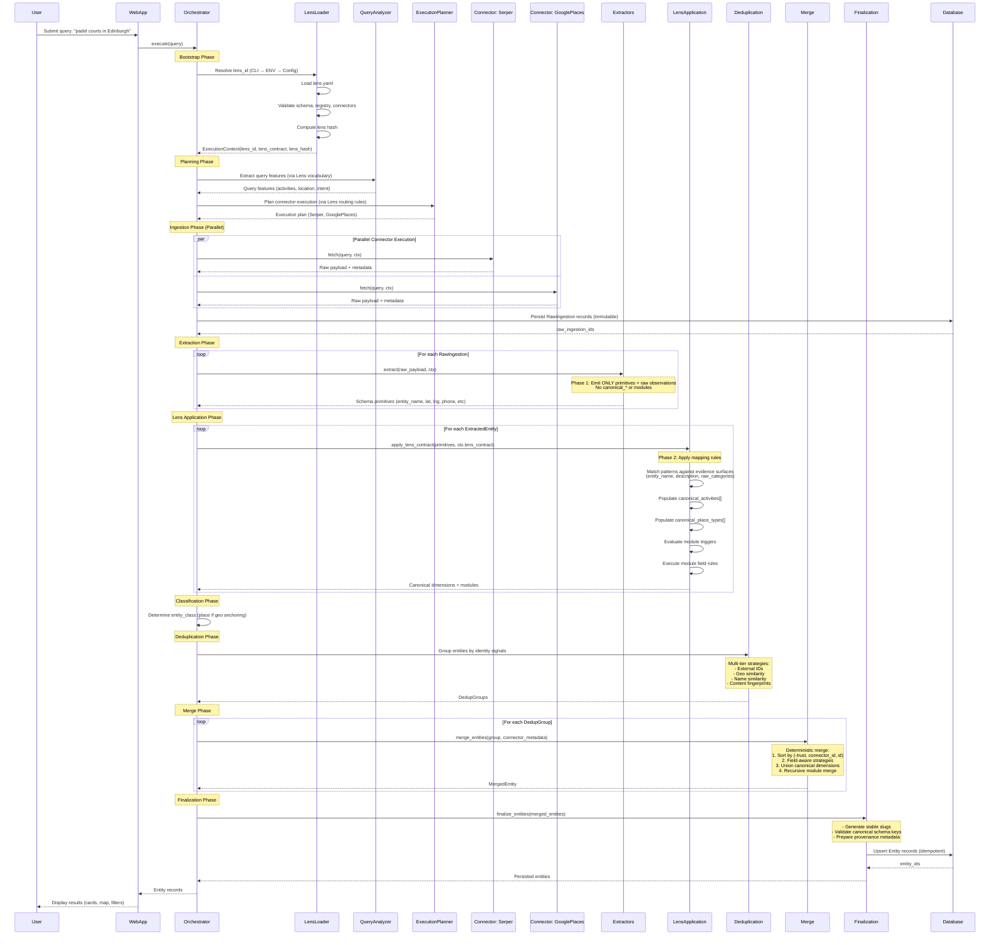

# Backend Documentation — Universal Entity Extraction Engine

**Last Updated:** 2026-02-08
**Status:** Complete
**Authority:** Implementation guide derived from [docs/target/system-vision.md](../target/system-vision.md) and [docs/target/architecture.md](../target/architecture.md)

---

## Table of Contents

1. [Overview](#overview)
2. [Architecture](#architecture)
3. [Orchestration Kernel](#orchestration-kernel)
4. [Ingestion System](#ingestion-system)
5. [Extraction System](#extraction-system)
6. [Lens Layer](#lens-layer)
7. [Schema Generation](#schema-generation)
8. [Module System](#module-system)
9. [Testing Strategy](#testing-strategy)
10. [Development Workflow](#development-workflow)

---

## Overview

The backend engine is a **vertical-agnostic entity extraction platform** that transforms natural language queries into complete, accurate entity records through AI-powered multi-source orchestration.

### Core Principles

**Engine Purity (Immutable)**
- ZERO domain knowledge in engine code
- No domain-specific terms ("Padel", "Wine", "Tennis", "Venue")
- All semantics live exclusively in Lens YAML contracts
- Engine operates only on generic structures and opaque values

**Determinism & Idempotency**
- Same inputs + lens contract → identical outputs
- Re-running queries updates entities, never creates duplicates
- All tie-breaking and merge behavior is deterministic

**Lens Ownership of Semantics**
- Domain vocabulary, mapping rules, canonical registries → Lenses
- Connector routing, module schemas, triggers → Lenses
- Engine executes generic logic; Lenses define interpretation

### Tech Stack

- **Language:** Python 3.x
- **Validation:** Pydantic (schema-driven models)
- **LLM Integration:** Instructor + Anthropic Claude (schema-bound structured output)
- **ORM:** Prisma Client Python
- **Database:** PostgreSQL (Supabase)
- **Testing:** pytest (>80% coverage target)

---

## Architecture

The backend follows a **6-subsystem architecture** as defined in [system-vision.md Section 3](../target/system-vision.md#3-architectural-boundaries):

```mermaid
graph TD
    %% Orchestration Layer
    subgraph Orchestration["Orchestration Layer"]
        ExecutionContext["ExecutionContext<br/>(Immutable context carrier)"]
        QueryFeatures["QueryFeatureExtractor<br/>(Vocabulary-based analysis)"]
        ExecutionPlanner["ExecutionPlanner<br/>(Connector selection)"]
        Orchestrator["Orchestrator<br/>(Pipeline coordinator)"]
        EntityFinalizer["EntityFinalizer<br/>(Slug generation & persistence)"]
    end

    %% Lens Layer
    subgraph LensLayer["Lens Layer"]
        LensLoader["LensLoader<br/>(YAML → runtime contract)"]
        LensValidator["LensValidator<br/>(Bootstrap validation)"]
        MappingEngine["MappingEngine<br/>(Pattern → canonical values)"]
        ModuleTriggerEngine["ModuleTriggerEngine<br/>(Conditional module attachment)"]
    end

    %% Ingestion Layer
    subgraph IngestionLayer["Ingestion Layer"]
        ConnectorRegistry["ConnectorRegistry<br/>(Metadata: trust, cost, phase)"]
        ConnectorAdapters["ConnectorAdapters<br/>(Async bridge & normalization)"]
        RawIngestionStorage["RawIngestionStorage<br/>(Immutable artifact persistence)"]

        subgraph Connectors["Connectors"]
            Serper["Serper"]
            GooglePlaces["GooglePlaces"]
            OSM["OpenStreetMap"]
            SportScotland["SportScotland"]
            EdinburghCouncil["EdinburghCouncil"]
            OpenChargeMap["OpenChargeMap"]
        end
    end

    %% Extraction Layer
    subgraph ExtractionLayer["Extraction Layer"]
        ValidationEngine["ValidationEngine<br/>(Pydantic schemas)"]
        LLMExtractionEngine["LLMExtractionEngine<br/>(Instructor + Claude)"]

        subgraph SourceExtractors["Source Extractors"]
            SerperExtractor["SerperExtractor<br/>(Primitives only)"]
            GooglePlacesExtractor["GooglePlacesExtractor<br/>(Primitives only)"]
            OSMExtractor["OSMExtractor<br/>(Primitives only)"]
            SportScotlandExtractor["SportScotlandExtractor<br/>(Primitives only)"]
            EdinburghCouncilExtractor["EdinburghCouncilExtractor<br/>(Primitives only)"]
            OpenChargeMapExtractor["OpenChargeMapExtractor<br/>(Primitives only)"]
        end

        EntityClassifier["EntityClassifier<br/>(Geographic anchoring rules)"]
        ModuleExtractor["ModuleExtractor<br/>(Generic field rule executor)"]
    end

    %% Deduplication & Merge Layer
    subgraph MergeLayer["Deduplication & Merge"]
        DeduplicationEngine["DeduplicationEngine<br/>(Cross-source grouping)"]
        MergeEngine["MergeEngine<br/>(Metadata-driven conflict resolution)"]
    end

    %% Persistence Layer
    subgraph PersistenceLayer["Persistence Layer"]
        EntityRepository["EntityRepository<br/>(Idempotent upsert)"]
        ProvenanceTracker["ProvenanceTracker<br/>(Source metadata)"]
    end

    %% Schema Generation System
    subgraph SchemaGeneration["Schema Generation"]
        SchemaParser["SchemaParser<br/>(YAML reader)"]
        PythonGenerator["PythonGenerator<br/>(FieldSpecs)"]
        PrismaGenerator["PrismaGenerator<br/>(Database schema)"]
        TypeScriptGenerator["TypeScriptGenerator<br/>(Frontend types)"]
    end

    %% Dependencies - Orchestration
    LensLoader --> ExecutionContext
    LensValidator --> LensLoader
    ExecutionContext --> QueryFeatures
    ExecutionContext --> ExecutionPlanner
    QueryFeatures --> ExecutionPlanner
    ConnectorRegistry --> ExecutionPlanner
    ExecutionPlanner --> Orchestrator
    Orchestrator --> ConnectorAdapters
    Orchestrator --> EntityFinalizer

    %% Dependencies - Lens Layer
    LensLoader --> LensValidator
    LensLoader --> MappingEngine
    LensLoader --> ModuleTriggerEngine

    %% Dependencies - Ingestion
    ConnectorAdapters --> Serper
    ConnectorAdapters --> GooglePlaces
    ConnectorAdapters --> OSM
    ConnectorAdapters --> SportScotland
    ConnectorAdapters --> EdinburghCouncil
    ConnectorAdapters --> OpenChargeMap
    ConnectorAdapters --> RawIngestionStorage
    ConnectorRegistry --> ConnectorAdapters

    %% Dependencies - Extraction
    RawIngestionStorage --> SerperExtractor
    RawIngestionStorage --> GooglePlacesExtractor
    RawIngestionStorage --> OSMExtractor
    RawIngestionStorage --> SportScotlandExtractor
    RawIngestionStorage --> EdinburghCouncilExtractor
    RawIngestionStorage --> OpenChargeMapExtractor

    SerperExtractor --> ValidationEngine
    GooglePlacesExtractor --> ValidationEngine
    OSMExtractor --> ValidationEngine
    SportScotlandExtractor --> ValidationEngine
    EdinburghCouncilExtractor --> ValidationEngine
    OpenChargeMapExtractor --> ValidationEngine

    SerperExtractor --> LLMExtractionEngine
    GooglePlacesExtractor --> LLMExtractionEngine
    OSMExtractor --> LLMExtractionEngine
    SportScotlandExtractor --> LLMExtractionEngine
    EdinburghCouncilExtractor --> LLMExtractionEngine
    OpenChargeMapExtractor --> LLMExtractionEngine

    %% Dependencies - Phase 2: Lens Application (Post-Extraction)
    Orchestrator --> MappingEngine
    Orchestrator --> ModuleTriggerEngine
    MappingEngine --> EntityClassifier
    ModuleTriggerEngine --> EntityClassifier

    %% Dependencies - Merge & Persistence
    EntityClassifier --> DeduplicationEngine
    DeduplicationEngine --> MergeEngine
    ConnectorRegistry --> MergeEngine
    MergeEngine --> EntityFinalizer
    EntityFinalizer --> EntityRepository
    EntityFinalizer --> ProvenanceTracker

    %% Dependencies - Schema Generation
    SchemaParser --> PythonGenerator
    SchemaParser --> PrismaGenerator
    SchemaParser --> TypeScriptGenerator
    PythonGenerator --> ValidationEngine
    PrismaGenerator --> EntityRepository

    %% Styling
    classDef orchestration fill:#e1f5ff,stroke:#01579b,stroke-width:2px
    classDef lens fill:#fff3e0,stroke:#e65100,stroke-width:2px
    classDef ingestion fill:#f3e5f5,stroke:#4a148c,stroke-width:2px
    classDef extraction fill:#e8f5e9,stroke:#1b5e20,stroke-width:2px
    classDef merge fill:#fff8e1,stroke:#f57f17,stroke-width:2px
    classDef persistence fill:#fce4ec,stroke:#880e4f,stroke-width:2px
    classDef schema fill:#e0f2f1,stroke:#004d40,stroke-width:2px

    class ExecutionContext,QueryFeatures,ExecutionPlanner,Orchestrator,EntityFinalizer orchestration
    class LensLoader,LensValidator,MappingEngine,ModuleTriggerEngine lens
    class ConnectorRegistry,ConnectorAdapters,RawIngestionStorage,Serper,GooglePlaces,OSM,SportScotland,EdinburghCouncil,OpenChargeMap ingestion
    class ValidationEngine,LLMExtractionEngine,SerperExtractor,GooglePlacesExtractor,OSMExtractor,SportScotlandExtractor,EdinburghCouncilExtractor,OpenChargeMapExtractor,EntityClassifier,ModuleExtractor extraction
    class DeduplicationEngine,MergeEngine merge
    class EntityRepository,ProvenanceTracker persistence
    class SchemaParser,PythonGenerator,PrismaGenerator,TypeScriptGenerator schema
```



### 11-Stage Pipeline

All executions flow through this canonical pipeline ([architecture.md Section 4.1](../target/architecture.md#41-pipeline-stages-canonical-order)):



---

## Orchestration Kernel

**Location:** `engine/orchestration/`
**Purpose:** Runtime control plane for intelligent multi-source query execution

### Key Components

#### 1. ExecutionContext (`execution_context.py`)

**Immutable context carrier** passed through entire pipeline.

```python
@dataclass(frozen=True)
class ExecutionContext:
    lens_id: str                    # Active lens identifier
    lens_contract: dict             # Validated lens runtime contract
    lens_hash: Optional[str]        # Content hash for reproducibility
```

**Responsibilities:**
- Identify active lens
- Carry validated lens contract
- Enable reproducibility and traceability
- Created once at bootstrap, never mutated

#### 2. QueryFeatureExtractor (`query_features.py`)

**Vocabulary-based query analysis** using lens-defined keywords.

```python
class QueryFeatureExtractor:
    def extract(self, query: str, lens: QueryLens) -> QueryFeatures:
        """
        Extract domain-agnostic features from query using lens vocabulary.

        Detects:
        - Activity mentions (via lens.activity_keywords)
        - Geographic intent (via lens.location_indicators)
        - Category search patterns
        - Facility type mentions
        """
```

**Output:**
```python
@dataclass
class QueryFeatures:
    detected_activities: List[str]          # Matched activity keywords
    has_geo_intent: bool                    # Location indicators present
    looks_like_category_search: bool        # Pattern: "<activity> in <location>"
    mentioned_facilities: List[str]         # Detected facility types
```

**Purity Guarantee:** Uses ONLY lens-provided vocabulary, no hardcoded domain terms.

#### 3. ExecutionPlanner (`planner.py`)

**Intelligent connector selection** based on lens routing rules.

**Responsibilities:**
- Analyze query features
- Match against lens connector_rules triggers
- Build phase-ordered execution plan
- Enforce budget and priority constraints

**Example Lens Rule:**
```yaml
connector_rules:
  sport_scotland:
    priority: high
    triggers:
      - type: any_keyword_match
        keywords: [tennis, padel, squash]
        threshold: 1
      - type: location_match
        keywords: [edinburgh, scotland]
```

**Output:**
```python
@dataclass
class ExecutionPlan:
    connectors: List[ConnectorNode]     # Ordered connector execution nodes
    estimated_cost_usd: float           # Total estimated cost
    phases: List[ExecutionPhase]        # DISCOVERY, STRUCTURED, ENRICHMENT
```

#### 4. Orchestrator (`orchestrator.py`)

**Main pipeline coordinator** enforcing phase barriers and deterministic execution.

**Phase Ordering (Strict):**
1. **DISCOVERY** — Fast, broad coverage (Serper, OSM)
2. **STRUCTURED** — Authoritative structured data (GooglePlaces, SportScotland)
3. **ENRICHMENT** — Specialized vertical data (EdinburghCouncil, OpenChargeMap)

**Execution Guarantees:**
- Phases execute sequentially (no reordering)
- Connectors within phase execute in alphabetical order (determinism)
- Shared ExecutionContext passed through all stages
- Early stopping based on budget/confidence thresholds

**Example Usage:**
```python
orchestrator = Orchestrator(plan=execution_plan)
context = orchestrator.execute(request, query_features)
# context.accepted_entities contains final results
```

#### 5. EntityFinalizer (`entity_finalizer.py`)

**Slug generation and persistence** layer.

**Responsibilities:**
- Group entities by slug candidates
- Generate URL-safe slugs (`"The Padel Club"` → `"padel-club"`)
- Upsert to Entity table (idempotent)
- Preserve provenance metadata

**Slug Generation Rules:**
```python
def generate_slug(entity_name: str) -> str:
    # 1. Lowercase
    # 2. Remove articles (the, a, an)
    # 3. Replace non-alphanumeric with hyphens
    # 4. Deduplicate hyphens
    # 5. Strip leading/trailing hyphens
```

---

## Ingestion System

**Location:** `engine/ingestion/`
**Purpose:** Fetch raw data from 6 external sources

### Connector Registry

**File:** `engine/orchestration/registry.py`

**Central metadata store** for all connectors (trust, cost, phase, timeout).

```python
@dataclass(frozen=True)
class ConnectorSpec:
    name: str                       # "serper", "google_places", etc.
    connector_class: str            # Full Python path
    phase: str                      # "discovery" | "enrichment"
    cost_per_call_usd: float        # Avg cost per API call
    trust_level: float              # 0.0 to 1.0 (1.0 = authoritative)
    timeout_seconds: int            # Max execution timeout
    rate_limit_per_day: int         # Daily request limit
```

**6 Registered Connectors:**

| Connector | Phase | Trust | Cost/Call | Rate Limit |
|-----------|-------|-------|-----------|------------|
| `serper` | DISCOVERY | 0.75 | $0.01 | 2,500/day |
| `google_places` | STRUCTURED | 0.95 | $0.017 | 1,000/day |
| `openstreetmap` | DISCOVERY | 0.70 | $0.00 | 10,000/day |
| `sport_scotland` | ENRICHMENT | 0.90 | $0.00 | 10,000/day |
| `edinburgh_council` | ENRICHMENT | 0.90 | $0.00 | 10,000/day |
| `open_charge_map` | ENRICHMENT | 0.80 | $0.00 | 10,000/day |

**Usage:**
```python
from engine.orchestration.registry import CONNECTOR_REGISTRY, get_connector_instance

spec = CONNECTOR_REGISTRY["serper"]
connector = get_connector_instance("serper")
await connector.db.connect()
results = await connector.fetch("padel courts Edinburgh")
```

### BaseConnector Interface

**File:** `engine/ingestion/base.py`

All connectors implement a common abstract interface:

```python
class BaseConnector(ABC):
    @abstractmethod
    async def fetch(self, query: str) -> RawData:
        """Fetch raw data from external source."""

    @abstractmethod
    async def is_duplicate(self, data: RawData) -> bool:
        """Detect ingestion-level duplicates."""
```

**Connector Responsibilities:**
- Fetch raw payloads from external APIs
- Detect duplicate ingestions (content hash)
- Return raw data + metadata to engine for persistence
- NEVER directly write to Entity table (engine owns persistence)

### Data Flow

```
Query
  ↓
Planner selects connectors based on lens rules
  ↓
Orchestrator executes connectors in phase order
  ↓
Connectors fetch raw payloads
  ↓
Engine persists to RawIngestion table (immutable)
  ↓
Extraction stage processes raw artifacts
```

---

## Extraction System

**Location:** `engine/extraction/`
**Purpose:** Transform raw payloads into structured ExtractedEntity records

### Locked Extraction Contract

**Critical Boundary ([architecture.md Section 4.2](../target/architecture.md#42-boundary-contracts)):**

#### Phase 1: Source Extraction (Extractors)

**Output:** Schema primitives + raw observations ONLY

```python
# ✅ ALLOWED outputs
{
    "entity_name": "The Padel Club",
    "latitude": 55.9533,
    "longitude": -3.1883,
    "street_address": "123 Main St",
    "phone": "+44 131 555 1234",
    "website_url": "https://example.com",
    "description": "Premier padel facility...",
    "raw_categories": ["Sports Club", "Tennis Court"]
}

# ❌ FORBIDDEN outputs (Phase 2 only)
{
    "canonical_activities": ["padel", "tennis"],  # Lens-owned
    "canonical_place_types": ["sports_facility"],  # Lens-owned
    "modules": {...}                               # Lens-owned
}
```

**Rationale:**
- Prevents domain semantics leaking into extractors
- Makes purity mechanically testable
- Centralizes interpretation in Lens layer

#### Phase 2: Lens Application (Engine-Owned)

**Input:** Primitives + raw observations
**Output:** Canonical dimensions + modules

```python
def apply_lens_contract(primitives: dict, lens_contract: dict) -> dict:
    """
    Apply lens mapping rules to populate canonical dimensions.

    1. Match patterns against evidence surfaces:
       - entity_name, description, raw_categories, summary, street_address
    2. Populate canonical_activities[] via mapping rules
    3. Populate canonical_place_types[] via mapping rules
    4. Evaluate module triggers
    5. Execute module field rules
    """
```

**Evidence Surfaces (Default):**
If mapping rule omits `source_fields`, engine searches:
- `entity_name`
- `summary`
- `description`
- `raw_categories`
- `street_address`

### Extractor Implementations

**6 Source-Specific Extractors:**

| Extractor | Source | Strategy |
|-----------|--------|----------|
| `SerperExtractor` | Serper web search | Hybrid (deterministic + LLM for unstructured) |
| `GooglePlacesExtractor` | Google Places API | Deterministic field mapping |
| `OSMExtractor` | OpenStreetMap | Deterministic tag normalization |
| `SportScotlandExtractor` | Sport Scotland API | Deterministic schema alignment |
| `EdinburghCouncilExtractor` | Edinburgh Council API | Deterministic field mapping |
| `OpenChargeMapExtractor` | OpenChargeMap API | Deterministic field extraction |

**Example: GooglePlacesExtractor**

```python
class GooglePlacesExtractor:
    def extract(self, raw_payload: dict, *, ctx: ExecutionContext) -> dict:
        """
        Extract schema primitives from Google Places payload.

        MUST emit only universal schema fields:
        - entity_name, latitude, longitude
        - street_address, city, postcode
        - phone, website_url
        - raw_categories (for Phase 2 lens application)
        """
        result = raw_payload.get("result", {})

        # Geographic primitives
        location = result.get("geometry", {}).get("location", {})

        # Address components (deterministic parsing)
        address_components = self._parse_address_components(
            result.get("address_components", [])
        )

        return {
            "entity_name": result.get("name"),
            "latitude": location.get("lat"),
            "longitude": location.get("lng"),
            "street_address": address_components.get("street_address"),
            "city": address_components.get("city"),
            "postcode": address_components.get("postcode"),
            "phone": result.get("formatted_phone_number"),
            "website_url": result.get("website"),
            "raw_categories": result.get("types", []),
            "description": result.get("editorial_summary", {}).get("overview")
        }
```

### LLM Extraction Engine

**File:** `engine/extraction/llm_client.py`

**Schema-Bound LLM Usage:**
- LLMs produce ONLY Pydantic-validated structured output
- Free-form or unvalidated LLM output is forbidden
- Instructor library enforces schema compliance

```python
from instructor import from_anthropic
from anthropic import Anthropic

client = from_anthropic(Anthropic(api_key=os.getenv("ANTHROPIC_API_KEY")))

response = client.messages.create(
    model="claude-3-5-sonnet-20241022",
    response_model=EntityExtraction,  # Pydantic schema
    messages=[{"role": "user", "content": prompt}]
)
# response is guaranteed to match EntityExtraction schema
```

**LLM Constraints:**
- Deterministic rules ALWAYS run first
- LLM extraction only when deterministic extraction insufficient
- Maximum 1 LLM call per module per payload
- Confidence scores tracked for merge decisions

### Entity Classifier

**File:** `engine/extraction/entity_classifier.py`

**Deterministic classification** using geographic anchoring rules.

```python
def classify_entity(extracted: dict) -> str:
    """
    Determine entity_class using universal rules.

    Classification logic:
    - Has geographic anchoring? → "place"
      - Anchoring = coordinates OR street_address OR city OR postcode
    - Has time_range? → "event"
    - Organization signals? → "organization"
    - Person signals? → "person"
    - Default → "thing"
    """
```

**No domain semantics:** Classifier never uses activity keywords or domain heuristics.

---

## Lens Layer

**Location:** `engine/lenses/`
**Purpose:** Pluggable vertical interpretation through YAML contracts

### Core Principle

**Engine:** Knows NOTHING about domains
**Lenses:** Provide ALL domain-specific vocabulary and routing

**Extensibility:** Adding a new vertical requires ZERO engine code changes.

### Lens Structure

Each lens is defined in `engine/lenses/<lens_id>/lens.yaml`:

```yaml
# Example: engine/lenses/edinburgh_finds/lens.yaml

vocabulary:
  activity_keywords:
    - tennis
    - padel
    - squash
    - football
  location_indicators:
    - edinburgh
    - leith
    - stockbridge
  facility_keywords:
    - court
    - club
    - venue

connector_rules:
  sport_scotland:
    priority: high
    triggers:
      - type: any_keyword_match
        keywords: [tennis, padel, squash]
        threshold: 1

mapping_rules:
  - id: map_tennis_activity
    pattern: "(?i)tennis|racket sports"
    dimension: canonical_activities
    value: tennis
    confidence: 0.95
    source_fields: [entity_name, raw_categories, description]

  - id: map_sports_facility_type
    pattern: "(?i)sports club|tennis club|padel club"
    dimension: canonical_place_types
    value: sports_facility
    confidence: 0.90

module_triggers:
  - when:
      dimension: canonical_activities
      values: [tennis, padel, squash]
    add_modules: [sports_facility]

canonical_values:
  tennis:
    display_name: "Tennis"
    seo_slug: "tennis"
    icon: "racquet"
  sports_facility:
    display_name: "Sports Facility"
    seo_slug: "sports-facility"
```

### Lens Loading Lifecycle

**Bootstrap Validation (Fail-Fast):**

```python
# 1. Load lens.yaml from disk
lens_path = Path(f"engine/lenses/{lens_id}/lens.yaml")
with lens_path.open() as f:
    lens_config = yaml.safe_load(f)

# 2. Validate schema structure
validate_lens_schema(lens_config)

# 3. Validate canonical registry integrity
validate_canonical_registry(lens_config["canonical_values"])

# 4. Validate connector references
validate_connector_references(
    lens_config["connector_rules"],
    CONNECTOR_REGISTRY
)

# 5. Compile regex patterns
compile_mapping_patterns(lens_config["mapping_rules"])

# 6. Compute deterministic hash
lens_hash = hash_lens_content(lens_config)

# 7. Materialize runtime contract
lens_contract = materialize_lens_contract(lens_config, lens_hash)

# 8. Inject into ExecutionContext
ctx = ExecutionContext(
    lens_id=lens_id,
    lens_contract=lens_contract,
    lens_hash=lens_hash
)
```

**Any validation failure → abort execution immediately.**

### Mapping Rule Execution

**Generic, domain-blind engine logic:**

```python
def apply_mapping_rules(
    primitives: dict,
    mapping_rules: List[dict],
    canonical_registry: dict
) -> dict:
    """
    Apply lens mapping rules to populate canonical dimensions.

    Execution semantics:
    1. Rules execute over union of source_fields (or default surfaces)
    2. First match wins per rule
    3. Multiple rules may contribute to same dimension
    4. Duplicate values deduplicated
    5. Ordering stabilized deterministically
    """
    canonical_dimensions = {
        "canonical_activities": [],
        "canonical_roles": [],
        "canonical_place_types": [],
        "canonical_access": []
    }

    for rule in mapping_rules:
        # Get evidence surfaces
        fields = rule.get("source_fields") or DEFAULT_EVIDENCE_SURFACES
        evidence = " ".join(str(primitives.get(f, "")) for f in fields)

        # Match pattern
        pattern = re.compile(rule["pattern"], re.IGNORECASE)
        if pattern.search(evidence):
            dimension = rule["dimension"]
            value = rule["value"]

            # Validate against registry
            if value not in canonical_registry:
                raise ValueError(f"Undeclared canonical value: {value}")

            # Append to dimension (deduplicated later)
            canonical_dimensions[dimension].append(value)

    # Deduplicate and sort deterministically
    for dimension in canonical_dimensions:
        canonical_dimensions[dimension] = sorted(set(canonical_dimensions[dimension]))

    return canonical_dimensions
```

### QueryLens Integration

**File:** `engine/lenses/query_lens.py`

**Lightweight lens accessor** for query orchestration:

```python
class QueryLens:
    def get_activity_keywords(self) -> List[str]:
        """Return lens-defined activity terms for query analysis."""

    def get_location_indicators(self) -> List[str]:
        """Return lens-defined location keywords."""

    def get_connectors_for_query(
        self,
        query: str,
        query_features: QueryFeatures
    ) -> List[str]:
        """Determine which connectors should run based on trigger rules."""
```

**Usage:**
```python
lens = get_active_lens("edinburgh_finds")
keywords = lens.get_activity_keywords()
features = QueryFeatureExtractor(lens).extract("padel courts Edinburgh")
connectors = lens.get_connectors_for_query(query, features)
# connectors = ["sport_scotland", "edinburgh_council"]
```

---

## Schema Generation

**Location:** `engine/schema/`
**Purpose:** Single source of truth for all data models

### Architecture

**YAML → Auto-Generated Schemas:**

```
engine/config/schemas/*.yaml (Single Source of Truth)
    ↓
engine/schema/generate.py
    ↓
├─→ Python FieldSpecs (engine/schema/<entity>.py)
├─→ Prisma Schema (web/prisma/schema.prisma)
└─→ TypeScript Interfaces (web/lib/types/generated/<entity>.ts)
```

### YAML Schema Example

**File:** `engine/config/schemas/entity.yaml`

```yaml
entity_name: Entity
fields:
  - name: id
    type: string
    required: true
    description: Unique entity identifier

  - name: entity_name
    type: string
    required: true
    description: Primary display name

  - name: entity_class
    type: enum
    values: [place, person, organization, event, thing]
    required: true

  - name: canonical_activities
    type: array
    item_type: string
    description: Opaque activity identifiers (lens-owned)

  - name: canonical_place_types
    type: array
    item_type: string
    description: Opaque place type identifiers (lens-owned)

  - name: modules
    type: json
    description: Namespaced structured modules
```

### Generation Command

```bash
# Validate schemas
python -m engine.schema.generate --validate

# Regenerate all derived schemas
python -m engine.schema.generate --all

# Generated files are marked "DO NOT EDIT" - never modify directly
```

### Schema Validation

**Enforcement:**
- Schema changes require regeneration before commit
- Generated files have "DO NOT EDIT" headers
- CI validates schema consistency
- Eliminates schema drift across Python/Prisma/TypeScript

**Prohibited Patterns:**
```python
# ❌ WRONG: Manual Prisma schema edits
# web/prisma/schema.prisma (GENERATED FILE)

# ✅ RIGHT: Edit YAML source
# engine/config/schemas/entity.yaml
```

---

## Module System

**Location:** `engine/extraction/module_extractor.py`
**Purpose:** Declarative, lens-owned structured data extraction

### Core Principle

**Module field extraction is:**
- Declarative (rules in lens YAML)
- Lens-owned (semantics in lens contracts)
- Schema-driven (Pydantic validation)
- Executed by generic engine interpreter
- Fully domain-blind inside engine code

### Module Definition (Lens YAML)

```yaml
modules:
  sports_facility:
    description: "Structured data for sports facilities"
    field_rules:
      - rule_id: extract_tennis_courts
        target_path: tennis_courts.total
        source_fields: [NumTennisCourts, tennis_count]
        extractor: numeric_parser
        confidence: 0.90
        applicability:
          source: [sport_scotland, google_places]
          entity_class: [place]
        normalizers: [round_integer]

      - rule_id: extract_surface_type
        target_path: tennis_courts.surface
        source_fields: [SurfaceType, court_surface]
        extractor: regex_capture
        pattern: "(?i)(hard|clay|grass|artificial)"
        confidence: 0.85
        normalizers: [lowercase, list_wrap]
```

### Extractor Vocabulary

**Deterministic Extractors:**
- `numeric_parser` — Parse numeric values
- `regex_capture` — Extract via regex patterns
- `json_path` — Navigate JSON structures
- `boolean_coercion` — Convert to boolean
- `coalesce` — First non-null value
- `array_builder` — Construct arrays
- `string_template` — String interpolation

**LLM Extractors:**
- `llm_structured` — Schema-bound LLM extraction (max 1 call per module)

**Normalizers (Post-Processing):**
- `trim`, `lowercase`, `uppercase`
- `list_wrap`, `comma_split`
- `round_integer`

### Execution Semantics

```python
def extract_module_fields(
    raw_data: dict,
    module_def: dict,
    source: str,
    entity_class: str
) -> dict:
    """
    Execute module field rules generically.

    Process:
    1. Filter rules by applicability (source, entity_class)
    2. Execute deterministic rules first
    3. Evaluate conditions for remaining LLM rules
    4. Build schema covering only remaining fields
    5. Execute single batched LLM call if required
    6. Validate and normalize outputs
    7. Write results to target paths
    """
```

**Error Handling:**
- Deterministic rule failures → log, skip field, continue
- LLM failures → log, continue with partial module data
- Lens validation failures → fail fast at bootstrap

---

## Testing Strategy

**Location:** `tests/engine/`
**Coverage Target:** >80%

### Test Categories

**1. Unit Tests**
- Mock external dependencies (APIs, LLM calls)
- Test success and failure cases
- Use fixtures for common setup

**2. Integration Tests**
- Test complete data flows (ingest → extract → merge)
- Verify database transactions
- Snapshot testing for extraction outputs

**3. Contract Tests**
- Validate extractor output contracts (Phase 1 primitives only)
- Validate lens application outputs (canonical dimensions + modules)
- Enforce purity boundaries

**4. Purity Tests**
- Detect domain literals in engine code
- Validate import boundaries (engine must not import lens implementations)
- Flag connector-specific logic in merge

### Running Tests

```bash
# All tests
pytest

# Fast tests only (excludes @pytest.mark.slow)
pytest -m "not slow"

# Coverage report
pytest --cov=engine --cov-report=html

# Specific module
pytest engine/orchestration/

# With verbose output
pytest -v
```

### Test Markers

```python
import pytest

@pytest.mark.slow
def test_llm_extraction_end_to_end():
    """Mark tests >1 second as 'slow' for fast iteration."""

@pytest.mark.integration
def test_full_pipeline():
    """Integration tests span multiple subsystems."""
```

### Fixtures

**Example:** `tests/engine/fixtures/raw_payloads/`

```python
# tests/conftest.py

@pytest.fixture
def serper_padel_payload():
    """Real Serper API response for 'padel courts Edinburgh'."""
    fixture_path = Path("tests/engine/fixtures/raw_payloads/serper_padel.json")
    return json.loads(fixture_path.read_text())

@pytest.fixture
def mock_lens_contract():
    """Minimal valid lens contract for testing."""
    return {
        "lens_id": "test_lens",
        "vocabulary": {"activity_keywords": ["test"]},
        "canonical_values": {"test_activity": {"display_name": "Test"}},
        "mapping_rules": [],
        "connector_rules": {}
    }
```

---

## Development Workflow

### Daily Commands

```bash
# Backend Tests
pytest                        # All tests
pytest -m "not slow"          # Fast tests only
pytest --cov=engine --cov-report=html  # Coverage report

# Schema Management
python -m engine.schema.generate --validate   # Validate YAML schemas
python -m engine.schema.generate --all        # Regenerate derived schemas

# Data Pipeline
python -m engine.ingestion.cli run --query "padel courts Edinburgh"
python -m engine.extraction.cli single <raw_ingestion_id>
python -m engine.orchestration.cli run "padel clubs in Edinburgh"
```

### TDD Workflow (Red → Green → Refactor)

**1. Red — Write Failing Test**
```python
def test_extract_tennis_courts_from_sport_scotland():
    """Test that SportScotlandExtractor emits primitives only."""
    raw_payload = load_fixture("sport_scotland_facility.json")
    extractor = SportScotlandExtractor()

    result = extractor.extract(raw_payload, ctx=mock_context)

    # Phase 1 contract: primitives only
    assert "entity_name" in result
    assert "latitude" in result
    assert "raw_categories" in result

    # Phase 1 contract: NO canonical dimensions
    assert "canonical_activities" not in result
    assert "modules" not in result
```

**2. Green — Implement Minimum Code**
```python
class SportScotlandExtractor:
    def extract(self, raw_payload: dict, *, ctx: ExecutionContext) -> dict:
        facility = raw_payload.get("facility", {})

        return {
            "entity_name": facility.get("name"),
            "latitude": facility.get("latitude"),
            "longitude": facility.get("longitude"),
            "raw_categories": facility.get("activities", [])
        }
```

**3. Refactor — Improve While Green**
```python
class SportScotlandExtractor:
    def extract(self, raw_payload: dict, *, ctx: ExecutionContext) -> dict:
        facility = raw_payload.get("facility", {})

        # Extract geographic primitives
        coordinates = self._extract_coordinates(facility)

        # Extract address components
        address = self._parse_address(facility.get("address", {}))

        return {
            **coordinates,
            **address,
            "entity_name": facility.get("name"),
            "raw_categories": facility.get("activities", [])
        }
```

### Quality Gates (All Required)

✅ All tests pass (`pytest`)
✅ >80% test coverage (`pytest --cov=engine`)
✅ Schema validation passes (`python -m engine.schema.generate --validate`)
✅ No domain literals in engine code (purity tests)
✅ No legacy naming patterns (field naming validation)

### Before Committing

```bash
# 1. Validate schemas
python -m engine.schema.generate --validate

# 2. Run tests
pytest

# 3. Check coverage
pytest --cov=engine --cov-report=term-missing

# 4. Regenerate schemas if modified
python -m engine.schema.generate --all

# 5. Commit with conventional format
git add .
git commit -m "feat(extraction): add SportScotland extractor

- Implement Phase 1 contract (primitives only)
- Add fixture for SportScotland API response
- Validate extractor purity (no canonical dimensions)

Co-Authored-By: Claude Sonnet 4.5 <noreply@anthropic.com>"
```

---

## Architectural Guardrails

### Prohibited Patterns

❌ Domain terms in engine code ("Padel", "Wine", "Tennis", "Venue")
❌ Connector-specific logic in merge
❌ Lens semantics embedded in engine
❌ Permanent translation layers
❌ Silent fallbacks or hidden defaults
❌ Extractors emitting canonical_* or modules
❌ Non-deterministic behavior in core processing

### Enforcement Mechanisms

**1. Import Boundary Tests**
```python
def test_engine_does_not_import_lens_implementations():
    """Engine code must not import lens loaders or registries."""
    engine_modules = get_all_python_files("engine/")

    for module in engine_modules:
        if "lenses/loader.py" in module:
            continue  # Allowed: query_lens.py for orchestration

        assert "from engine.lenses." not in read_file(module)
```

**2. Literal Detection Tests**
```python
def test_no_domain_literals_in_engine():
    """Prevent hardcoded canonical values in engine code."""
    engine_code = get_all_python_files("engine/")
    domain_terms = ["padel", "wine", "tennis", "venue"]

    for file in engine_code:
        content = read_file(file).lower()
        for term in domain_terms:
            assert term not in content, f"Domain literal '{term}' found in {file}"
```

**3. Contract Validation Tests**
```python
def test_extractor_output_contract():
    """Extractors must emit primitives only (Phase 1)."""
    extractor = SerperExtractor()
    result = extractor.extract(raw_payload, ctx=mock_context)

    # Allowed: Universal schema primitives
    allowed_fields = {"entity_name", "latitude", "longitude", "street_address",
                      "phone", "website_url", "raw_categories", "description"}

    # Forbidden: Lens-owned fields
    forbidden_fields = {"canonical_activities", "canonical_roles",
                        "canonical_place_types", "modules"}

    for field in result.keys():
        assert field in allowed_fields or field.startswith("_raw_"), \
            f"Extractor emitted forbidden field: {field}"
```

---

## Key Files Reference

- **Architectural Constitution:** [docs/target/system-vision.md](../target/system-vision.md) (immutable invariants)
- **Runtime Specification:** [docs/target/architecture.md](../target/architecture.md) (concrete pipeline, contracts)
- **Schema Authority:** `engine/config/schemas/*.yaml` (single source of truth)
- **Orchestration Kernel:** `engine/orchestration/` (planner, orchestrator, context)
- **Ingestion System:** `engine/ingestion/` (6 connectors, registry)
- **Extraction System:** `engine/extraction/` (extractors, LLM client, classifiers)
- **Lens Layer:** `engine/lenses/` (query_lens.py, loader.py)
- **Schema Generation:** `engine/schema/` (generate.py, generators/)

---

## Success Criteria

### One Perfect Entity (OPE) Validation Gate

At least ONE entity must flow end-to-end with:
- Correct `entity_class`
- Non-empty canonical dimensions (where evidence exists)
- All triggered modules attached + at least one module field populated
- Accurate universal primitives
- Provenance preserved

### Multi-Source Merge Validation Gate

At least ONE entity from multiple sources merged deterministically:
- Cross-source deduplication working
- Idempotent re-runs converge to same output
- Metadata-driven conflict resolution (no connector-specific logic)

---

## Environment Setup

### Required Environment Variables

```bash
# Engine (.env or environment)
ANTHROPIC_API_KEY=<your_key>      # For LLM extraction
SERPER_API_KEY=<your_key>         # For Serper connector
GOOGLE_PLACES_API_KEY=<your_key>  # For Google Places connector

# Database (shared with web)
DATABASE_URL=<supabase_postgres_url>
```

### Database Setup

```bash
cd web
npx prisma generate  # Generate Prisma client from schema
npx prisma db push   # Sync schema to Supabase (dev)
npx prisma migrate dev  # Create migration (production)
```

---

## Next Steps

1. **Understand the Architecture**
   - Read [system-vision.md](../target/system-vision.md) (immutable architectural constitution)
   - Read [architecture.md](../target/architecture.md) (runtime mechanics)

2. **Explore the Code**
   - Browse `engine/orchestration/` for pipeline control flow
   - Browse `engine/extraction/extractors/` for data source adapters
   - Browse `engine/lenses/` for lens configuration examples

3. **Run the Pipeline**
   ```bash
   python -m engine.orchestration.cli run "padel courts in Edinburgh"
   ```

4. **Contribute**
   - Follow TDD workflow (Red → Green → Refactor)
   - Preserve engine purity (no domain terms)
   - Validate against quality gates before committing

---

**Questions?** Consult [system-vision.md Section 8](../target/system-vision.md#8-how-humans-and-ai-agents-should-use-this-document) for architectural guidance.
