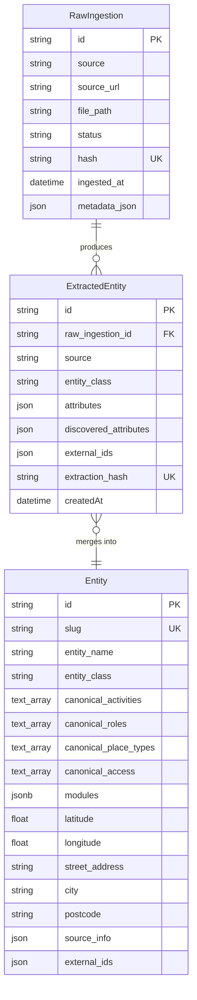

# DATABASE.md - Universal Entity Extraction Engine Database Design

## Overview

The Universal Entity Extraction Engine uses PostgreSQL (hosted on Supabase) as its canonical data store, reflecting an architecture where **database structure is universal** but **data semantics are lens-owned**.

This design directly operationalizes the engine's core invariant: the engine owns structure, indexing, persistence, and lifecycle guarantees, while Lenses own all domain interpretation, vocabulary, and meaning.

**Architectural Philosophy**

The database schema embodies three critical separation-of-concerns principles:

1. **Universal Structure, Opaque Values** — All entities conform to a stable universal schema (`entity_class`, canonical dimension arrays, namespaced modules, provenance) regardless of vertical. Field names are authoritative end-to-end; the engine never translates or interprets domain values.

2. **No Domain Semantics in Schema** — The database stores opaque identifiers like `canonical_activities: ["tennis", "padel"]` or `canonical_roles: ["coaching_provider"]` without knowing what "tennis" or "coaching_provider" mean. All semantic interpretation lives exclusively in Lens YAML contracts.

3. **Deterministic Persistence** — The schema enforces determinism through GIN-indexed arrays, stable primary keys, and idempotent upsert contracts. Re-running the same execution updates existing entities rather than creating duplicates.

**Technology Rationale**

- **PostgreSQL** — Provides native array types with GIN indexing for efficient multi-valued dimension queries, JSONB for structured modules, and ACID guarantees for deterministic persistence
- **Supabase** — Managed PostgreSQL with built-in auth, real-time subscriptions, and edge functions for future frontend needs
- **Prisma ORM** — Schema-driven client generation ensures TypeScript and Python access layers remain synchronized with the canonical schema

**Schema Single Source of Truth**

All schema definitions originate from `engine/config/schemas/*.yaml`. These YAML files auto-generate three derived artifacts:

- `engine/schema/*.py` (Python FieldSpecs for validation)
- `web/prisma/schema.prisma` and `engine/prisma/schema.prisma` (Prisma schemas)
- `web/lib/types/generated/*.ts` (TypeScript interfaces)

Generated files are marked "DO NOT EDIT" and overwritten on regeneration. This eliminates schema drift and enables horizontal scaling: adding a new vertical requires only a new YAML file, not database migrations or ORM changes.

**Separation of Structure vs Semantics**

The database enforces structural contracts (arrays never null, no duplicate dimension values, stable ordering) but never validates semantic correctness (whether "tennis" is a valid activity or whether an entity should have that value). Semantic validation occurs exclusively through Lens mapping rules during the extraction pipeline.

This boundary is absolute: the engine persists structure, Lenses define meaning.

## Core Tables

The database implements a three-tier artifact pipeline that preserves immutability guarantees while enabling deterministic entity formation through multi-source merge.

### RawIngestion (Immutable Source Artifacts)

Stores raw payloads from connectors as immutable artifacts. Once persisted, these records are never modified.

```sql
RawIngestion {
  id: String (CUID)
  source: String                    -- Connector identifier (e.g., "serper", "google_places")
  source_url: String                -- Original query or URL
  file_path: String                 -- Physical location of raw JSON payload
  status: String                    -- "success" | "failed" | "pending"
  hash: String                      -- Content hash for ingestion-level deduplication
  ingested_at: DateTime
  metadata_json: String             -- Connector-specific metadata
  orchestration_run_id: String?     -- Parent orchestration context
}

Indexes: [source], [status], [hash], [ingested_at], [orchestration_run_id]
```

**Immutability Contract:** Raw ingestion records are write-once. Downstream stages consume these artifacts as read-only inputs. Re-running identical queries produces idempotent hash-based deduplication rather than duplicate records.

### ExtractedEntity (Phase 1 Output)

Stores structured primitives and raw observations from source-specific extractors. Per the locked extraction contract (architecture.md §4.2), extractors emit **only** schema primitives and raw observations—never canonical dimensions or modules.

```sql
ExtractedEntity {
  id: String (CUID)
  raw_ingestion_id: String          -- FK to RawIngestion
  source: String                    -- Connector identifier
  entity_class: String              -- Universal classification: place|person|organization|event|thing
  attributes: String                -- Schema primitives (entity_name, latitude, longitude, street_address, etc.)
  discovered_attributes: String     -- Raw observations for downstream lens interpretation
  external_ids: String              -- Source-native identifiers for cross-source deduplication
  extraction_hash: String           -- Deterministic hash of extraction output
  model_used: String?               -- LLM model identifier if applicable
  createdAt: DateTime
}

Indexes: [raw_ingestion_id], [source], [entity_class], [extraction_hash]
```

**Phase Boundary Enforcement:** Extractors populate `attributes` (primitives like `entity_name`, `latitude`, `street_address`) and `discovered_attributes` (raw categories, descriptions). Canonical dimensions (`canonical_activities`, `canonical_roles`, etc.) and modules are populated exclusively by Phase 2 lens application.

### Entity (Canonical Merged Entities)

Stores final canonical entities after cross-source deduplication, deterministic merge, and finalization. This is the authoritative representation of real-world entities.

```sql
Entity {
  id: String (CUID)
  slug: String (unique)             -- URL-safe stable identifier
  entity_name: String
  entity_class: String              -- place | person | organization | event | thing

  -- Universal Primitives
  summary: String?
  description: String?
  street_address: String?
  city: String?
  postcode: String?
  country: String?
  latitude: Float?
  longitude: Float?
  phone: String?
  email: String?
  website_url: String?

  -- Social Media
  instagram_url: String?
  facebook_url: String?
  twitter_url: String?
  linkedin_url: String?
  mainImage: String?

  -- Canonical Dimensions (Lens-Owned Values)
  canonical_activities: String[]    -- Multi-valued opaque identifiers
  canonical_roles: String[]
  canonical_place_types: String[]
  canonical_access: String[]

  -- Raw Observations
  raw_categories: String[]
  discovered_attributes: Json       -- Unstructured observations

  -- Structured Modules (Lens-Defined Schemas)
  modules: Json                     -- Namespaced domain-specific attributes

  -- Provenance
  source_info: Json                 -- Contributing sources and trust metadata
  external_ids: Json                -- Cross-source identifiers
  field_confidence: Json            -- Per-field confidence scores
  opening_hours: Json

  createdAt: DateTime
  updatedAt: DateTime
}

Indexes: [slug], [entity_name], [entity_class], [city], [postcode], [latitude, longitude]
```

**Canonical Dimensions Contract:** The four canonical dimension arrays are universal structures defined by the engine, but all values are opaque identifiers defined exclusively by lens contracts. The engine never interprets semantic meaning—it only enforces structural integrity (no nulls, no duplicates, deterministic ordering).

**Module Storage:** The `modules` field stores namespaced JSON structures (e.g., `modules.sports_facility`, `modules.amenities`). Universal modules are always available; domain modules are attached conditionally via lens triggers. Module schemas are defined in lens contracts and validated at load time.

**Immutability vs Upsert:** Entity records are updated via idempotent upsert keyed on `slug`. Re-running the same query with identical inputs produces deterministic convergence to the same canonical state rather than duplicate entities. Provenance metadata accumulates rather than overwrites.

### Artifact Flow Summary

```
Query → Orchestrator → Connectors
                           ↓
                    RawIngestion (immutable)
                           ↓
               Source Extractors (Phase 1)
                           ↓
                  ExtractedEntity (immutable, primitives only)
                           ↓
            Lens Application (Phase 2: canonical dimensions + modules)
                           ↓
              Deduplication + Deterministic Merge
                           ↓
                 Finalization (slug generation)
                           ↓
                    Entity (idempotent upsert)
```

**Key Constraints:**
- `RawIngestion.hash` enables content-based deduplication at ingestion level
- `ExtractedEntity.raw_ingestion_id` preserves traceability to source artifacts
- `Entity.slug` provides stable, human-readable identifiers for frontend routing
- `Entity.external_ids` enables cross-source entity resolution during deduplication
- GIN indexes on canonical dimension arrays support efficient containment queries (`WHERE 'tennis' = ANY(canonical_activities)`)

## Universal Schema Fields

The engine defines a fixed set of primitive fields that apply to all entities regardless of vertical. These fields represent the universal structure through which all domain data flows.

**Naming Authority:** Field names defined in `engine/config/schemas/entity.yaml` are canonical and immutable across the entire pipeline. Extractors emit these exact names, merge logic consumes these exact names, and finalization persists these exact names. No translation layers exist.

### Identity Fields

**`entity_name`** (String, required)
- Official name of the entity
- Primary human-readable identifier
- Used in slug generation and search ranking
- Validators: non-empty
- Example: `"The Padel Club Edinburgh"`

**`entity_class`** (String, engine-populated)
- Universal classification: `place | person | organization | event | thing`
- Determined by `entity_classifier.py` using deterministic rules based on geographic anchoring (coordinates, street address, city, postcode)
- Never populated by extractors or LLMs
- Opaque to domain logic—engine uses this for structural routing only
- Example: `"place"`

**`slug`** (String, unique, engine-generated)
- URL-safe stable identifier derived from `entity_name`
- Auto-generated by `SlugGenerator` during finalization
- Used for frontend routing and canonical URLs
- Example: `"padel-club-edinburgh"`

### Geographic Fields

**`latitude`** (Float, nullable)
- WGS84 decimal degrees
- Populated by source extractors from connector payloads
- Used for classification (any geo anchor → likely `place`) and geo queries
- Example: `55.953251`

**`longitude`** (Float, nullable)
- WGS84 decimal degrees
- Must be paired with latitude for valid geocoding
- Example: `-3.188267`

**`street_address`** (String, nullable)
- Full street address including building number, street name
- Does not include city or postcode (separate fields)
- Example: `"12 Lochrin Place"`

**`city`** (String, nullable, indexed)
- City or town name
- Used for geographic filtering and classification
- Example: `"Edinburgh"`

**`postcode`** (String, nullable, indexed)
- Full UK postcode with correct spacing
- Validators: `postcode_uk` (e.g., `"EH3 9QX"`)
- Example: `"EH3 9QX"`

**`country`** (String, nullable)
- Country name
- Currently UK-focused but schema supports international expansion
- Example: `"United Kingdom"`

### Contact Fields

**`phone`** (String, nullable)
- Primary contact phone number
- Validators: `e164_phone` (must include country code)
- Format: E.164 UK standard (e.g., `"+441315397071"`)

**`email`** (String, nullable)
- Primary public email address
- Example: `"info@padelclub.co.uk"`

**`website_url`** (String, nullable)
- Official website URL
- Validators: `url_http` (must be valid HTTP/HTTPS URL)
- Example: `"https://www.padelclub.co.uk"`

### Social Media URLs

**`instagram_url`** (String, nullable)
- Instagram profile URL or handle
- Example: `"https://instagram.com/padelclub"`

**`facebook_url`** (String, nullable)
- Facebook page URL

**`twitter_url`** (String, nullable)
- Twitter/X profile URL or handle

**`linkedin_url`** (String, nullable)
- LinkedIn company page URL

### Content Fields

**`summary`** (String, nullable)
- Short overall description summarizing all gathered data
- Typically 1-3 sentences
- Used for search snippets and card previews
- Example: `"Edinburgh's premier indoor padel facility with 6 courts, coaching programs, and a pro shop."`

**`description`** (String, nullable)
- Long-form aggregated evidence from multiple sources
- May include reviews, snippets, editorial summaries
- Used for entity detail pages

### Legacy Naming Patterns (FORBIDDEN)

The following naming patterns are **permanently forbidden** and will cause validation failures:

- **`location_*`** (e.g., `location_lat`, `location_lng`, `location_address`) → Use `latitude`, `longitude`, `street_address`
- **`contact_*`** (e.g., `contact_phone`, `contact_email`) → Use `phone`, `email`
- **`address_*`** (e.g., `address_street`, `address_city`) → Use `street_address`, `city`
- **Ambiguous aliases** (e.g., `website` instead of `website_url`, `name` instead of `entity_name`)

**Enforcement:** Legacy detection runs during extraction validation. In Phase 1 (migration), legacy patterns emit warnings. In Phase 2 (enforcement), they trigger fatal errors and block execution.

**Rationale:** Permanent translation layers introduce hidden coupling, ambiguity, and long-term technical debt. The universal schema is the single source of truth across all stages.

### Field Ownership by Stage

**Source Extractors (Phase 1):**
- Emit ONLY universal primitives listed above
- NEVER emit `canonical_*` dimensions or `modules` fields
- Example valid output: `{entity_name, latitude, longitude, street_address, phone, website_url}`

**Lens Application (Phase 2):**
- Consumes universal primitives
- Populates `canonical_activities`, `canonical_roles`, `canonical_place_types`, `canonical_access`
- Populates `modules` using lens-defined field rules

**Finalization:**
- Consumes merged primitives and canonical dimensions
- Generates `slug` from `entity_name`
- Persists to `Entity` table using **only canonical keys** (no legacy naming)

### Validation Strategy

Universal schema validation occurs at three enforcement points:

1. **Extractor Output Validation** — Ensures extractors emit only permitted primitive fields and use exact canonical names
2. **Merge Contract Validation** — Verifies merge logic operates on canonical field names without translation
3. **Finalization Validation** — Confirms slug generation and upsert use canonical schema keys only

**Permissive Mode (Phase 1):** Warn on legacy naming, allow execution to continue for migration
**Strict Mode (Phase 2):** Treat legacy naming as fatal error, block execution

## Canonical Dimensions

The engine maintains exactly four canonical dimension arrays that provide queryable structure across all verticals. These dimensions are defined in `engine/config/schemas/entity.yaml` and represent the universal structural contract through which domain-specific vocabulary flows.

**Constitutional Status:** Adding, removing, or redefining canonical dimensions requires explicit architectural review and amendment to `docs/target/system-vision.md` (§5.2). The current four-dimension model is architecturally locked.

### The Four Dimensions

**`canonical_activities`** (TEXT[])
- What activities occur at or are provided by the entity
- Examples (opaque to engine): `["tennis", "padel", "squash"]`, `["wine_tasting", "vineyard_tours"]`
- Lens interpretation: Maps raw categories/descriptions to standardized activity identifiers
- Used for: Activity-based filtering, "Find places offering [activity]" queries

**`canonical_roles`** (TEXT[])
- What functional roles the entity serves in its domain
- Examples (opaque to engine): `["coaching_provider", "facility_operator"]`, `["retailer", "venue"]`
- Lens interpretation: Determines entity purpose and service model
- Used for: Internal faceting (not typically shown in UI), query routing, module triggers

**`canonical_place_types`** (TEXT[])
- Physical infrastructure classification (applicable to `entity_class: place` only)
- Examples (opaque to engine): `["sports_club", "gym"]`, `["winery", "tasting_room"]`
- Lens interpretation: Maps venue types to standardized place classifications
- Used for: Venue-type filtering, "Find [type] near me" queries

**`canonical_access`** (TEXT[])
- How users engage with or access the entity
- Examples (opaque to engine): `["membership", "pay_and_play"]`, `["free", "ticketed"]`
- Lens interpretation: Business model and accessibility constraints
- Used for: Access-model filtering, "Show only [access type]" queries

### Storage Guarantees

**Postgres Implementation:**
```sql
canonical_activities     TEXT[] NOT NULL DEFAULT ARRAY[]::TEXT[]
canonical_roles          TEXT[] NOT NULL DEFAULT ARRAY[]::TEXT[]
canonical_place_types    TEXT[] NOT NULL DEFAULT ARRAY[]::TEXT[]
canonical_access         TEXT[] NOT NULL DEFAULT ARRAY[]::TEXT[]

CREATE INDEX idx_entity_activities USING GIN (canonical_activities);
CREATE INDEX idx_entity_roles USING GIN (canonical_roles);
CREATE INDEX idx_entity_place_types USING GIN (canonical_place_types);
CREATE INDEX idx_entity_access USING GIN (canonical_access);
```

**Engine Guarantees:**
1. **Never Null** — Arrays are always present (empty array `[]` indicates no observed values)
2. **No Duplicates** — Merge logic deduplicates values before persistence
3. **Deterministic Ordering** — Values are lexicographically sorted for stable comparison
4. **Opaque Values** — Engine never interprets semantic meaning of identifiers
5. **GIN Indexing** — Efficient containment queries (`@>`, `&&` operators) for faceted search

### Population Contract (Lens-Driven)

**Phase 1 (Source Extraction):**
- Extractors MUST NOT populate canonical dimensions
- Extractors emit only `raw_categories` and other raw observations
- Violation of this contract is an architectural defect (architecture.md §4.2)

**Phase 2 (Lens Application):**
- Generic lens interpreter applies mapping rules to raw observations
- Rules match patterns in evidence surfaces (entity_name, description, raw_categories, summary, street_address)
- Successful matches append values to appropriate dimension arrays
- Example rule: `pattern: "(?i)tennis|racket sports" → canonical_activities += ["tennis"]`

**Phase 3 (Deterministic Merge):**
- Union all values from contributing sources
- Deduplicate identical values
- Lexicographically sort for deterministic output
- No weighting or ranking (all sources contribute equally after deduplication)

### Semantic Interpretation (Lens Responsibility)

The engine treats dimension values as opaque strings. All semantic meaning lives in lens canonical registries:

```yaml
# Lens YAML: Canonical registry provides display metadata
canonical_values:
  tennis:
    display_name: "Tennis"
    description: "Tennis courts and programs"
    seo_slug: "tennis"
    icon: "racquet"
    related_activities: ["padel", "squash"]
```

**Registry Authority:** All values in canonical dimensions MUST exist in the lens canonical registry. Orphaned references fail lens validation at bootstrap (architecture.md §3.3).

### Query Patterns

**Containment (Has Activity):**
```sql
SELECT * FROM Entity WHERE canonical_activities @> ARRAY['tennis'];
```

**Overlap (Has Any Of):**
```sql
SELECT * FROM Entity WHERE canonical_activities && ARRAY['tennis', 'padel', 'squash'];
```

**Multi-Dimension Filter:**
```sql
SELECT * FROM Entity
WHERE canonical_activities @> ARRAY['tennis']
  AND canonical_access && ARRAY['pay_and_play', 'membership'];
```

GIN indexes make these queries efficient even at scale (millions of entities).

### Validation and Enforcement

**Bootstrap Validation:**
- Lens loading validates all mapping rule outputs exist in canonical registry
- Missing registry entries abort execution before any ingestion begins

**Runtime Validation:**
- Extraction boundary tests ensure extractors never emit canonical dimensions
- Merge validation confirms union/deduplicate/sort semantics

**Database Constraints:**
- NOT NULL with DEFAULT ensures arrays never become null
- No uniqueness constraint on array contents (union merge strategy permits duplicates across sources)

## Modules Storage

Modules store structured domain-specific attributes that don't belong in the universal schema. The engine enforces namespaced JSONB structure while treating module semantics as opaque lens-owned data.

**Storage Format:**
```sql
modules JSONB DEFAULT '{}'::JSONB
```

**Namespaced Structure:**
```json
{
  "sports_facility": {
    "tennis_courts": {
      "total": 12,
      "indoor": 8,
      "outdoor": 4,
      "surfaces": ["hard_court", "clay"]
    },
    "coaching_available": true,
    "equipment_rental": true
  },
  "amenities": {
    "parking": {
      "available": true,
      "spaces": 50,
      "cost": "free"
    },
    "facilities": ["changing_rooms", "showers", "cafe"]
  }
}
```

**Universal Modules (Always Available):**
- `core` — Entity identity and metadata
- `location` — Geographic and address details
- `contact` — Contact information and social links
- `hours` — Opening hours and availability
- `amenities` — General facility attributes
- `time_range` — Temporal constraints for events

**Domain Modules (Lens-Defined):**
- `sports_facility` — Courts, fields, equipment (sports lens)
- `fitness_facility` — Classes, trainers, equipment (fitness lens)
- `wine_attributes` — Varietals, vintage, tasting notes (wine lens)

**Module Attachment (Trigger-Driven):**

Lenses define module triggers that conditionally attach modules based on entity classification and canonical dimensions:

```yaml
module_triggers:
  - when:
      entity_class: place
      canonical_activities: [tennis, padel]
    add_modules: [sports_facility]
```

**Population Contract:**

Modules are populated exclusively by Phase 2 lens application using declarative field rules. Each rule specifies a target JSON path, source fields, and extraction strategy (numeric parser, regex capture, LLM structured extraction).

**Engine Guarantees:**
- Namespace isolation prevents field collisions across modules
- Structural validation ensures valid JSONB at persistence time
- No semantic interpretation of module field names or values
- Merge strategy: recursive deep merge with trust-based conflict resolution

## Indexes and Performance

The database schema employs strategic indexing to support the three primary query patterns: identity lookup, geographic proximity, and multi-dimensional faceting.

**Primary Indexes:**

```sql
-- Identity and routing
CREATE UNIQUE INDEX idx_entity_slug ON Entity(slug);
CREATE INDEX idx_entity_name ON Entity(entity_name);
CREATE INDEX idx_entity_class ON Entity(entity_class);

-- Geographic queries
CREATE INDEX idx_entity_location ON Entity(latitude, longitude) WHERE latitude IS NOT NULL;
CREATE INDEX idx_entity_city ON Entity(city);
CREATE INDEX idx_entity_postcode ON Entity(postcode);

-- Canonical dimensions (GIN for array containment)
CREATE INDEX idx_entity_activities USING GIN (canonical_activities);
CREATE INDEX idx_entity_roles USING GIN (canonical_roles);
CREATE INDEX idx_entity_place_types USING GIN (canonical_place_types);
CREATE INDEX idx_entity_access USING GIN (canonical_access);

-- Provenance and lineage
CREATE INDEX idx_raw_ingestion_source ON RawIngestion(source);
CREATE INDEX idx_raw_ingestion_hash ON RawIngestion(hash);
CREATE INDEX idx_extracted_entity_raw_id ON ExtractedEntity(raw_ingestion_id);
CREATE INDEX idx_extracted_entity_hash ON ExtractedEntity(extraction_hash);
```

**GIN Index Strategy:**

GIN (Generalized Inverted Index) indexes enable efficient containment queries on TEXT[] arrays:

- `@>` operator (contains): "Find entities offering tennis" → `canonical_activities @> ARRAY['tennis']`
- `&&` operator (overlaps): "Find entities offering any racket sport" → `canonical_activities && ARRAY['tennis', 'padel', 'squash']`
- Time complexity: O(log n) for containment checks vs O(n) table scan
- Space overhead: ~30-50% additional storage per indexed array (acceptable for query performance gains)

**Geographic Index Strategy:**

Composite (latitude, longitude) index with partial `WHERE latitude IS NOT NULL` clause:

- Supports bounding box queries for "near me" searches
- Avoids indexing non-place entities (person, organization) that lack coordinates
- PostGIS extension not required for simple proximity queries (Haversine formula in application layer)

**JSONB Module Indexing (Future):**

Currently modules are unindexed JSONB. Future optimization may add:

```sql
CREATE INDEX idx_modules_gin ON Entity USING GIN (modules jsonb_path_ops);
```

This enables efficient existence checks (`modules @> '{"sports_facility": {}}'`) but adds write overhead. Defer until query patterns demonstrate need.

**Query Performance Targets:**

- Identity lookup (by slug): <5ms (unique index, single row)
- City filter: <50ms (B-tree index, typically <10k rows per city)
- Single dimension filter: <100ms (GIN index, typically <5k matching entities)
- Multi-dimension filter (2-3 dimensions): <200ms (GIN index intersection)
- Geographic proximity (10km radius): <300ms (composite index + Haversine calculation)

**Deduplication Hash Indexes:**

Hash-based deduplication at ingestion and extraction stages prevents duplicate work:

- `RawIngestion.hash` — Content hash of raw payload (prevents re-ingesting identical API responses)
- `ExtractedEntity.extraction_hash` — Deterministic hash of extraction output (detects when re-extraction would produce identical results)

Both indexes support idempotent replay: re-running same query skips duplicate processing while allowing intentional refresh operations.

**Monitoring Strategy:**

Track slow query log for queries >200ms. Common anti-patterns:

- Full table scans on Entity (missing WHERE clause on indexed field)
- Unindexed JSONB traversal (`modules->>'sports_facility'` without GIN index)
- Geographic queries without composite index (separate latitude/longitude filters)

## Provenance Tracking

Every entity retains explicit provenance metadata that enables traceability, debugging, trust evaluation, and incremental enrichment strategies.

**Provenance Fields:**

```sql
Entity {
  source_info: JSONB              -- Contributing sources, URLs, timestamps
  field_confidence: JSONB         -- Per-field confidence scores
  external_ids: JSONB             -- Source-native identifiers
}
```

**Source Info Structure:**
```json
{
  "contributors": ["serper", "google_places", "sport_scotland"],
  "primary_source": "google_places",
  "urls": {
    "serper": "https://google.com/search?q=...",
    "google_places": "place_id:ChIJ..."
  },
  "timestamps": {
    "serper": "2026-02-07T10:30:00Z",
    "google_places": "2026-02-07T10:31:15Z"
  },
  "method": "orchestrated_query"
}
```

**Field Confidence Structure:**
```json
{
  "entity_name": 0.95,
  "latitude": 0.98,
  "phone": 0.80,
  "modules.sports_facility.tennis_courts.total": 0.85
}
```

**External IDs Structure:**
```json
{
  "google_places": "ChIJN1t_tDeuEmsRUsoyG83frY4",
  "osm": "node/123456789",
  "sport_scotland": "facility/456"
}
```

**Provenance Guarantees:**

1. **Never Discarded** — Merge logic unions provenance from all contributing sources
2. **Deterministic Primary Source** — Highest trust_tier source becomes primary (tie-break by priority then connector_id)
3. **Field-Level Attribution** — Confidence scores enable auditing which source won for each field
4. **Reproducibility** — Timestamps and method metadata enable exact replay of extraction logic

**Use Cases:**

- **Trust Evaluation** — Prefer fields from high-confidence sources during merge
- **Conflict Resolution** — Audit why one value won over another in multi-source merge
- **Incremental Refresh** — Re-fetch only from sources that haven't been updated recently
- **Cross-Reference** — Link entities across external systems using external_ids
- **Quality Monitoring** — Track which connectors produce low-confidence extractions

## Entity Relationships

The current schema deliberately avoids explicit foreign key relationships between entities, favoring a document-oriented model where each Entity is a self-contained canonical record.

**No Explicit Relations (Current State):**

The Entity table has no FK columns pointing to other entities. This design reflects the current system phase where entities are independently discovered and merged from multiple sources without relationship inference.

**Implicit Relationships (Discovery Metadata):**

Relationships exist implicitly through:

1. **Shared External IDs** — Multiple entities with same `external_ids.google_places` indicate duplicate detection candidates
2. **Geographic Proximity** — Entities with similar (latitude, longitude) may represent same real-world place
3. **Name Similarity** — Normalized entity_name matching used in cross-source deduplication

**Artifact Lineage (Explicit FKs):**

The ingestion pipeline maintains explicit parent-child relationships:

```sql
ExtractedEntity.raw_ingestion_id → RawIngestion.id
ExtractedEntity.orchestration_run_id → OrchestrationRun.id (future)
```

These FKs enable tracing canonical entities back to raw source artifacts for debugging and provenance auditing.

**Future Relationship Model:**

Phase 3+ may introduce explicit entity relationships:

- **Organizational Hierarchy** — `Entity(coaching_provider)` → `Entity(parent_facility)`
- **Event-Venue Links** — `Entity(event)` → `Entity(venue)`
- **Person-Organization** — `Entity(coach)` → `Entity(coaching_company)`

**Design Constraints for Future Relations:**

1. **Deterministic Resolution** — Relationship inference must be deterministic and reproducible
2. **Provenance Retention** — Relationships must carry confidence scores and source attribution
3. **Lens-Driven Semantics** — Relationship types defined in lens contracts, not hardcoded in engine
4. **No Cascading Deletes** — Entity deletion must be explicit operator action, not automatic

## Data Integrity

The database enforces integrity through schema constraints, validation rules, and deterministic upsert contracts that prevent corruption while enabling idempotent evolution.

**Schema-Level Constraints:**

```sql
-- Identity uniqueness
CONSTRAINT pk_entity PRIMARY KEY (id)
CONSTRAINT unique_entity_slug UNIQUE (slug)

-- Required fields
CONSTRAINT entity_name_not_empty CHECK (entity_name <> '')
CONSTRAINT entity_class_valid CHECK (entity_class IN ('place', 'person', 'organization', 'event', 'thing'))

-- Array defaults prevent null
canonical_activities TEXT[] NOT NULL DEFAULT ARRAY[]::TEXT[]
canonical_roles TEXT[] NOT NULL DEFAULT ARRAY[]::TEXT[]

-- Referential integrity
CONSTRAINT fk_extracted_raw FOREIGN KEY (raw_ingestion_id) REFERENCES RawIngestion(id)
```

**Application-Level Validation:**

Python extractors and TypeScript frontend both validate against generated Pydantic/Zod schemas derived from `entity.yaml`. This three-tier validation (YAML → Python → Postgres) prevents invalid data from reaching the database.

**Field Validators (Python):**
- `phone` — E.164 format with country code
- `postcode` — UK postcode format with space
- `website_url` — Valid HTTP/HTTPS URL
- `entity_name` — Non-empty string

**Deterministic Upsert Contract:**

The finalization stage uses `ON CONFLICT (slug) DO UPDATE` semantics:

```python
# Idempotent upsert ensures re-running same execution updates, not duplicates
upsert_entity(
    slug=generated_slug,
    entity_name=merged.entity_name,
    # ... all fields
)
```

**Upsert Key Stability:** Slug generation is deterministic (same entity_name → same slug). This guarantees repeated executions converge to stable entity records rather than creating duplicates.

**Integrity Violation Responses:**

- **Duplicate slug collision** — Append numeric suffix (`padel-club-2`) deterministically
- **Missing required field** — Fail extraction, log error, continue with partial entity data
- **Invalid enum value** — Fail validation at extraction boundary, never reach database
- **Constraint violation** — Abort transaction, surface diagnostic, require manual intervention

**Immutability Guarantees:**

- `RawIngestion` records are write-once (no UPDATE queries)
- `ExtractedEntity` records are write-once (no UPDATE queries)
- `Entity` records are write-many via deterministic upsert only

**Audit Trail (Future):**

Currently no audit log of Entity changes. Phase 3+ may add:
- `EntityHistory` table capturing snapshots before each upsert
- Timestamp and lens_hash metadata for change attribution

## Migrations Strategy

Schema evolution follows a staged validation approach that preserves backward compatibility while enabling deliberate architectural evolution.

**Migration Philosophy:**

1. **Additive Changes Preferred** — New fields are nullable; removing fields requires explicit deprecation window
2. **No Permanent Translation Layers** — Field renames require full pipeline migration, not runtime translation
3. **Schema-First Evolution** — All changes originate in `entity.yaml`, never manual SQL or Prisma edits
4. **Reproducible Rollouts** — Migrations are versioned, tested on fixtures, and deterministic

**Migration Workflow:**

```bash
# 1. Edit canonical schema
vim engine/config/schemas/entity.yaml

# 2. Regenerate derived schemas
python -m engine.schema.generate --all

# 3. Create Prisma migration
cd web && npx prisma migrate dev --name add_new_field

# 4. Apply to production
npx prisma migrate deploy

# 5. Backfill existing entities if needed (rare)
python -m engine.migrations.backfill_field --field new_field
```

**Backward Compatibility Contract:**

- **Adding Fields** — Always nullable with sensible defaults; existing entities unaffected
- **Removing Fields** — Deprecate first (mark as `deprecated: true` in YAML), remove after migration window
- **Renaming Fields** — Treated as remove + add; requires full pipeline re-extraction or backfill script
- **Changing Types** — Requires explicit migration script; never silent coercion

**Legacy Field Deprecation (Example):**

The `location_*` → universal schema migration follows this pattern:

Phase 1 (Warning): Extractors emit warnings when using legacy keys; finalization accepts both
Phase 2 (Enforcement): Extractors fail validation on legacy keys; database rejects legacy columns

**Testing Strategy:**

All migrations must pass:
1. Schema validation (`python -m engine.schema.generate --validate`)
2. Prisma migration dry-run (`npx prisma migrate dev --create-only`)
3. Fixture-based regression tests (ensure existing entities remain valid)
4. Production snapshot test (sample 100 entities, verify no corruption)

## ER Diagram


