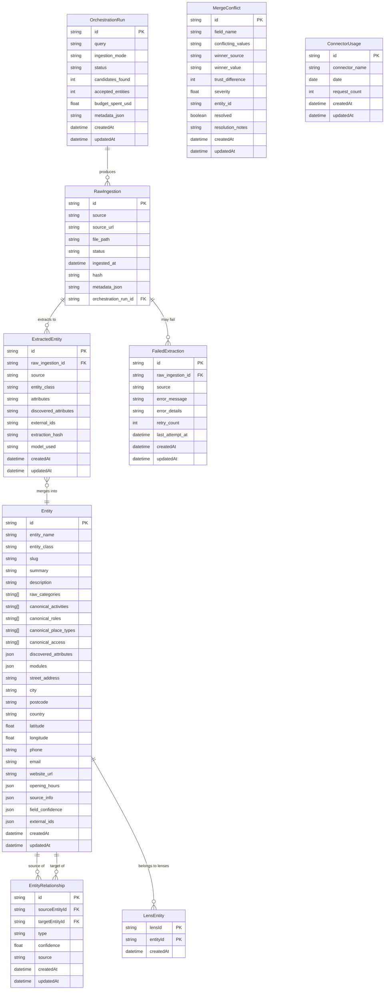

# Database Architecture

**Last Updated:** 2026-02-07
**Status:** Living Documentation
**Database:** PostgreSQL (via Supabase)
**ORM:** Prisma (Client JS for web, Client Python for engine)

This document provides a comprehensive overview of the database architecture for the Universal Entity Extraction Engine, including schema design, data model philosophy, relationships, indexing strategy, and operational considerations.

---

## Table of Contents

1. [Schema Overview](#schema-overview)
2. [Entity Relationship Diagram](#entity-relationship-diagram)
3. [Core Models](#core-models)
4. [Universal Entity Model](#universal-entity-model)
5. [Pipeline Models](#pipeline-models)
6. [Supporting Models](#supporting-models)
7. [Data Philosophy](#data-philosophy)
8. [Performance Considerations](#performance-considerations)
9. [Migration Strategy](#migration-strategy)
10. [Backup and Recovery](#backup-and-recovery)

---

## Schema Overview

The database schema is designed around the **Engine-Lens Architecture** principle: the engine owns universal structure and lifecycle, while Lenses own domain semantics and interpretation.

### Single Source of Truth

**CRITICAL:** The database schema is **auto-generated** from YAML schema definitions. NEVER edit Prisma files directly.

**Schema Generation Flow:**
```
engine/config/schemas/*.yaml
        ↓
  python -m engine.schema.generate
        ↓
├── Python FieldSpecs (engine/schema/*.py)
├── Prisma Schema (web/prisma/schema.prisma)
├── Prisma Schema (engine/schema.prisma)
└── TypeScript Types (web/lib/types/generated/*.ts)
```

**To modify the schema:**
1. Edit YAML files in `engine/config/schemas/`
2. Run: `python -m engine.schema.generate --all`
3. Run: `cd web && npx prisma migrate dev`
4. Commit YAML + generated files together

### Schema Design Principles

1. **Universal Structure, Opaque Values**
   - Engine defines field structure (e.g., `canonical_activities TEXT[]`)
   - Lenses define allowed values and interpretation
   - Engine never interprets domain semantics

2. **Three-Layer Field Classification**
   - **Schema Primitives**: Universal fields (name, address, coordinates)
   - **Canonical Dimensions**: Multi-valued facets for filtering (activities, roles, place types, access)
   - **Modules**: Namespaced JSONB for rich domain-specific data

3. **Immutable Artifacts**
   - Raw ingestion → extraction → merge → finalization
   - Each stage produces immutable artifacts
   - Deterministic processing guarantees reproducibility

4. **Provenance-First Design**
   - Every entity tracks contributing sources (`source_info`, `external_ids`)
   - Merge conflicts are auditable (`MergeConflict` model)
   - Field-level confidence scores enable intelligent merging

---

## Entity Relationship Diagram



**Note on ERD Limitations:** Mermaid ERD syntax doesn't support composite primary keys or combined PK/FK notation. The `LensEntity` table uses a composite primary key of `(lensId, entityId)` - both fields together form the unique identifier.

---

## Core Models

### Entity (Canonical Entity Store)

The `Entity` model is the **single source of truth** for canonical entity data after merge and finalization.

**Purpose:** Store complete, merged entity records ready for consumption by the frontend and downstream applications.

**Key Characteristics:**
- **Universal schema**: All entities share the same structure regardless of vertical
- **Opaque values**: Engine stores values without interpreting their meaning
- **Multi-source**: Represents merged data from multiple connectors
- **Provenance**: Tracks contributing sources and confidence scores

**Field Groups:**

#### Identity
| Field | Type | Description | Notes |
|-------|------|-------------|-------|
| `id` | String | Primary key (CUID) | Auto-generated |
| `entity_name` | String | Official entity name | Required, indexed |
| `entity_class` | String | Universal classification | One of: place, person, organization, event, thing |
| `slug` | String | URL-safe identifier | Unique, auto-generated |
| `summary` | String? | Short description | Aggregated from sources |
| `description` | String? | Long-form description | Aggregated evidence |

#### Classification
| Field | Type | Description | Notes |
|-------|------|-------------|-------|
| `raw_categories` | String[] | Uncontrolled discovery labels | NOT indexed, for mapping only |
| `canonical_activities` | String[] | Activity facets | GIN indexed, lens-interpreted |
| `canonical_roles` | String[] | Functional roles | GIN indexed, lens-interpreted |
| `canonical_place_types` | String[] | Physical place types | GIN indexed, lens-interpreted |
| `canonical_access` | String[] | Access requirements | GIN indexed, lens-interpreted |

**IMPORTANT:** The four `canonical_*` dimensions are **fixed**. Adding, removing, or redefining canonical dimensions requires architectural review and amendment to `docs/system-vision.md`.

#### Flexible Data
| Field | Type | Description | Notes |
|-------|------|-------------|-------|
| `discovered_attributes` | Json | Extra attributes not in schema | Free-form discovery |
| `modules` | Json | Namespaced module data | `{core: {...}, location: {...}, sports_facility: {...}}` |

#### Location
| Field | Type | Description | Notes |
|-------|------|-------------|-------|
| `street_address` | String? | Full street address | |
| `city` | String? | City or town | Indexed |
| `postcode` | String? | Postal code | Indexed, UK format |
| `country` | String? | Country name | |
| `latitude` | Float? | WGS84 latitude | Composite index with longitude |
| `longitude` | Float? | WGS84 longitude | Composite index with latitude |

#### Contact
| Field | Type | Description | Notes |
|-------|------|-------------|-------|
| `phone` | String? | Primary phone | E.164 format (e.g., +441315397071) |
| `email` | String? | Primary email | |
| `website_url` | String? | Official website | |
| `instagram_url` | String? | Instagram profile | |
| `facebook_url` | String? | Facebook page | |
| `twitter_url` | String? | Twitter/X profile | |
| `linkedin_url` | String? | LinkedIn page | |

#### Hours & Media
| Field | Type | Description | Notes |
|-------|------|-------------|-------|
| `opening_hours` | Json | Opening hours per day | `{monday: {open: '05:30', close: '22:00'}}` |
| `mainImage` | String? | Primary image URL | |

#### Metadata
| Field | Type | Description | Notes |
|-------|------|-------------|-------|
| `source_info` | Json | Provenance metadata | URLs, method, timestamps, notes |
| `field_confidence` | Json | Per-field confidence scores | Used for merge decisions |
| `external_ids` | Json | External system identifiers | `{google: 'abc', osm: '123'}` |
| `createdAt` | DateTime | Creation timestamp | Auto-generated |
| `updatedAt` | DateTime | Last update timestamp | Auto-updated |

**Relationships:**
- `outgoingRelationships`: EntityRelationship[] (where this entity is the source)
- `incomingRelationships`: EntityRelationship[] (where this entity is the target)
- `lensMemberships`: LensEntity[] (which lenses this entity belongs to)

**Indexes:**
```prisma
@@index([entity_name])
@@index([entity_class])
@@index([city])
@@index([postcode])
@@index([latitude, longitude])  // Composite index for geo queries
@@index([createdAt])
@@index([updatedAt])
```

**GIN Indexes (PostgreSQL-specific):**
The four `canonical_*` array fields use **GIN (Generalized Inverted Index)** indexes for efficient containment queries:
```sql
-- Example query enabled by GIN index
SELECT * FROM "Entity"
WHERE 'tennis' = ANY(canonical_activities);
```

---

## Universal Entity Model

### The Three-Layer Field Architecture

The Entity model implements a sophisticated three-layer field architecture that balances universal structure with vertical flexibility.

#### Layer 1: Schema Primitives (Engine-Owned)

Universal fields that apply to all entities regardless of vertical:

- **Identity**: `entity_name`, `entity_class`, `slug`
- **Location**: `street_address`, `city`, `postcode`, `latitude`, `longitude`
- **Contact**: `phone`, `email`, `website_url`
- **Time**: `opening_hours`, `createdAt`, `updatedAt`
- **Metadata**: `source_info`, `field_confidence`, `external_ids`

**Ownership:** Engine validates structure and types, but does NOT interpret values.

#### Layer 2: Canonical Dimensions (Lens-Interpreted)

Multi-valued array fields for faceted filtering and classification:

```typescript
canonical_activities:     string[]  // What activities occur here
canonical_roles:          string[]  // What functional role it serves
canonical_place_types:    string[]  // Physical place classifications
canonical_access:         string[]  // How users can access/engage
```

**Key Properties:**
- **Structure**: Owned by engine (always TEXT[] arrays)
- **Values**: Owned by lenses (opaque identifiers to engine)
- **Indexing**: GIN indexes for efficient containment queries
- **Determinism**: Always sorted, deduplicated, never null (empty array = no values)

**Example:**
```json
{
  "canonical_activities": ["tennis", "padel", "squash"],
  "canonical_roles": ["provides_facility", "membership_org"],
  "canonical_place_types": ["sports_complex", "indoor_facility"],
  "canonical_access": ["membership", "pay_and_play"]
}
```

The engine treats `"tennis"` as an opaque string. The lens provides:
- Display name: "Tennis"
- Icon: "🎾"
- SEO slug: "tennis"
- Grouping: "racket_sports"

#### Layer 3: Modules (Namespaced JSONB)

Rich, structured domain-specific data organized by namespace:

```json
{
  "modules": {
    "sports_facility": {
      "tennis_courts": {
        "total": 12,
        "indoor": 8,
        "outdoor": 4,
        "surfaces": ["hard_court", "clay"]
      },
      "padel_courts": {
        "total": 3,
        "indoor": 3,
        "covered": true,
        "heated": true
      },
      "booking": {
        "online_booking_available": true,
        "advance_booking_days": 7,
        "booking_url": "https://clubspark.lta.org.uk/CraiglockharttennisEdinburghLeisure"
      },
      "coaching_available": true,
      "equipment_rental": true
    },
    "amenities": {
      "parking": {
        "available": true,
        "spaces": 50,
        "cost": "free"
      },
      "accessibility": {
        "wheelchair_accessible": true,
        "accessible_parking": true,
        "accessible_changing_rooms": true
      },
      "facilities": ["changing_rooms", "showers", "cafe", "pro_shop"]
    }
  }
}
```

**Module Categories:**

**Domain Modules** (lens-specific, conditionally attached):
- `sports_facility`: Courts, pitches, equipment, coaching, booking details
- `fitness_facility`: Gym equipment, classes, membership details
- `wine_discovery`: Vintages, tasting notes, pairings (future vertical)

**General Modules** (available to all verticals):
- `amenities`: Facilities, parking, accessibility, services
- `hours`: Complex operating hours (beyond standard daily hours)
- `time_range`: Event-specific date ranges

**Important:** Modules contain ONLY data that doesn't exist as first-class columns. Identity fields (`entity_name`, `slug`), location fields (`street_address`, `city`, `latitude`, `longitude`), and contact fields (`phone`, `email`, `website_url`) are stored as first-class columns on the Entity model, NOT in modules.

**Module Triggers:** Lenses define rules for when modules attach:
```yaml
module_triggers:
  - when:
      canonical_activities: [tennis, padel]
    add_modules: [sports_facility]
```

### Why This Architecture?

1. **Horizontal Scaling**: Adding new verticals requires NO engine code changes
2. **Queryability**: Canonical dimensions provide fast faceted filtering
3. **Richness**: Modules capture deep domain data without polluting universal schema
4. **Clarity**: Clear ownership boundaries prevent semantic drift
5. **Flexibility**: Verticals can evolve module schemas independently

---

## Pipeline Models

### RawIngestion (Immutable Source Data)

**Purpose:** Store raw JSON payloads from connectors as immutable artifacts.

**Key Characteristics:**
- Immutable once created
- Content-hash based deduplication
- Links to orchestration run for traceability
- Actual JSON stored on filesystem (`engine/data/raw/<source>/<timestamp>_<id>.json`)

| Field | Type | Description | Notes |
|-------|------|-------------|-------|
| `id` | String | Primary key | CUID |
| `source` | String | Connector name | e.g., "serper", "google_places" |
| `source_url` | String | Original query/URL | |
| `file_path` | String | Path to raw JSON file | Relative to project root |
| `status` | String | Ingestion status | "success", "failed", "pending" |
| `ingested_at` | DateTime | Ingestion timestamp | Auto-generated |
| `hash` | String | Content hash | For deduplication |
| `metadata_json` | String? | Connector metadata | JSON string |
| `orchestration_run_id` | String? | Parent orchestration run | Foreign key |

**Relationships:**
- `orchestration_run`: OrchestrationRun (parent)
- `extractedEntities`: ExtractedEntity[] (outputs)
- `failedExtractions`: FailedExtraction[] (errors)

**Indexes:**
```prisma
@@index([source])
@@index([status])
@@index([hash])  // Critical for deduplication
@@index([ingested_at])
@@index([orchestration_run_id])
@@index([source, status])  // Composite for connector health
@@index([status, ingested_at])  // Composite for queue processing
```

**Data Flow:**
```
Connector → RawIngestion record → JSON file on disk → ExtractedEntity
```

---

### ExtractedEntity (Intermediate Extraction Results)

**Purpose:** Store structured extraction results before merge and finalization.

**Key Characteristics:**
- One per raw ingestion (1:1 relationship)
- Contains schema primitives + raw observations only
- **MUST NOT** contain canonical dimensions or modules (Phase 1 contract)
- Immutable after creation

| Field | Type | Description | Notes |
|-------|------|-------------|-------|
| `id` | String | Primary key | CUID |
| `raw_ingestion_id` | String | Source raw ingestion | Foreign key |
| `source` | String | Connector name | Denormalized for performance |
| `entity_class` | String | Entity classification | Determined by engine rules |
| `attributes` | String? | Structured attributes | JSON string |
| `discovered_attributes` | String? | Extra attributes | JSON string |
| `external_ids` | String? | External identifiers | JSON string |
| `extraction_hash` | String? | Extraction signature | For deduplication |
| `model_used` | String? | LLM model identifier | e.g., "claude-sonnet-4.5" |

**Relationships:**
- `raw_ingestion`: RawIngestion (source)

**Indexes:**
```prisma
@@index([raw_ingestion_id])
@@index([source])
@@index([entity_class])
@@index([extraction_hash])
@@index([source, entity_class])  // Composite for source analysis
@@index([createdAt])
```

**Extraction Contract (Phase 1):**

✅ **Allowed Outputs:**
- Schema primitives: `entity_name`, `latitude`, `street_address`, `phone`, etc.
- Raw observations: `raw_categories`, `description`, connector-native fields

❌ **Forbidden Outputs:**
- `canonical_activities`, `canonical_roles`, `canonical_place_types`, `canonical_access`
- `modules` or any module fields
- Any lens-derived interpretation

**Phase Boundary:**
```
Phase 1 (Extractor)         Phase 2 (Lens Application)
ExtractedEntity            →  Canonical dimensions populated
                           →  Modules attached and populated
                           →  Ready for merge
```

See `docs/architecture.md` Section 4.2 for the complete extraction contract.

---

### OrchestrationRun (Execution Metadata)

**Purpose:** Track multi-connector orchestration executions for observability and cost monitoring.

**Key Characteristics:**
- One per user query
- Tracks status, budget, and results
- Links to all raw ingestions from that run

| Field | Type | Description | Notes |
|-------|------|-------------|-------|
| `id` | String | Primary key | CUID |
| `query` | String | Original user query | e.g., "padel courts in Edinburgh" |
| `ingestion_mode` | String | Orchestration mode | "discover_many", "verify_one" |
| `status` | String | Run status | "in_progress", "completed", "failed" |
| `candidates_found` | Int | Total candidates discovered | Default: 0 |
| `accepted_entities` | Int | Entities accepted into store | Default: 0 |
| `budget_spent_usd` | Float? | Total cost in USD | Tracks API costs |
| `metadata_json` | String? | Additional metadata | Lens hash, connector list, etc. |

**Relationships:**
- `raw_ingestions`: RawIngestion[] (all ingestions from this run)

**Indexes:**
```prisma
@@index([query])  // For query history
@@index([status])  // For monitoring
@@index([createdAt])  // For time-series analysis
```

---

### FailedExtraction (Error Tracking)

**Purpose:** Track extraction failures for monitoring and retry logic.

| Field | Type | Description | Notes |
|-------|------|-------------|-------|
| `id` | String | Primary key | CUID |
| `raw_ingestion_id` | String | Failed ingestion | Foreign key |
| `source` | String | Connector name | Denormalized |
| `error_message` | String | Error summary | |
| `error_details` | String? | Full stack trace | |
| `retry_count` | Int | Retry attempts | Default: 0 |
| `last_attempt_at` | DateTime? | Last retry timestamp | |

**Relationships:**
- `raw_ingestion`: RawIngestion (source)

**Indexes:**
```prisma
@@index([raw_ingestion_id])
@@index([source])
@@index([retry_count])
@@index([last_attempt_at])
@@index([retry_count, last_attempt_at])  // For retry queue
```

**Retry Strategy:**
- Exponential backoff based on `retry_count`
- Max retries: 3 (configurable)
- Failed extractions don't block other extractions

---

## Supporting Models

### EntityRelationship (Entity Graph)

**Purpose:** Store relationships between entities (e.g., "teaches at", "plays at", "part of").

**Use Cases:**
- Coach teaches at Venue
- Team plays at Venue
- Venue is part of Organization

| Field | Type | Description | Notes |
|-------|------|-------------|-------|
| `id` | String | Primary key | CUID |
| `sourceEntityId` | String | Source entity | Foreign key |
| `targetEntityId` | String | Target entity | Foreign key |
| `type` | String | Relationship type | e.g., "teaches_at", "plays_at" |
| `confidence` | Float? | Confidence score | 0.0 - 1.0 |
| `source` | String | Discovering connector | |

**Relationships:**
- `sourceEntity`: Entity (source)
- `targetEntity`: Entity (target)

**Indexes:**
```prisma
@@index([sourceEntityId])
@@index([targetEntityId])
@@index([type])
```

**Cascade Behavior:**
When an entity is deleted, all relationships where it participates are also deleted (`onDelete: Cascade`).

---

### LensEntity (Lens Membership)

**Purpose:** Track which lenses each entity belongs to (many-to-many).

**Why This Exists:**
- Entities may belong to multiple lenses (e.g., a sports venue in both "Edinburgh Finds" and "UK Sports Discovery")
- Lenses can be activated/deactivated independently
- Enables lens-scoped queries

| Field | Type | Description | Notes |
|-------|------|-------------|-------|
| `lensId` | String | Lens identifier | Part of composite PK |
| `entityId` | String | Entity identifier | Part of composite PK |

**Primary Key:** `(lensId, entityId)` — both fields together form the unique identifier.

**Relationships:**
- `entity`: Entity (member)

**Indexes:**
```prisma
@@index([lensId])   // Query all entities in a lens
@@index([entityId]) // Query all lenses for an entity
```

---

### MergeConflict (Conflict Audit Trail)

**Purpose:** Track merge conflicts for debugging and data quality monitoring.

**Key Characteristics:**
- Created when multiple sources provide conflicting values
- Records which source won and why
- Enables post-merge analysis

| Field | Type | Description | Notes |
|-------|------|-------------|-------|
| `id` | String | Primary key | CUID |
| `field_name` | String | Conflicting field | e.g., "phone" |
| `conflicting_values` | String | All observed values | JSON array |
| `winner_source` | String | Winning connector | |
| `winner_value` | String | Selected value | |
| `trust_difference` | Int | Trust tier difference | Higher = more significant |
| `severity` | Float | Conflict severity | 0.0 - 1.0 |
| `entity_id` | String? | Resolved entity | May be null if entity not yet created |
| `resolved` | Boolean | Resolution status | Default: false |
| `resolution_notes` | String? | Manual notes | |

**Indexes:**
```prisma
@@index([field_name])    // Analyze which fields conflict most
@@index([winner_source]) // Connector trust analysis
@@index([severity])      // Prioritize high-severity conflicts
@@index([resolved])      // Track resolution progress
@@index([entity_id])     // Query conflicts for an entity
```

**Severity Calculation:**
```python
severity = (trust_difference / max_trust_difference) * field_importance_weight
```

---

### ConnectorUsage (API Cost Tracking)

**Purpose:** Track connector API usage by date for cost monitoring.

| Field | Type | Description | Notes |
|-------|------|-------------|-------|
| `id` | String | Primary key | CUID |
| `connector_name` | String | Connector identifier | |
| `date` | DateTime | Usage date | Date only (no time) |
| `request_count` | Int | Request count | Default: 0 |

**Unique Constraint:**
```prisma
@@unique([connector_name, date])  // One record per connector per day
```

**Indexes:**
```prisma
@@index([connector_name])
@@index([date])
```

**Usage Pattern:**
```sql
-- Increment daily usage
INSERT INTO "ConnectorUsage" (connector_name, date, request_count)
VALUES ('google_places', '2026-02-07', 1)
ON CONFLICT (connector_name, date)
DO UPDATE SET request_count = request_count + 1;
```

---

## Data Philosophy

### Immutable Artifacts vs. Mutable State

The database distinguishes between **immutable artifacts** (historical records) and **mutable state** (current truth).

**Immutable Artifacts:**
- `RawIngestion`: Once created, never modified
- `ExtractedEntity`: Immutable extraction results
- `FailedExtraction`: Historical error records
- `MergeConflict`: Audit trail of conflicts

**Benefits:**
- Reproducible processing
- Debugging via historical replay
- Audit trail for data quality
- Safe reprocessing

**Mutable State:**
- `Entity`: Updated via idempotent upsert
- `OrchestrationRun`: Status updates during execution
- `ConnectorUsage`: Incremented daily

### Provenance as First-Class Data

Every entity retains **explicit provenance**:

```json
{
  "source_info": {
    "contributing_sources": ["google_places", "serper", "osm"],
    "primary_source": "google_places",
    "last_verified": "2026-02-07T10:30:00Z",
    "ingestion_method": "orchestrated"
  },
  "external_ids": {
    "google": "ChIJN1t_tDeuEmsRUsoyG83frY4",
    "osm": "123456789"
  },
  "field_confidence": {
    "phone": 0.95,
    "opening_hours": 0.80,
    "latitude": 0.99
  }
}
```

**Provenance Enables:**
- **Debugging**: Trace incorrect data back to source
- **Trust evaluation**: Weight sources in merge decisions
- **Incremental enrichment**: Identify stale data for refresh
- **Conflict resolution**: Understand why values were chosen

### Evidence-Driven Design

The schema supports **evidence-driven extraction** (see `docs/system-vision.md` Section 4):

**Phase 1 Evidence Surfaces** (produced by extractors):
- Structured primitives: `entity_name`, `street_address`, `coordinates`
- Narrative surfaces: `summary`, `description`
- Source observations: `raw_categories`

**Phase 2 Interpretation** (produced by lens application):
- Canonical dimensions populated from mapping rules
- Modules attached and populated via field rules

**No Evidence, No Data:**
- Empty canonical dimensions = no evidence found (not "unknown")
- Empty modules = module not triggered (not "incomplete")
- Null primitive fields = genuinely missing data

### Deterministic Merge Constitution

Multi-source merge is **deterministic** and **metadata-driven** (see `docs/architecture.md` Section 9):

**Merge Inputs (Pre-Sorted):**
```python
sorted_entities = sorted(
    dedup_group,
    key=lambda e: (-trust_tier(e.source), e.source, e.id)
)
```

**Field-Group Strategies:**

| Field Group | Strategy | Tie-Break |
|-------------|----------|-----------|
| Identity (name, summary) | Higher trust, more complete | trust → priority → source_id |
| Geo (lat/lon) | Precision metadata → trust → decimal places | trust → precision → source_id |
| Contact (phone, email, URL) | Quality scoring → trust | quality → trust → source_id |
| Canonical dimensions | Union all, deduplicate, sort | Lexicographic |
| Modules | Recursive merge, per-leaf selection | trust → confidence → completeness |
| Provenance | Always union, never overwrite | N/A |

**Guarantees:**
- Same inputs → identical outputs (deterministic)
- Re-running same query → updates existing entity (idempotent)
- No connector names in merge logic (metadata-driven)

---

## Performance Considerations

### Indexing Strategy

The schema uses **strategic indexes** to optimize common query patterns:

#### Single-Column Indexes

**Entity Table:**
```prisma
@@index([entity_name])    // Text search, autocomplete
@@index([entity_class])   // Filter by entity type
@@index([city])           // Geographic filtering
@@index([postcode])       // Precise location lookup
@@index([createdAt])      // Time-series queries
@@index([updatedAt])      // "Recently updated" queries
```

**RawIngestion Table:**
```prisma
@@index([source])         // Connector health monitoring
@@index([status])         // Queue processing
@@index([hash])           // Deduplication (critical!)
@@index([ingested_at])    // Time-series analysis
```

#### Composite Indexes

**Geo Queries:**
```prisma
@@index([latitude, longitude])  // Proximity search
```

**Connector Health:**
```prisma
@@index([source, status])       // "Failed ingestions for Serper"
```

**Queue Processing:**
```prisma
@@index([status, ingested_at])  // "Pending ingestions oldest-first"
```

#### GIN Indexes (Canonical Dimensions)

PostgreSQL GIN indexes enable **fast containment queries** on array fields:

```sql
-- Find all entities with "tennis" activity
SELECT * FROM "Entity"
WHERE 'tennis' = ANY(canonical_activities);

-- Find entities with multiple activities
SELECT * FROM "Entity"
WHERE canonical_activities @> ARRAY['tennis', 'padel'];
```

**Why GIN?**
- O(log n) lookup for array containment
- Supports partial matches and overlap queries
- Essential for faceted filtering UI

**Storage Cost:**
- GIN indexes are larger than B-tree indexes (~3x)
- Worth the cost for canonical dimensions (queried frequently)
- **NOT** used for `raw_categories` (discovery-only, not filtered)

### Query Optimization Patterns

#### 1. Use Covering Indexes

**BAD** (requires table lookup):
```sql
SELECT * FROM "Entity" WHERE city = 'Edinburgh';
```

**GOOD** (index-only scan):
```sql
SELECT id, entity_name, city FROM "Entity" WHERE city = 'Edinburgh';
```

#### 2. Leverage Composite Indexes

**BAD** (two separate index scans):
```sql
SELECT * FROM "RawIngestion"
WHERE source = 'serper' AND status = 'failed';
```

**GOOD** (single composite index scan):
```sql
-- Uses @@index([source, status]) directly
```

#### 3. Batch JSONB Operations

**BAD** (N+1 queries):
```typescript
for (const entity of entities) {
  const modules = entity.modules;
  // Process modules
}
```

**GOOD** (single query with JSONB extraction):
```sql
SELECT
  id,
  entity_name,
  modules->'sports_facility'->'tennis_courts'->>'total' as court_count
FROM "Entity"
WHERE modules ? 'sports_facility';
```

### Deduplication Performance

**Hash-Based Deduplication:**

RawIngestion uses content hashing for deduplication:

```python
import hashlib

content_hash = hashlib.sha256(
    json.dumps(payload, sort_keys=True).encode()
).hexdigest()

# Check for duplicates
existing = await db.rawingestion.find_first(
    where={'hash': content_hash}
)
```

**Index:** `@@index([hash])` makes this O(log n) instead of O(n).

**Cross-Source Deduplication:**

ExtractedEntity deduplication uses:
- External IDs (Google Place ID, OSM ID)
- Geo similarity (latitude/longitude proximity)
- Name similarity (normalized Levenshtein distance)

**Optimization:**
```sql
-- Use composite index for geo proximity
CREATE INDEX idx_entity_geo ON "Entity" (latitude, longitude);

-- Query uses spatial index
SELECT * FROM "Entity"
WHERE latitude BETWEEN ? AND ?
  AND longitude BETWEEN ? AND ?;
```

### Scaling Considerations

**Current Scale (MVP):**
- Entities: 1,000 - 10,000
- RawIngestions: 10,000 - 100,000
- Query time: <100ms for most queries

**Future Scale (Production):**
- Entities: 100,000 - 1,000,000
- RawIngestions: 1,000,000 - 10,000,000
- Query time target: <200ms p95

**Scaling Strategy:**

1. **Vertical Scaling (Supabase Pro)**
   - Larger database instances
   - Connection pooling (PgBouncer)
   - Read replicas for analytics

2. **Query Optimization**
   - Materialized views for complex aggregations
   - Partial indexes for common filters
   - JSONB indexing for module queries

3. **Archival Strategy**
   - Move old `RawIngestion` records to cold storage
   - Retain `ExtractedEntity` and `MergeConflict` for audit
   - Keep `Entity` table hot (primary query target)

4. **Sharding (Future)**
   - Geographic sharding (city/region)
   - Lens-based sharding (vertical isolation)

---

## Migration Strategy

### Schema Evolution Discipline

**Golden Rule:** Schema changes must preserve backward compatibility or provide explicit migration paths.

**Allowed Changes:**
✅ Add new optional fields
✅ Add new indexes
✅ Add new models
✅ Expand enum values
✅ Add JSONB module namespaces

**Forbidden Changes:**
❌ Remove fields without deprecation window
❌ Change field types (string → int)
❌ Remove canonical dimensions (architectural change)
❌ Rename fields without translation layer removal plan

### Migration Workflow

**1. YAML Schema Change**

Edit `engine/config/schemas/entity.yaml`:

```yaml
fields:
  - name: verified
    type: boolean
    description: Whether entity has been manually verified
    nullable: true
    default: false
```

**2. Regenerate Schemas**

```bash
python -m engine.schema.generate --all
```

This updates:
- `engine/schema/entity.py` (Python FieldSpecs)
- `web/prisma/schema.prisma` (Frontend Prisma)
- `engine/schema.prisma` (Backend Prisma)
- `web/lib/types/generated/entity.ts` (TypeScript)

**3. Create Migration**

```bash
cd web
npx prisma migrate dev --name add_verified_field
```

This generates:
- `web/prisma/migrations/YYYYMMDDHHMMSS_add_verified_field/migration.sql`

**4. Review Migration SQL**

```sql
-- Migration: add_verified_field
ALTER TABLE "Entity" ADD COLUMN "verified" BOOLEAN DEFAULT false;
```

**5. Apply to Production**

```bash
npx prisma migrate deploy
```

**6. Commit Together**

Commit in a single atomic commit:
- YAML schema change
- Generated Python/Prisma/TypeScript files
- Migration SQL file

### Backward Compatibility Strategy

**Additive Changes:**
New fields must be nullable or have defaults:

```yaml
# GOOD
- name: verified
  type: boolean
  nullable: true  # ✅ Safe to add

# BAD
- name: verified
  type: boolean
  nullable: false  # ❌ Breaks existing data
```

**Deprecation Window:**
When removing fields:

1. **Phase 1:** Mark as deprecated, add warning
2. **Phase 2:** Stop populating field
3. **Phase 3:** Remove from YAML schema (after data migration)

**No Permanent Translation Layers:**

Legacy naming must be eliminated, not accommodated:

```python
# FORBIDDEN: Permanent translation
{
  "location_lat": entity.latitude,  # ❌ Don't perpetuate legacy names
  "location_lon": entity.longitude
}

# CORRECT: Direct canonical names
{
  "latitude": entity.latitude,  # ✅ Use universal schema names
  "longitude": entity.longitude
}
```

### Data Backfill Strategy

**When to Backfill:**
- Adding new canonical dimension (requires lens mapping rules)
- Adding new module (requires module triggers)
- Fixing extraction bugs (requires re-extraction)

**Backfill Workflow:**

```bash
# 1. Identify affected entities
SELECT id FROM "Entity"
WHERE canonical_activities = '{}'
  AND raw_categories @> ARRAY['tennis'];

# 2. Re-extract from RawIngestion
python -m engine.extraction.cli reprocess --entity-ids <ids>

# 3. Verify results
SELECT id, entity_name, canonical_activities
FROM "Entity"
WHERE id IN (<ids>);
```

**Safety:**
- Idempotent: Re-running same extraction updates, doesn't duplicate
- Deterministic: Same input → same output
- Auditable: Merge conflicts tracked in `MergeConflict` table

---

## Backup and Recovery

### Backup Strategy (Supabase)

**Automated Backups:**
- **Daily snapshots**: Last 7 days retained
- **Point-in-time recovery**: 30 days (Supabase Pro)
- **Storage location**: Supabase infrastructure

**Manual Backups:**

```bash
# Export entire database
pg_dump $DATABASE_URL > backup_$(date +%Y%m%d).sql

# Export specific table
pg_dump $DATABASE_URL -t "Entity" > entity_backup.sql

# Export as CSV (for analysis)
psql $DATABASE_URL -c "COPY \"Entity\" TO STDOUT CSV HEADER" > entities.csv
```

### Disaster Recovery Procedures

**Scenario 1: Corrupted Entity Data**

1. Identify corruption scope:
   ```sql
   SELECT COUNT(*) FROM "Entity" WHERE latitude IS NULL AND city IS NOT NULL;
   ```

2. Restore from backup:
   ```bash
   # Option A: Full restore (destructive)
   psql $DATABASE_URL < backup_20260207.sql

   # Option B: Selective restore
   psql $DATABASE_URL -c "DELETE FROM \"Entity\" WHERE id IN (<corrupted_ids>)"
   psql $DATABASE_URL < entity_backup.sql
   ```

3. Re-run extraction:
   ```bash
   python -m engine.orchestration.cli reprocess --since "2026-02-06"
   ```

**Scenario 2: Accidental Deletion**

```sql
-- Entities are soft-deletable via relationships
-- Restore from point-in-time backup (Supabase Pro)
-- Or re-extract from RawIngestion (preferred)
```

**Scenario 3: Schema Migration Failure**

```bash
# Rollback migration
cd web
npx prisma migrate resolve --rolled-back <migration_name>

# Restore database state
psql $DATABASE_URL < backup_before_migration.sql

# Fix migration SQL
# Re-apply corrected migration
npx prisma migrate deploy
```

### Data Integrity Guarantees

**Foreign Key Constraints:**

All relationships enforce referential integrity:

```prisma
model ExtractedEntity {
  raw_ingestion RawIngestion @relation(fields: [raw_ingestion_id], references: [id], onDelete: Cascade)
}
```

**Cascade Behavior:**
- Delete `RawIngestion` → cascades to `ExtractedEntity`, `FailedExtraction`
- Delete `Entity` → cascades to `EntityRelationship`, `LensEntity`
- Delete `OrchestrationRun` → sets `RawIngestion.orchestration_run_id` to NULL

**Unique Constraints:**

```prisma
model Entity {
  slug String @unique  // Prevents duplicate slugs
}

model ConnectorUsage {
  @@unique([connector_name, date])  // One record per connector per day
}
```

**Check Constraints (Application-Level):**

```python
# Phone must be E.164 format
assert phone.startswith('+44'), "Phone must be E.164 UK format"

# Coordinates must be valid
assert -90 <= latitude <= 90, "Invalid latitude"
assert -180 <= longitude <= 180, "Invalid longitude"
```

### Monitoring and Alerts

**Key Metrics:**

```sql
-- Extraction success rate
SELECT
  source,
  COUNT(*) FILTER (WHERE status = 'success') * 100.0 / COUNT(*) as success_rate
FROM "RawIngestion"
WHERE ingested_at > NOW() - INTERVAL '24 hours'
GROUP BY source;

-- Merge conflict rate
SELECT
  field_name,
  COUNT(*) as conflict_count,
  AVG(severity) as avg_severity
FROM "MergeConflict"
WHERE createdAt > NOW() - INTERVAL '7 days'
GROUP BY field_name
ORDER BY conflict_count DESC;

-- Entity completeness
SELECT
  COUNT(*) FILTER (WHERE phone IS NOT NULL) * 100.0 / COUNT(*) as phone_coverage,
  COUNT(*) FILTER (WHERE opening_hours IS NOT NULL) * 100.0 / COUNT(*) as hours_coverage,
  COUNT(*) FILTER (WHERE latitude IS NOT NULL) * 100.0 / COUNT(*) as geo_coverage
FROM "Entity";
```

**Alert Thresholds:**
- Extraction success rate < 90% → investigate connector
- Merge conflict severity > 0.8 → review trust metadata
- Entity completeness < 50% → improve extraction rules

---

## Related Documentation

- **Schema Definition**: `engine/config/schemas/entity.yaml` (single source of truth)
- **Architecture**: `docs/architecture.md` (runtime pipeline and contracts)
- **System Vision**: `docs/system-vision.md` (immutable invariants and principles)
- **API Documentation**: `docs/API.md` (GraphQL/REST endpoints for querying entities)
- **Backend Architecture**: `docs/BACKEND.md` (Python engine implementation details)

---

## Appendix: Common Queries

### Query All Entities in a City

```sql
SELECT id, entity_name, street_address
FROM "Entity"
WHERE city = 'Edinburgh'
ORDER BY entity_name;
```

### Find Entities by Activity

```sql
SELECT id, entity_name, canonical_activities
FROM "Entity"
WHERE 'tennis' = ANY(canonical_activities);
```

### Proximity Search

```sql
-- Find entities within ~1km of coordinates (55.95, -3.19)
SELECT id, entity_name, latitude, longitude
FROM "Entity"
WHERE latitude BETWEEN 55.94 AND 55.96
  AND longitude BETWEEN -3.20 AND -3.18;
```

### Entities with Module Data

```sql
-- Entities with sports_facility module
SELECT id, entity_name, modules->'sports_facility' as sports_data
FROM "Entity"
WHERE modules ? 'sports_facility';

-- Entities with specific module field
SELECT id, entity_name,
       modules->'sports_facility'->'tennis_courts'->>'total' as courts
FROM "Entity"
WHERE modules->'sports_facility'->'tennis_courts' IS NOT NULL;
```

### Recent Orchestration Runs

```sql
SELECT
  id,
  query,
  status,
  candidates_found,
  accepted_entities,
  budget_spent_usd,
  createdAt
FROM "OrchestrationRun"
ORDER BY createdAt DESC
LIMIT 10;
```

### Connector Health Dashboard

```sql
SELECT
  source,
  COUNT(*) as total_ingestions,
  COUNT(*) FILTER (WHERE status = 'success') as successful,
  COUNT(*) FILTER (WHERE status = 'failed') as failed,
  AVG(EXTRACT(EPOCH FROM (updatedAt - createdAt))) as avg_processing_seconds
FROM "RawIngestion"
WHERE ingested_at > NOW() - INTERVAL '7 days'
GROUP BY source
ORDER BY total_ingestions DESC;
```

### Merge Conflict Analysis

```sql
SELECT
  field_name,
  COUNT(*) as total_conflicts,
  AVG(severity) as avg_severity,
  MODE() WITHIN GROUP (ORDER BY winner_source) as most_common_winner
FROM "MergeConflict"
WHERE createdAt > NOW() - INTERVAL '30 days'
GROUP BY field_name
HAVING COUNT(*) > 5
ORDER BY total_conflicts DESC;
```

---

**End of DATABASE.md**
