# Deployment

**Generated:** 2026-02-06
**Status:** Auto-generated documentation

---

## Overview

Edinburgh Finds is currently in **active development** with a lightweight deployment setup. The system is designed for local development with cloud database hosting.

---

## Current Architecture

```mermaid
graph LR
    subgraph "Local Development"
        Engine[Python Engine CLI]
        NextJS[Next.js Dev Server]
    end

    subgraph "Cloud — Supabase"
        DB[(PostgreSQL Database)]
    end

    subgraph "External APIs"
        Serper[Serper]
        Google[Google Places]
        OSM[OpenStreetMap]
        SportScot[Sport Scotland]
        ChargeMap[OpenChargeMap]
    end

    Engine --> DB
    NextJS --> DB
    Engine --> Serper & Google & OSM & SportScot & ChargeMap
```



**Current setup:**
- **Database:** Supabase PostgreSQL (cloud-hosted)
- **Engine:** Runs locally via CLI commands
- **Frontend:** Runs locally via `npm run dev`
- **External APIs:** Called directly from the engine

---

## CI/CD Pipeline

### GitHub Actions (`.github/workflows/tests.yml`)

The CI pipeline runs on every push and PR to `main` and `develop`:

**Jobs:**

1. **Engine Purity Checks**
   - Runs `scripts/check_engine_purity.sh`
   - Verifies no domain terms leak into engine code

2. **Test Suite**
   - Sets up Python 3.12
   - Installs dependencies from `engine/requirements.txt`
   - Runs engine tests with coverage
   - Runs specific test categories:
     - Purity tests
     - Lens validation tests
     - Deduplication tests
     - Prisma array filter tests
     - Module composition tests

### PR Template (`.github/pull_request_template.md`)

Every PR must pass an architectural validation checklist:
- Engine purity (no domain terms, no value-based branching)
- Lens contract validation (valid facets, values, mapping rules)
- Module composition (proper namespacing)
- All existing tests pass
- New tests for new functionality

---

## Environment Configuration

### Development

```bash
# .env (project root)
ANTHROPIC_API_KEY=sk-ant-...
SERPER_API_KEY=...
GOOGLE_PLACES_API_KEY=AIza...
DATABASE_URL=postgresql://...

# web/.env
DATABASE_URL=postgresql://...
```

### Production (Future)

Production deployment will require:
- Secure environment variable management (e.g., Vercel env vars, AWS Secrets Manager)
- Database connection pooling
- Rate limiting for public API endpoints
- CDN for static assets

---

## Database Migrations

```bash
# Development: Quick schema sync
cd web && npx prisma db push

# Production: Create migration file
cd web && npx prisma migrate dev --name <description>

# Production: Apply pending migrations
cd web && npx prisma migrate deploy
```

---

## Deployment Steps (Future)

### Frontend (Next.js)

The frontend is designed for deployment to **Vercel**:

1. Connect GitHub repository to Vercel
2. Set `DATABASE_URL` environment variable
3. Vercel auto-detects Next.js and handles build/deploy
4. ISR (Incremental Static Regeneration) for entity pages

### Engine

The engine is currently CLI-based. Future deployment options:
- **Cron jobs** for scheduled data refresh
- **API wrapper** (FastAPI) for on-demand orchestration
- **Queue-based** processing for large-scale ingestion

---

## Monitoring

### Current

- Structured logging in engine (extraction, orchestration)
- `ConnectorUsage` table tracks daily API calls per connector
- `MergeConflict` table records merge decision auditing
- `FailedExtraction` table tracks extraction failures with retry counts

### Future

- Application performance monitoring (APM)
- Database query performance monitoring
- API cost tracking dashboards
- Entity quality metrics

---

## Rollback

### Database

```bash
# Revert last migration
cd web && npx prisma migrate rollback
```

### Code

```bash
# Revert to previous commit
git revert HEAD

# Or reset to specific commit (destructive)
git reset --hard <commit_hash>
```

---

## Performance Considerations

- **PostgreSQL GIN indexes** on `TEXT[]` arrays for fast faceted filtering
- **Idempotent upserts** allow safe re-runs without data duplication
- **Content-hash deduplication** prevents duplicate API calls
- **Rate limiting** per connector prevents API quota exhaustion
- **Async connectors** via `aiohttp` for concurrent data fetching

---

## Related Documentation

- **Configuration:** [CONFIGURATION.md](CONFIGURATION.md)
- **Onboarding:** [ONBOARDING.md](ONBOARDING.md)
- **Development:** [DEVELOPMENT.md](DEVELOPMENT.md)
