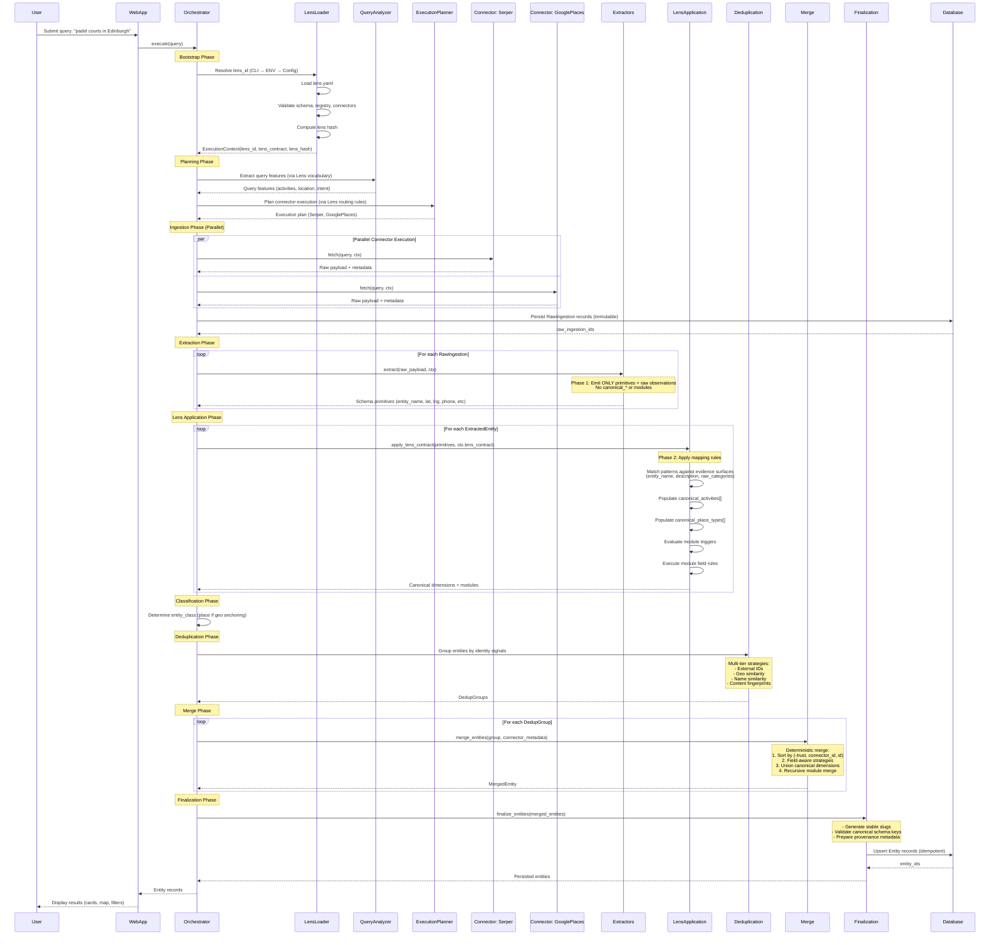

# Features Documentation

**Generated:** 2026-02-08
**System:** Universal Entity Extraction Engine
**Reference Application:** Edinburgh Finds

---

## Table of Contents

1. [Feature Catalog](#feature-catalog)
2. [Feature-to-Code Mapping](#feature-to-code-mapping)
3. [User Journeys](#user-journeys)
4. [Implementation Status](#implementation-status)
5. [Future Roadmap](#future-roadmap)

---

## Feature Catalog

### 1. Multi-Source Intelligent Orchestration

**Description:** Executes natural language queries across multiple data sources with intelligent connector selection, parallel execution, and cost-aware planning.

**Core Capabilities:**
- Query analysis and feature extraction using lens vocabulary
- Metadata-driven connector selection from lens routing rules
- Phase-ordered execution (Discovery → Enrichment)
- Budget and confidence thresholds for early stopping
- Cross-source deduplication before persistence

**Value Proposition:** Combines discovery breadth (Serper, OpenStreetMap) with authoritative depth (Google Places, Sport Scotland) to produce complete entity records from partial observations.

**Architectural Authority:** Section 4 (Pipeline Architecture) in `docs/target/architecture.md`

---

### 2. Lens-Driven Extraction

**Description:** Separates universal extraction logic from domain-specific interpretation through pluggable YAML configuration contracts.

**Core Capabilities:**
- Two-phase extraction contract enforcement:
  - **Phase 1 (Source Extraction):** Schema primitives + raw observations only
  - **Phase 2 (Lens Application):** Canonical dimension population + module attachment
- Pattern-based mapping rules (regex matching against evidence surfaces)
- Module triggers based on canonical dimension values
- Domain vocabulary stored in lens contracts, not engine code

**Value Proposition:** New verticals (Wine Discovery, Restaurant Finder) require ZERO engine code changes - only a new `lens.yaml` configuration file.

**Architectural Authority:** Invariants 1-3 in `docs/target/system-vision.md`, Section 6 in `docs/target/architecture.md`

---

### 3. Deterministic Entity Merge

**Description:** Combines observations from multiple sources into canonical entity records using transparent, reproducible merge logic.

**Core Capabilities:**
- Field-group-aware merge strategies:
  - **Geo fields:** Paired (latitude, longitude) with spatial validation
  - **Narrative fields:** Length + quality metrics (summary, description)
  - **Canonical arrays:** Union deduplication with lexicographic ordering
  - **Scalar fields:** Trust-level priority with deterministic tie-breaking
- Explicit missingness semantics (curated placeholder detection)
- Deep recursive merge for nested module structures
- Connector-blind merge (no source-specific logic)

**Value Proposition:** Same inputs + lens contract → identical outputs. Re-running queries updates existing entities rather than creating duplicates.

**Architectural Authority:** Invariant 4 in `docs/target/system-vision.md`, Section 9 in `docs/target/architecture.md`

---

### 4. Universal Entity Classification

**Description:** Categorizes entities using generic classes (place, person, organization, event, thing) without domain-specific hardcoding.

**Core Capabilities:**
- Geo-anchoring detection (any of: coordinates, street address, city, postcode)
- Deterministic classification rules
- Class assignment independent of vertical domain
- No "Venue" or domain-specific type names in engine

**Value Proposition:** Engine operates universally across all domains. Domain semantics stored in canonical dimensions + modules, not entity class.

**Architectural Authority:** Invariant 1 in `docs/target/system-vision.md`, Section 7 in `docs/target/architecture.md`

---

### 5. Canonical Dimension Registry

**Description:** Authoritative catalog of all valid canonical values with display metadata and validation.

**Core Capabilities:**
- Centralized registry for canonical vocabulary
- Fail-fast validation at lens load time
- Orphan reference detection
- Display metadata (labels, icons, SEO slugs) stored per canonical value

**Value Proposition:** No undeclared or ad-hoc canonical values. Invalid lens contracts fail before execution starts, not silently during runtime.

**Architectural Authority:** Invariant 5 in `docs/target/system-vision.md`, Section 6.5 in `docs/target/architecture.md`

---

### 6. Schema-Driven Code Generation

**Description:** YAML schemas auto-generate Python FieldSpecs, Prisma schemas, and TypeScript interfaces to eliminate schema drift.

**Core Capabilities:**
- Single source of truth: `engine/config/schemas/*.yaml`
- Automated generation of:
  - Python `engine/schema/<entity>.py`
  - Prisma `web/prisma/schema.prisma`
  - TypeScript `web/lib/types/generated/<entity>.ts`
- Generated files marked "DO NOT EDIT"
- Validation enforced before regeneration

**Value Proposition:** Horizontal scaling without schema divergence. Adding a new vertical's data model = adding YAML schema + regenerating.

**Architectural Authority:** Section 5 (Schema Management) in `docs/target/architecture.md`

---

### 7. Provenance Tracking

**Description:** Maintains explicit lineage from raw ingestion through extraction to final entity.

**Core Capabilities:**
- Immutable `RawIngestion` records with full connector payloads
- Traceable `raw_ingestion_id` foreign keys in `ExtractedEntity`
- Source contribution metadata in merged entities
- Lens hash tracking for reproducibility

**Value Proposition:** Debug failures, evaluate source quality, audit entity correctness, and support incremental refresh strategies.

**Architectural Authority:** Section 4.6 in `docs/target/system-vision.md`

---

### 8. Structured Module System

**Description:** Namespaced JSON modules for domain-specific attributes without polluting universal schema.

**Core Capabilities:**
- Universal modules: `core`, `location`, `contact`, `hours`, `amenities`, `time_range`
- Domain modules: Conditionally attached via lens rules (e.g., `sports_facility`)
- Recursive merge during entity combination
- Module triggers based on canonical dimension values

**Value Proposition:** Captures rich differentiating data (court counts, facility specs) beyond commodity listings (name, address, phone).

**Architectural Authority:** Section 4.2 in `docs/target/system-vision.md`, Section 6.6 in `docs/target/architecture.md`

---

### 9. Cost-Aware Execution

**Description:** Tracks API costs per connector and supports budget constraints during orchestration.

**Core Capabilities:**
- Cost metadata in connector registry (per-call USD)
- Budget threshold enforcement
- Cost reporting and auditing
- Free-tier connector prioritization

**Value Proposition:** Prevents runaway costs during development and enables cost-optimized production deployment.

**Architectural Authority:** Section 4.4 in `docs/target/architecture.md`

---

### 10. Idempotent Persistence

**Description:** Re-running queries updates existing entities rather than creating duplicates.

**Core Capabilities:**
- Deduplication grouping across sources (external IDs, geo similarity, name matching)
- Deterministic slug generation (URL-safe entity identifiers)
- Upsert operations in finalization stage
- Convergence to stable entity state on repeated runs

**Value Proposition:** Safe reprocessing, backfills, and incremental refresh without data duplication.

**Architectural Authority:** Invariant 4 in `docs/target/system-vision.md`, Section 10 in `docs/target/architecture.md`

---

## Feature-to-Code Mapping

### Multi-Source Intelligent Orchestration
**Primary Modules:**
- `engine/orchestration/orchestrator.py` — Main control loop, phase enforcement
- `engine/orchestration/planner.py` — Query analysis, connector selection
- `engine/orchestration/registry.py` — Connector metadata registry (6 sources)
- `engine/orchestration/adapters.py` — Async connector bridge, normalization

**Supporting Modules:**
- `engine/orchestration/query_features.py` — Feature extraction from queries
- `engine/orchestration/execution_plan.py` — Phase-ordered execution plans
- `engine/orchestration/execution_context.py` — Shared context across connectors

**Data Sources (6 Connectors):**
- `engine/ingestion/connectors/serper.py` — Web search discovery
- `engine/ingestion/connectors/google_places.py` — Authoritative place data
- `engine/ingestion/connectors/open_street_map.py` — Crowdsourced geodata
- `engine/ingestion/connectors/sport_scotland.py` — Government sports facilities
- `engine/ingestion/connectors/edinburgh_council.py` — Local government data
- `engine/ingestion/connectors/open_charge_map.py` — EV charging stations

---

### Lens-Driven Extraction
**Primary Modules:**
- `engine/lenses/mapping_engine.py` — Pattern matching, canonical population
- `engine/lenses/loader.py` — Lens YAML loading and validation
- `engine/lenses/validator.py` — Schema validation, registry checks
- `engine/lenses/query_lens.py` — Query routing and vocabulary matching

**Supporting Modules:**
- `engine/lenses/ops.py` — Lens operations and utilities
- `engine/lenses/extractors/numeric_parser.py` — Numeric value extraction
- `engine/lenses/extractors/regex_capture.py` — Regex-based field capture
- `engine/lenses/extractors/normalizers.py` — Value normalization

**Integration:**
- `engine/extraction/lens_integration.py` — Phase 2 lens application bridge
- `engine/extraction/module_extractor.py` — Module field population

---

### Deterministic Entity Merge
**Primary Modules:**
- `engine/extraction/merging.py` — Field-group merge strategies, trust hierarchy
- `engine/extraction/deduplication.py` — Cross-source entity grouping
- `engine/orchestration/entity_finalizer.py` — Slug generation, finalization
- `engine/orchestration/persistence.py` — Idempotent upsert operations

**Supporting Modules:**
- `engine/extraction/attribute_splitter.py` — Field normalization before merge
- `engine/extraction/entity_classifier.py` — Universal entity class assignment

---

### Schema-Driven Code Generation
**Primary Modules:**
- `engine/schema/generators/` — Auto-generation of Python, Prisma, TypeScript

**Schema Authority:**
- `engine/config/schemas/entity.yaml` — Universal entity schema
- `engine/config/schemas/raw_ingestion.yaml` — Raw data schema
- `engine/config/schemas/extracted_entity.yaml` — Extracted entity schema

**Generated Outputs:**
- `engine/schema/entity.py` — Python FieldSpecs
- `web/prisma/schema.prisma` — Prisma database schema
- `web/lib/types/generated/entity.ts` — TypeScript interfaces

---

### Source Extraction (Phase 1)
**Extractors (Per-Source):**
- `engine/extraction/extractors/serper_extractor.py` — Serper results
- `engine/extraction/extractors/google_places_extractor.py` — Google Places API
- `engine/extraction/extractors/osm_extractor.py` — OpenStreetMap data
- `engine/extraction/extractors/sport_scotland_extractor.py` — Sport Scotland API
- `engine/extraction/extractors/edinburgh_council_extractor.py` — Council datasets
- `engine/extraction/extractors/open_charge_map_extractor.py` — Charging station data

**Common Utilities:**
- `engine/extraction/base.py` — Base extractor interface
- `engine/extraction/llm_client.py` — Instructor + Anthropic Claude integration
- `engine/extraction/schema_utils.py` — Schema validation utilities

---

## User Journeys

### End User Journey: Finding Padel Courts in Edinburgh

```mermaid
journey
    title Universal Entity Engine User Journeys

    section End User: Finding Padel Courts
      Visit Edinburgh Finds app: 5: User
      See search interface: 5: User
      Enter padel courts near Leith: 4: User
      Submit search: 4: User
      Wait for results: 3: User
      View list of padel venues: 5: User
      See venue cards with photos: 5: User
      Scan key details on cards: 4: User
      Click venue for full information: 4: User
      Read venue description: 5: User
      View activity tags: 5: User
      View facility specifications: 5: User
      Check opening hours: 5: User
      See contact information: 5: User
      View location on map: 5: User
      Click Get Directions: 5: User

    section Developer: Building Wine Discovery Vertical
      Read system-vision.md: 5: Developer
      Read architecture.md: 5: Developer
      Create wine-discovery directory: 5: Developer
      Draft lens.yaml configuration: 4: Developer
      Define wine vocabulary keywords: 4: Developer
      Configure connector routing rules: 4: Developer
      Define mapping to canonical_activities: 3: Developer
      Define mapping to canonical_place_types: 3: Developer
      Configure module triggers: 4: Developer
      Add canonical value metadata: 4: Developer
      Validate lens.yaml syntax: 4: Developer
      Run test query: 3: Developer
      Inspect entity store results: 2: Developer
      Verify canonical dimensions populated: 3: Developer
      Verify modules attached correctly: 3: Developer
      Refine mapping rules based on results: 4: Developer
      Deploy lens configuration: 5: Developer
      Zero engine code changes required: 5: Developer
```

### Developer Journey: Adding a New Vertical (Wine Discovery)

**Step 1: Read Architectural Documents (5 min)**
- Review `docs/target/system-vision.md` for immutable invariants
- Review `docs/target/architecture.md` for runtime mechanics

**Step 2: Create Lens Directory (1 min)**
```bash
mkdir -p engine/lenses/wine-discovery
touch engine/lenses/wine-discovery/lens.yaml
```

**Step 3: Define Lens Configuration (30-60 min)**
```yaml
# engine/lenses/wine-discovery/lens.yaml
vocabulary:
  activity_keywords: [wine, tasting, vineyard, winery, cellar]
  location_indicators: [scotland, edinburgh, speyside]

connector_rules:
  - connector: google_places
    priority: high
    triggers:
      - type: any_keyword_match
        keywords: [wine, winery]

mapping_rules:
  - pattern: "(?i)wine.*tasting|tasting.*room"
    canonical: wine_tasting
    dimension: canonical_activities
    source_fields: [entity_name, description]

  - pattern: "(?i)vineyard|winery|wine.*estate"
    canonical: winery
    dimension: canonical_place_types

module_triggers:
  - when:
      dimension: canonical_activities
      values: [wine_tasting]
    add_modules: [wine_facility]

canonical_values:
  wine_tasting:
    display_name: "Wine Tasting"
    seo_slug: "wine-tasting"
    icon: "wine-glass"
  winery:
    display_name: "Winery"
    seo_slug: "winery"
    icon: "grapes"
```

**Step 4: Validate Lens (2 min)**
```bash
python -m engine.lenses.validator engine/lenses/wine-discovery/lens.yaml
```

**Step 5: Test Query (3 min)**
```bash
LENS_ID=wine-discovery python -m engine.orchestration.cli run "wine tastings in Edinburgh"
```

**Step 6: Inspect Results (5 min)**
- Query entity database
- Verify `canonical_activities` contains `wine_tasting`
- Verify `canonical_place_types` contains `winery`
- Verify `modules.wine_facility` attached where triggered

**Step 7: Refine Mapping Rules (15-30 min)**
- Review entities with missing canonical dimensions
- Add mapping rules for observed patterns
- Re-run test query to validate improvements

**Step 8: Deploy (5 min)**
- Commit `lens.yaml` to version control
- Set `LENS_ID=wine-discovery` in production environment
- Zero engine code changes required

**Total Time:** 60-90 minutes for complete vertical

---

## System Pipeline Sequence



---

## Implementation Status

### Fully Implemented (Production-Ready)

**Multi-Source Orchestration:**
- 6 connectors operational (Serper, Google Places, OSM, Sport Scotland, Edinburgh Council, Open Charge Map)
- Phase-ordered execution (Discovery → Enrichment)
- Query feature extraction from lens vocabulary
- Connector routing from lens rules
- Cross-source deduplication
- Cost tracking and budget constraints

**Deterministic Merge:**
- Field-group-aware strategies (geo, narrative, canonical arrays, scalars)
- Explicit missingness semantics
- Deep recursive module merge
- Trust-level prioritization with deterministic tie-breaking
- Connector-blind merge logic

**Provenance Tracking:**
- Immutable `RawIngestion` persistence
- Foreign key lineage in `ExtractedEntity`
- Source metadata in merged entities
- Lens hash tracking

**Schema-Driven Generation:**
- YAML → Python FieldSpecs
- YAML → Prisma schema
- YAML → TypeScript interfaces
- Validation enforcement

---

### Partially Implemented (In Development)

**Lens-Driven Extraction:**
- **Implemented:**
  - Lens loading and validation
  - Query feature extraction
  - Connector routing rules
  - Mapping rule pattern matching
  - Canonical dimension population logic
- **In Progress:**
  - Module triggers evaluation
  - Module field population from lens rules
  - Complete `lens.yaml` files for Edinburgh Finds vertical

**Status:** Core architecture complete, Phase 2 lens application wiring in progress. See `docs/target/system-vision.md` Section 6.3 (One Perfect Entity validation gate).

---

### Not Yet Implemented (Future Work)

**Advanced Query Understanding:**
- Multi-intent query decomposition
- Temporal query handling ("open now", "this weekend")
- Comparative queries ("compare these venues")

**Incremental Refresh:**
- Partial entity updates
- Staleness detection
- Selective reprocessing

**Advanced Deduplication:**
- Machine learning similarity models
- Cross-vertical entity linking
- Confidence-based merge decisions

**Observability:**
- Real-time pipeline monitoring
- Quality metrics dashboards
- Cost analytics and optimization

---

## Future Roadmap

### Phase 4: Lens System Completion (Q1 2026)

**Objective:** Achieve "One Perfect Entity" end-to-end validation (system-vision.md Section 6.3)

**Deliverables:**
- Complete Phase 2 lens application wiring
- Module trigger evaluation
- Module field population
- Full Edinburgh Finds `lens.yaml` configuration
- At least one entity flowing end-to-end with:
  - Correct `entity_class`
  - Non-empty canonical dimensions
  - All triggered modules attached
  - At least one module field populated

**Success Criteria:**
- Manual inspection of entity store shows complete, accurate entity
- Multi-source merge working (one entity from 2+ sources)
- Idempotent re-runs converge to same output

---

### Phase 5: Second Vertical Validation (Q1-Q2 2026)

**Objective:** Prove architectural scalability by adding Wine Discovery vertical with ZERO engine code changes

**Deliverables:**
- Complete `engine/lenses/wine-discovery/lens.yaml`
- Wine-specific vocabulary and mapping rules
- Module schema for wine facility attributes
- Canonical value registry for wine domain
- Test queries producing complete wine entities

**Success Criteria:**
- New vertical added without modifying any engine code
- Engine remains domain-agnostic
- Invariants 1-3, 9-10 preserved

---

### Phase 6: Frontend Integration (Q2 2026)

**Objective:** Build Next.js 16 frontend consuming entity API

**Deliverables:**
- Search interface with auto-complete
- Entity cards with photos, tags, key details
- Entity detail pages with full information
- Map view with geo-clustered results
- Filters by canonical dimensions
- Mobile-first responsive design

**Tech Stack:**
- Next.js 16 (App Router), React 19
- Tailwind CSS v4, shadcn/ui components
- TypeScript, Prisma ORM
- Dynamic metadata for SEO

---

### Phase 7: Advanced Features (Q2-Q3 2026)

**Incremental Refresh:**
- Staleness detection based on last verified date
- Selective connector re-execution
- Partial entity updates without full reprocessing

**Advanced Query Understanding:**
- Temporal queries ("open now", "this weekend")
- Multi-intent decomposition ("padel courts with parking")
- Comparative queries ("compare these venues")

**Observability:**
- Real-time pipeline monitoring
- Quality metrics dashboards (completeness, accuracy)
- Cost analytics and optimization

**Performance Optimization:**
- Parallel connector execution within phases
- Caching strategies for lens contracts
- Database indexing for canonical dimension queries

---

### Phase 8: Production Deployment (Q3 2026)

**Infrastructure:**
- Supabase PostgreSQL with GIN indexes
- Next.js deployment (Vercel or similar)
- Python engine deployment (Docker containers)
- API gateway for connector rate limiting

**Operational Readiness:**
- Automated testing (>80% coverage)
- CI/CD pipeline
- Error monitoring and alerting
- Backup and disaster recovery

**Performance Targets:**
- Query response <3s (end-to-end)
- 100/100 Core Web Vitals (frontend)
- >95% entity completeness (where data available)
- Zero architectural compromise

---

## Validation Gates

All future development must pass these gates before completion:

### Gate 1: Architectural Purity
- No domain terms in engine code
- All semantics in lens contracts
- Engine independence preserved

### Gate 2: Determinism
- Same inputs + lens → identical outputs
- Idempotent re-runs converge
- No randomness in core processing

### Gate 3: Data Quality
- Entity store inspection shows correct, complete entities
- Canonical dimensions populated where evidence exists
- Modules attached and populated

### Gate 4: Multi-Source Validation
- At least one entity from multiple sources
- Cross-source deduplication working
- Deterministic merge producing single canonical entity

### Gate 5: Reality-Based Testing
- Real connector payloads (not mocks)
- End-to-end validation against entity store
- Manual inspection supplements automated tests

---

**Document Authority:** This feature catalog reflects current implementation status as of 2026-02-08. For architectural decisions, consult `docs/target/system-vision.md` (immutable invariants) and `docs/target/architecture.md` (runtime specification).
