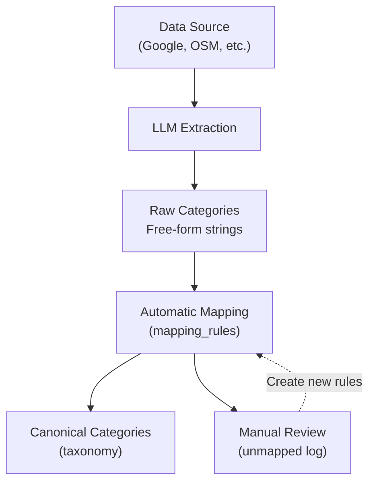

# Managing Canonical Categories

## Overview

The extraction engine uses a two-tier category system to organize listings:

1. **Raw Categories**: Free-form categories extracted from sources (e.g., "Tennis Club", "Indoor Sports Facility")
2. **Canonical Categories**: Controlled taxonomy mapped from raw categories for consistent navigation

This guide explains how to manage the canonical taxonomy, create mapping rules, and review unmapped categories.

**Key Benefits:**
- **Consistency**: All sources map to the same controlled taxonomy
- **Flexibility**: LLM can extract any category, promotion is manual
- **SEO**: Canonical categories enable consistent URLs and filtering
- **Scalability**: Add new sports/verticals without code changes

---

## Architecture

### Data Flow



### Storage

**Listing Model Fields:**

```typescript
Listing {
  // Raw categories (never modified after extraction)
  categories: string[]  // ["Tennis Club", "Indoor Sports", "Coaching Available"]

  // Canonical categories (automatically mapped)
  canonical_categories: string[]  // ["tennis", "sports_centre", "coach"]
}
```

**Example:**

```json
{
  "id": "clx123",
  "entity_name": "Game4Padel Edinburgh",
  "categories": [
    "Padel Club",
    "Indoor Sports Facility",
    "Coaching Available",
    "Equipment Rental"
  ],
  "canonical_categories": [
    "padel",
    "sports_centre",
    "coach"
  ]
}
```

---

## Configuration File

**Location:** `engine/config/canonical_categories.yaml`

**Structure:**

```yaml
# 1. TAXONOMY: Canonical categories (controlled vocabulary)
taxonomy:
  - category_key: padel
    display_name: Padel
    parent: venue
    description: Padel courts and facilities
    search_keywords: [padel, pádel, paddle tennis]

# 2. MAPPING RULES: Map raw categories to canonical
mapping_rules:
  - pattern: "(?i)\\bp[aá]d[eé]l\\b"  # Regex pattern
    canonical: padel
    confidence: 1.0

# 3. PROMOTION CONFIG: Settings for automatic mapping
promotion_config:
  min_confidence: 0.7
  max_categories: 5
  log_unmapped: true
```

---

## Managing the Taxonomy

### Adding a New Canonical Category

**Scenario:** You want to add "Pickleball" as a new sport.

#### Step 1: Add to Taxonomy

Edit `engine/config/canonical_categories.yaml`:

```yaml
taxonomy:
  # ... existing categories

  - category_key: pickleball  # Unique key (snake_case)
    display_name: Pickleball  # User-facing label
    parent: venue            # Optional parent category
    description: Pickleball courts and facilities
    search_keywords:
      - pickleball
      - pickle ball
      - pickleball court
```

**Taxonomy Fields:**

| Field | Required | Description | Example |
|-------|----------|-------------|---------|
| `category_key` | Yes | Unique identifier (snake_case, stable) | `pickleball` |
| `display_name` | Yes | User-facing label | `Pickleball` |
| `parent` | No | Parent category for hierarchy | `venue` |
| `description` | Yes | Internal documentation | `Pickleball courts and facilities` |
| `search_keywords` | Yes | Keywords for text search | `[pickleball, pickle ball]` |

#### Step 2: Add Mapping Rule

Add a pattern to map raw categories to your new canonical category:

```yaml
mapping_rules:
  # ... existing rules

  - pattern: "(?i)\\bpickleball\\b|\\bpickle.?ball\\b"
    canonical: pickleball
    confidence: 1.0
```

**Mapping Rule Fields:**

| Field | Required | Description | Example |
|-------|----------|-------------|---------|
| `pattern` | Yes | Regex pattern (case-insensitive by default) | `"(?i)\\bpickleball\\b"` |
| `canonical` | Yes | Target canonical category_key | `pickleball` |
| `confidence` | Yes | Match confidence (0-1) | `1.0` (certain), `0.7` (ambiguous) |

**Pattern Tips:**

- Use `(?i)` for case-insensitive matching
- Use `\\b` for word boundaries (avoids partial matches)
- Use `|` for OR (e.g., `pickleball|pickle.?ball`)
- Use `.?` for optional characters (e.g., `pickle.?ball` matches "pickleball" and "pickle ball")

#### Step 3: Test Mapping

Create a test to verify your mapping works:

```python
# Test file: engine/extraction/tests/test_category_mapping.py

def test_pickleball_mapping():
    """Test that 'Pickleball' maps to canonical 'pickleball'"""
    from engine.extraction.utils.categories import map_categories

    raw_categories = ["Pickleball Court", "Indoor Sports"]
    canonical = map_categories(raw_categories)

    assert "pickleball" in canonical
```

Run test:
```bash
pytest engine/extraction/tests/test_category_mapping.py::test_pickleball_mapping -v
```

#### Step 4: Re-Extract or Update

**Option A: Re-extract existing records** (if data was already extracted):

```bash
# Re-extract all records to apply new mapping
python -m engine.extraction.run_all --force-retry
```

**Option B: Run category mapping script** (faster, planned feature):

```bash
# Planned: Re-map categories without full re-extraction
python -m engine.extraction.utils.remap_categories
```

---

### Editing Existing Categories

#### Updating Display Name

**Before:**
```yaml
- category_key: gym
  display_name: Gym
```

**After:**
```yaml
- category_key: gym
  display_name: Fitness Centre  # Updated label
```

**Impact:**
- **Frontend**: Display name changes immediately
- **Database**: No database changes needed (key is stable)
- **SEO**: URLs unchanged (uses `category_key`, not `display_name`)

#### Adding Search Keywords

**Before:**
```yaml
- category_key: tennis
  search_keywords: [tennis, tennis court]
```

**After:**
```yaml
- category_key: tennis
  search_keywords:
    - tennis
    - tennis court
    - lawn tennis  # Added
    - real tennis  # Added
```

**Impact:**
- **Search**: More phrases map to this category
- **No Re-extraction Needed**: Search keywords don't affect extraction, only search UI

#### Changing Parent Category

**Before:**
```yaml
- category_key: padel
  parent: venue
```

**After:**
```yaml
- category_key: padel
  parent: racket_sports  # New parent (requires adding racket_sports first)
```

**Impact:**
- **Hierarchy**: Breadcrumbs and navigation change
- **No Database Changes**: Parent is reference data, not stored in listings

---

## Managing Mapping Rules

### Adding a New Mapping Rule

**Scenario:** You notice raw categories like "Racquet Club" aren't mapping to "tennis".

#### Step 1: Check Unmapped Categories Log

```bash
# View unmapped categories
cat logs/unmapped_categories.log
```

**Example Log:**
```
2026-01-17 14:32:15 | clx123 | "Racquet Club"
2026-01-17 14:35:22 | clx456 | "Squash and Tennis Centre"
2026-01-17 14:40:11 | clx789 | "Badders Club"
```

#### Step 2: Add Mapping Rule

```yaml
mapping_rules:
  # ... existing rules

  # Map "Racquet Club" to tennis
  - pattern: "(?i)racqu?et\\s+club"  # Matches "racquet club" or "racket club"
    canonical: tennis
    confidence: 0.8  # Lower confidence (could also be squash)
```

**Confidence Guidelines:**

| Confidence | Meaning | Example |
|------------|---------|---------|
| **1.0** | Certain match | "Padel" → `padel` |
| **0.9** | Very likely | "Gym" → `gym` |
| **0.8** | Likely, but ambiguous | "Racquet Club" → `tennis` (could be squash) |
| **0.7** | Possible (minimum threshold) | "Club" → `club` (very generic) |
| **<0.7** | Don't create rule (too ambiguous) | - |

#### Step 3: Test Rule

```bash
# Test with dry-run
python -m engine.extraction.run --source=google_places --limit=5 --dry-run

# Verify "Racquet Club" now maps to "tennis"
```

---

### Handling Ambiguous Categories

**Problem:** "Sports Club" could map to `club`, `sports_centre`, or be a parent category.

#### Solution 1: Multiple Mappings (Recommended)

Map to all applicable categories:

```yaml
# Map "Sports Club" to both club and sports_centre
- pattern: "(?i)sports\\s+club"
  canonical: club
  confidence: 0.8

- pattern: "(?i)sports\\s+club"
  canonical: sports_centre
  confidence: 0.75
```

**Result:**
- Listing gets both `["club", "sports_centre"]`
- Users can filter by either category

#### Solution 2: Choose Most Specific

Map to the most specific category:

```yaml
# Prefer sports_centre over generic club
- pattern: "(?i)sports\\s+club"
  canonical: sports_centre
  confidence: 0.85
```

**Result:**
- Listing gets only `["sports_centre"]`
- More precise categorization

---

## Promotion Workflow

### Stage 1: Extraction (Automatic)

**LLM Extracts Raw Categories:**

```python
# Serper extractor output
{
  "categories": [
    "Padel Club",
    "Indoor Sports Facility",
    "Coaching Available",
    "Equipment Rental On-Site"
  ]
}
```

**Stored in Database:**

```json
{
  "categories": ["Padel Club", "Indoor Sports Facility", "Coaching Available", "Equipment Rental On-Site"]
}
```

---

### Stage 2: Automatic Mapping

**Mapping Engine Applies Rules:**

```python
from engine.extraction.utils.categories import map_categories

raw = ["Padel Club", "Indoor Sports Facility", "Coaching Available"]
canonical = map_categories(raw)

# Result: ["padel", "sports_centre", "coach"]
```

**Mapping Process:**

1. For each raw category:
   - Check all mapping rules
   - If pattern matches AND confidence >= 0.7:
     - Add canonical category
2. Deduplicate canonical categories
3. Limit to max_categories (default: 5)
4. Log unmapped categories if enabled

**Stored in Database:**

```json
{
  "categories": ["Padel Club", "Indoor Sports Facility", "Coaching Available"],
  "canonical_categories": ["padel", "sports_centre", "coach"]
}
```

---

### Stage 3: Manual Review (Planned)

**Future Admin Interface:**

```
╔══════════════════════════════════════════════════════════════╗
║         UNMAPPED CATEGORIES REVIEW                           ║
╚══════════════════════════════════════════════════════════════╝

Unmapped Category: "Racquet Sports Venue"
Appears in: 15 listings
Sample Listings:
  - Game4Padel Edinburgh (clx123)
  - Edinburgh Tennis Club (clx456)

Suggested Mapping (AI):
  [✓] tennis (confidence: 0.75)
  [ ] sports_centre (confidence: 0.60)

Actions:
  [ ] Create Mapping Rule (tennis)
  [ ] Add to Taxonomy (new category)
  [ ] Ignore (low quality category)
```

**For Now (Manual Process):**

1. Review `logs/unmapped_categories.log`
2. Manually add mapping rules to `canonical_categories.yaml`
3. Re-run extraction with `--force-retry`

---

## Configuration Options

### Promotion Config

Edit `promotion_config` section in `canonical_categories.yaml`:

```yaml
promotion_config:
  # Minimum confidence for automatic mapping
  min_confidence: 0.7  # Default: 0.7, Range: 0.0-1.0

  # Maximum canonical categories per listing
  max_categories: 5  # Default: 5, Prevents category spam

  # Whether to include parent categories automatically
  # e.g., if "padel" is assigned, also assign "venue"
  include_parents: false  # Default: false (keep it simple)

  # Whether to log unmapped categories for manual review
  log_unmapped: true  # Default: true (helps discover new categories)

  # Path for unmapped categories log (relative to project root)
  unmapped_log_path: "logs/unmapped_categories.log"
```

**Tuning min_confidence:**

| Value | Effect | Use When |
|-------|--------|----------|
| **0.7** | Balanced (default) | Normal operation |
| **0.8-0.9** | Stricter (fewer false positives) | High precision needed |
| **0.5-0.6** | Looser (more mappings, more errors) | Exploratory phase, low data |

---

## Testing Category Mappings

### Unit Tests

**Create test file:** `engine/extraction/tests/test_category_mapping.py`

```python
import pytest
from engine.extraction.utils.categories import map_categories, load_category_config

def test_padel_mapping():
    """Test that 'Padel' maps to canonical 'padel'"""
    raw = ["Padel Court", "Indoor Sports"]
    canonical = map_categories(raw)
    assert "padel" in canonical

def test_ambiguous_sports_club():
    """Test that 'Sports Club' maps to both club and sports_centre"""
    raw = ["Sports Club"]
    canonical = map_categories(raw)
    assert "club" in canonical or "sports_centre" in canonical

def test_unmapped_category_logged():
    """Test that unmapped categories are logged"""
    raw = ["Underwater Basket Weaving"]  # Not in taxonomy
    canonical = map_categories(raw)
    assert canonical == []  # No mapping

    # Check log file
    with open("logs/unmapped_categories.log", "r") as f:
        log = f.read()
        assert "Underwater Basket Weaving" in log

def test_confidence_threshold():
    """Test that low-confidence mappings are excluded"""
    config = load_category_config()
    assert config["promotion_config"]["min_confidence"] == 0.7
```

**Run tests:**
```bash
pytest engine/extraction/tests/test_category_mapping.py -v
```

---

### Integration Tests

Test with real extraction data:

```bash
# Extract single record and verify categories
python -m engine.extraction.run --raw-id=clx123 --verbose

# Expected output:
# Canonical Categories: ["padel", "sports_centre", "coach"]
```

---

## Common Workflows

### Workflow 1: Adding a New Sport (e.g., Pickleball)

```bash
# Step 1: Add to taxonomy
# Edit: engine/config/canonical_categories.yaml
# Add pickleball to taxonomy section

# Step 2: Add mapping rule
# Edit: engine/config/canonical_categories.yaml
# Add pattern for "pickleball"

# Step 3: Test
pytest engine/extraction/tests/test_category_mapping.py

# Step 4: Re-extract data
python -m engine.extraction.run_all --force-retry

# Step 5: Verify in health dashboard
python -m engine.extraction.health
```

---

### Workflow 2: Reviewing Unmapped Categories

```bash
# Step 1: View unmapped log
cat logs/unmapped_categories.log | sort | uniq -c | sort -rn

# Example output:
# 15 "Racquet Sports Venue"
# 8 "Badders Club"
# 3 "TT Club"

# Step 2: Identify patterns
# "Racquet Sports Venue" → tennis or squash
# "Badders Club" → badminton
# "TT Club" → table_tennis

# Step 3: Add mapping rules
# Edit: engine/config/canonical_categories.yaml

# Step 4: Clear log and re-extract
rm logs/unmapped_categories.log
python -m engine.extraction.run_all --force-retry
```

---

### Workflow 3: Fixing Incorrect Mappings

**Scenario:** "Private Club" is mapping to `club` but should map to `private_club`.

```bash
# Step 1: Verify current behavior
python -m engine.extraction.run --raw-id=clx123 --verbose
# Output: canonical_categories: ["club"]

# Step 2: Update mapping rule priority
# Edit: engine/config/canonical_categories.yaml
# Ensure "private" pattern comes BEFORE generic "club" pattern

# Before (wrong order):
mapping_rules:
  - pattern: "(?i)\\bclub\\b"
    canonical: club
    confidence: 0.7

  - pattern: "(?i)private.*club"
    canonical: private_club
    confidence: 0.9

# After (correct order):
mapping_rules:
  # More specific patterns first
  - pattern: "(?i)private.*club"
    canonical: private_club
    confidence: 0.9

  # Generic patterns last
  - pattern: "(?i)\\bclub\\b"
    canonical: club
    confidence: 0.7

# Step 3: Test
python -m engine.extraction.run --raw-id=clx123 --verbose --force-retry
# Output: canonical_categories: ["private_club"]
```

**Rule:** More specific patterns should appear BEFORE generic patterns in the config file.

---

## Best Practices

### 1. Keep Taxonomy Shallow

**Good: 2-3 levels**
```
venue
├── padel
├── tennis
└── sports_centre
```

**Bad: 4+ levels**
```
venue
├── racket_sports
│   ├── padel
│   │   ├── indoor_padel
│   │   └── outdoor_padel
│   └── tennis
```

**Why:** Deep hierarchies are confusing for users and hard to maintain.

---

### 2. Prefer Specificity

**Good:**
```yaml
- category_key: pickleball
  display_name: Pickleball
```

**Bad:**
```yaml
- category_key: racket_sports_other
  display_name: Other Racket Sports
```

**Why:** Specific categories enable better filtering and SEO.

---

### 3. Document Ambiguous Mappings

**Good:**
```yaml
# "Sports Club" is ambiguous - could be a club entity or a sports venue
# Map to both club and sports_centre with lower confidence
- pattern: "(?i)sports\\s+club"
  canonical: club
  confidence: 0.75  # Lowered due to ambiguity
```

**Why:** Future maintainers understand reasoning for low confidence.

---

### 4. Review Unmapped Categories Quarterly

**Schedule:** Every 3 months

```bash
# Workflow
1. cat logs/unmapped_categories.log | sort | uniq -c | sort -rn > unmapped_analysis.txt
2. Review top 20 unmapped categories
3. Create mapping rules for categories appearing 5+ times
4. Ignore one-off/low-quality categories
5. Clear log: rm logs/unmapped_categories.log
```

**Why:** Discover new sports/categories over time without manual monitoring.

---

## Troubleshooting

### Issue 1: Category Not Mapping

**Symptom:**
```
Raw category: "Padel Court"
Canonical: []  # Empty!
```

**Diagnosis:**

```bash
# Check if pattern matches
python -c "
import re
pattern = r'(?i)\\bp[aá]d[eé]l\\b'
raw = 'Padel Court'
print('Matches:', bool(re.search(pattern, raw)))
"
```

**Common Causes:**

1. **Typo in pattern**: `\\bpadel\\b` won't match "Pádel" (with accent)
2. **Wrong regex escaping**: `\b` vs `\\b` in YAML
3. **Confidence too low**: `0.6` < `min_confidence: 0.7`

**Fix:**

```yaml
# Fix pattern to handle accents
- pattern: "(?i)\\bp[aá]d[eé]l\\b"  # Matches "Padel" and "Pádel"
  canonical: padel
  confidence: 1.0  # Increase confidence
```

---

### Issue 2: Too Many Categories Assigned

**Symptom:**
```
Canonical: ["padel", "tennis", "squash", "badminton", "sports_centre", "gym"]
# 6 categories! Exceeds max_categories: 5
```

**Diagnosis:**

Mapping rules are too broad.

**Fix:**

```yaml
# Option 1: Increase max_categories
promotion_config:
  max_categories: 10  # Allow more categories

# Option 2: Make patterns more specific
- pattern: "(?i)\\bpadel\\b(?!.*tennis)"  # Only padel, not "padel and tennis"
  canonical: padel
  confidence: 1.0
```

---

### Issue 3: Unmapped Log Growing Too Large

**Symptom:**
```
logs/unmapped_categories.log: 50 MB
```

**Diagnosis:**

Low-quality raw categories creating noise.

**Fix:**

```bash
# Option 1: Disable unmapped logging temporarily
# Edit: engine/config/canonical_categories.yaml
promotion_config:
  log_unmapped: false  # Disable

# Option 2: Rotate log file
mv logs/unmapped_categories.log logs/unmapped_categories_$(date +%Y%m%d).log
touch logs/unmapped_categories.log
```

---

## Future Enhancements (Phase 10+)

### 1. Admin UI for Category Management

**Planned Features:**
- Visual taxonomy editor
- Bulk mapping rule creation
- Unmapped category review interface
- A/B testing for ambiguous mappings

### 2. Field-Specific Canonical Categories

**Example:**
```yaml
# Different canonical categories per field
field_mappings:
  sport_types:
    - pattern: "(?i)padel"
      canonical: padel

  amenities:
    - pattern: "(?i)equipment rental"
      canonical: equipment_rental
```

### 3. ML-Powered Mapping Suggestions

**Concept:**
- Train model on existing mappings
- Suggest mappings for unmapped categories
- Confidence scoring based on context

---

## Summary

**Key Takeaways:**

1. **Two-tier system**: Raw categories (free-form) → Canonical categories (controlled)
2. **Configuration file**: `engine/config/canonical_categories.yaml`
3. **Three stages**: Extraction → Automatic Mapping → Manual Review
4. **Mapping rules**: Use regex patterns with confidence scores
5. **Review unmapped**: Check `logs/unmapped_categories.log` quarterly

**Quick Reference:**

```yaml
# Add new canonical category
taxonomy:
  - category_key: new_sport
    display_name: New Sport
    parent: venue
    search_keywords: [new sport, sport]

# Add mapping rule
mapping_rules:
  - pattern: "(?i)\\bnew.?sport\\b"
    canonical: new_sport
    confidence: 1.0
```

---

**Document Version:** 1.0
**Last Updated:** 2026-01-17
**Related Docs:**
- [Extraction Engine Overview](./extraction_engine_overview.md) - How categories fit into extraction
- [Adding a New Extractor](./adding_new_extractor.md) - Extracting raw categories
- [Tuning LLM Prompts](./tuning_llm_prompts.md) - Improving category extraction quality
