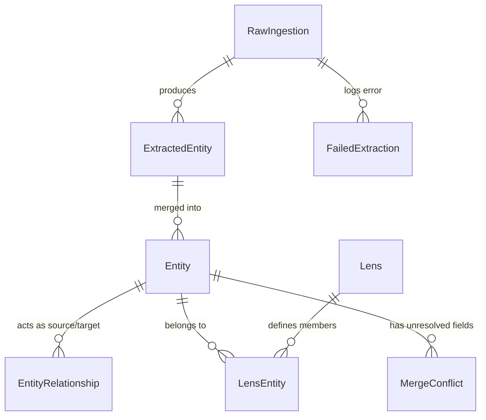

# Data Models Reference

This document describes the core data entities and their relationships within the Edinburgh Finds system.

## Entity Relationship Diagram

## Core Entities

### `Entity`
The central canonical record representing a real-world object (Place, Person, Organization, etc.).
- **`id`**: Unique identifier (CUID).
- **`entity_name`**: The primary name of the entity.
- **`entity_class`**: Classification (e.g., `place`, `person`).
- **`slug`**: URL-friendly identifier.
- **`canonical_activities`**: Opaque array of activities (e.g., `["tennis", "padel"]`).
- **`canonical_roles`**: Opaque array of roles (e.g., `["club", "coach"]`).
- **`modules`**: JSONB field containing universal module data (location, contact, etc.).

### `RawIngestion`
Immutable record of data fetched from an external API.
- **`source`**: Name of the connector (e.g., `google_places`).
- **`raw_data`**: The original JSON content (or path to it).
- **`hash`**: SHA-256 hash of the content for deduplication.
- **`status`**: Current processing state (`pending`, `extracted`, `failed`).

### `ExtractedEntity`
Structured data parsed from `RawIngestion` by an LLM.
- **`data`**: JSON representation of the extracted attributes.
- **`confidence`**: LLM-assigned confidence score.
- **`merger_status`**: Whether this data has been merged into a canonical `Entity`.

### `LensEntity`
Join table representing an entity's inclusion in a specific discovery view.
- **`lens_id`**: Identifier of the lens (e.g., `edinburgh_finds`).
- **`entity_id`**: Reference to the canonical entity.

### `MergeConflict`
Tracks when multiple sources provide conflicting data for the same entity field.
- **`field_name`**: The field with the conflict.
- **`values`**: The conflicting values and their source trust levels.

## Universal Modules
Entities are composed of "Universal Modules" stored in a namespaced JSONB column:
- **`location`**: Coordinates, address, neighborhood.
- **`contact`**: Phone, email, website, social handles.
- **`hours`**: Normalized opening hours.
- **`amenities`**: Boolean flags for features (e.g., `wifi`, `parking`).

---
*Evidence: docs/architecture/subsystems/database.md, engine/schema.prisma*
